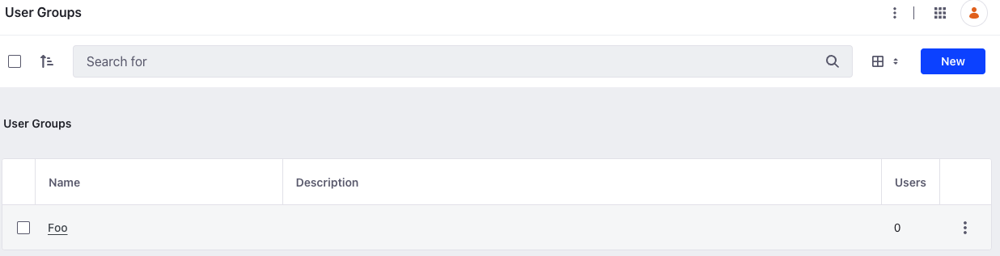

# SCIM Group API Basics

{bdg-secondary}`Liferay DXP 2024.Q1+`
{bdg-link-primary}`[Beta Feature](../../../system-administration/configuring-liferay/feature-flags.md#beta-feature-flags)`

Liferay provides a headless API to perform CRUD operations on SCIM groups to keep their information in sync with your company's applications. SCIM groups are analogous to [user groups](../../../users-and-permissions/user-groups.md) in Liferay. Use the `/scim` endpoint from the [API Explorer](https://learn.liferay.com/w/dxp/headless-delivery/consuming-apis/consuming-rest-services) to manage SCIM [groups](https://datatracker.ietf.org/doc/html/rfc7643#section-4.2).

## Adding a Group

```{include} /_snippets/run-liferay-dxp.md
```

Once Liferay is running,

1. Download and unzip [SCIM Group API Basics](./liferay-p9z7.zip).

   ```bash
   curl https://resources.learn.liferay.com/dxp/latest/en/installation-and-upgrades/securing-liferay/developer-guide/liferay-p9z7.zip -O
   ```

   ```bash
   unzip liferay-p9z7.zip
   ```

1. Use the cURL script to add a SCIM group in Liferay. On the command line, navigate to the `curl` folder. Execute the `Group_POST_ToInstance.sh` script.

   ```bash
   ./Group_POST_ToInstance.sh
   ```

   The JSON response shows the addition of a new SCIM group:

   ```json
   {
      "displayName": "Foo",
      "meta": {
         "created": "2024-03-13T11:51:35Z",
         "location": "http://localhost:8080/o/scim/v1.0/v2/Groups/36449",
         "lastModified": "2024-03-13T11:51:35Z",
         "resourceType": "Group"
      },
      "schemas": [
         "urn:ietf:params:scim:schemas:core:2.0:Group"
      ],
      "externalId": "eef7340d-3bc8-201b-76ae-411ec3a4ed1e",
      "id": "36449"
   }
   ```

1. Verify this by opening the *Global Menu* (), and navigating to *Control Panel* &rarr; *Users Groups*. See that a new user group has been added.

   

1. Alternatively, call the REST service using the Java client. Navigate into the `java` folder and compile the source files:

   ```bash
   javac -classpath .:* *.java
   ```

1. Run the `Group_POST_ToInstance` class.

   ```bash
   java -classpath .:* Group_POST_ToInstance
   ```

## Examine the cURL Command

The `Group_POST_ToInstance.sh` script calls the REST service with a cURL command.

```{literalinclude} ./scim-group-api-basics/resources/liferay-p9z7.zip/curl/Group_POST_ToInstance.sh
    :language: bash
```

Here are the command's arguments:

| Arguments                                        | Description                                                                          |
| :----------------------------------------------- | :----------------------------------------------------------------------------------- |
| `"http://localhost:8080/o/scim/v1.0/v2/Groups"`  | The REST service endpoint                                                            |
| `--data-raw "{ "displayName": "Foo" }"`          | The data to post                                                                     |
| `--header "Content-Type: application/scim+json"` | Indicates that the request body format is in JSON and conforms to the SCIM protocol. |
| `--request "POST"`                               | The HTTP method to invoke at the specified endpoint                                  |
| `--user "test@liferay.com:learn"`                | Basic authentication credentials                                                     |

!!! note
    Basic authentication is used here for demonstration purposes. For production, you should authorize users via [OAuth2](https://learn.liferay.com/w/dxp/headless-delivery/using-oauth2). See [Using OAuth2 to Authorize Users](https://learn.liferay.com/w/dxp/headless-delivery/using-oauth2/using-oauth2-to-authorize-users) for a sample React application using OAuth2.

## Examine the Java Class

The `Group_POST_ToInstance.java` class adds a SCIM group by calling the `GroupResource` service.

```{literalinclude} ./scim-group-api-basics/resources/liferay-p9z7.zip/java/Group_POST_ToInstance.java
   :dedent: 1
   :language: java
   :lines: 9-22
```

This class invokes the REST service using only three lines of code:

| Line (abbreviated)                                                   | Description                                                               |
| :------------------------------------------------------------------- | :------------------------------------------------------------------------ |
| `GroupResource.Builder builder = ...`                                | Get a `Builder` for generating a `GroupResource` service instance.        |
| `GroupResource groupResource = builder.authentication(...).build();` | Use basic authentication and generate a `GroupResource` service instance. |
| `groupResource.postV2Group(...);`                                    | Call the `groupResource.postV2Group` method.                              |

Note that the project includes the `com.liferay.scim.rest.client.jar` file as a dependency. You can find client JAR dependency information for all REST applications in the API explorer in your installation at `/o/api` (e.g., <http://localhost:8080/o/api>).

!!! note
    The `main` method's comment demonstrates running the class.

!!! important
    See [GroupResource](https://github.com/liferay/liferay-portal/blob/[$LIFERAY_LEARN_PORTAL_GIT_TAG$]/modules/dxp/apps/scim/scim-rest-client/src/main/java/com/liferay/scim/rest/client/resource/v1_0/GroupResource.java) for service details.

### Groups_GET_FromInstance.sh

Command:

```bash
./Groups_GET_FromInstance.sh
```

Code:

```{literalinclude} ./scim-group-api-basics/resources/liferay-p9z7.zip/curl/Groups_GET_FromInstance.sh
   :language: bash
```

### Groups_GET_FromInstance.java

Command:

```bash
java -classpath .:* Groups_GET_FromInstance
```

Code:

```{literalinclude} ./scim-group-api-basics/resources/liferay-p9z7.zip/java/Groups_GET_FromInstance.java
   :dedent: 1
   :language: java
   :lines: 8-16
```

The `Group` objects of your Liferay instance are listed in JSON.

Read [API Query Parameters](https://learn.liferay.com/w/dxp/headless-delivery/consuming-apis/api-query-parameters) for more information.

## Get a Group

Get a specific group with the following cURL or Java command. Replace `1234` with the group's ID.

!!! tip
    Use ``Groups_GET_FromInstance.[java|sh]`` to get a list of all groups, and note the `id` of the group you want specifically.

### Group_GET_ById.sh

Command:

```bash
./Group_GET_ById.sh 1234
```

Code:

```{literalinclude} ./scim-group-api-basics/resources/liferay-p9z7.zip/curl/Group_GET_ById.sh
   :language: bash
```

### Group_GET_ById.java

Command:

```bash
java -classpath .:* -DgroupId=1234 Group_GET_ById
```

Code:

```{literalinclude} ./scim-group-api-basics/resources/liferay-p9z7.zip/java/Group_GET_ById.java
   :dedent: 1
   :language: java
   :lines: 8-18
```

The `Group` fields are listed in JSON.

## Put a Group

Update an existing group with the following cURL and Java commands. Replace `1234` with your group's ID.

### Group_PUT_ById.sh

Command:

```bash
./Group_PUT_ById.sh 1234
```

Code:

```{literalinclude} ./scim-group-api-basics/resources/liferay-p9z7.zip/curl/Group_PUT_ById.sh
   :language: bash
```

### Group_PUT_ById.java

Command:

```bash
java -classpath .:* -DgroupId=1234 Group_PUT_ById
```

Code:

```{literalinclude} ./scim-group-api-basics/resources/liferay-p9z7.zip/java/Group_PUT_ById.java
   :dedent: 1
   :language: java
   :lines: 9-23
```

## Delete a Group

Delete an existing group with the following cURL and Java commands. Replace `1234` with your group's ID.

### Group_DELETE_ById.sh

Command:

```bash
./Group_DELETE_ById.sh 1234
```

Code:

```{literalinclude} ./scim-group-api-basics/resources/liferay-p9z7.zip/curl/Group_DELETE_ById.sh
   :language: bash
```

### Group_DELETE_ById.java

Command

```bash
java -classpath .:* -DgroupId=1234 Group_DELETE_ById
```

Code:

```{literalinclude} ./scim-group-api-basics/resources/liferay-p9z7.zip/java/Group_DELETE_ById.java
   :dedent: 1
   :language: java
   :lines: 8-17
```

The [API Explorer](https://learn.liferay.com/w/dxp/headless-delivery/consuming-apis/consuming-rest-services) lists all of the `Group` services and schemas and has an interface to try out each service.

## Related Topics

* [Consuming REST Services](https://learn.liferay.com/dxp/latest/en/headless-delivery/consuming-apis/consuming-rest-services)
