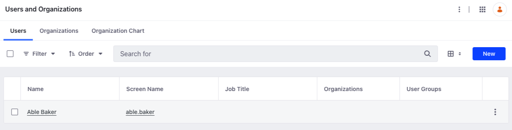

# SCIM User API Basics

{bdg-secondary}`Liferay DXP 2024.Q1+`
{bdg-link-primary}`[Beta Feature](../../../system-administration/configuring-liferay/feature-flags.md#beta-feature-flags)`

Liferay provides a headless API to perform CRUD operations on SCIM users to keep their identity information in sync with your company's applications. Use the `/scim` endpoint from the [API Explorer](https://learn.liferay.com/dxp/latest/en/headless-delivery/consuming-apis/consuming-rest-services.html) to manage SCIM [users](https://datatracker.ietf.org/doc/html/rfc7643#section-4.1).

## Adding a User

```{include} /_snippets/run-liferay-dxp.md
```

Once Liferay is running,

1. Download and unzip [SCIM User API Basics](./liferay-g7y9.zip).

   ```bash
   curl https://resources.learn.liferay.com/dxp/latest/en/installation-and-upgrades/securing-liferay/developer-guide/liferay-g7y9.zip -O
   ```

   ```bash
   unzip liferay-g7y9.zip
   ```

1. Use the cURL script to add a SCIM user in Liferay. On the command line, navigate to the `curl` folder. Execute the `User_POST_ToInstance.sh` script.

   ```bash
   ./User_POST_ToInstance.sh
   ```

   The JSON response shows the addition of a new SCIM user:

   ```bash
   {
      "emails": [
         {
            "type": "default",
            "value": "able@liferay.com",
            "primary": true
         }
      ],
      "meta": {
         "created": "2024-03-13T09:53:22Z",
         "location": "http://localhost:8080/o/scim/v1.0/v2/Users/36433",
         "lastModified": "2024-03-13T09:53:23Z",
         "resourceType": "User"
      },
      "schemas": [
         "urn:ietf:params:scim:schemas:core:2.0:User",
         "urn:ietf:params:scim:schemas:extension:liferay:2.0:User"
      ],
      "urn:ietf:params:scim:schemas:extension:liferay:2.0:User": {
         "birthday": "1970-01-01",
         "male": true
      },
      "name": {
         "familyName": "Baker",
         "givenName": "Able"
      },
      "active": true,
      "externalId": "1446cf10-3de9-6e11-dd15-c561de806259",
      "id": "36433",
      "title": "",
      "userName": "able.baker"
   }
   ```

1. Verify this by opening the *Global Menu* (), and navigating to *Control Panel* &rarr; *Users and Organizations*. See that a new user has been added.

   

1. Alternatively, call the REST service using the Java client. Navigate into the `java` folder and compile the source files:

   ```bash
   javac -classpath .:* *.java
   ```

1. Run the `User_POST_ToInstance` class.

   ```bash
   java -classpath .:* User_POST_ToInstance
   ```

## Examine the cURL Command

The `User_POST_ToInstance.sh` script calls the REST service with a cURL command.

```{literalinclude} ./scim-user-api-basics/resources/liferay-g7y9.zip/curl/User_POST_ToInstance.sh
    :language: bash
```

Here are the command's arguments:

| Arguments                                                                                                                                                                                                      | Description                                                                          |
| :------------------------------------------------------------------------------------------------------------------------------------------------------------------------------------------------------------- | :----------------------------------------------------------------------------------- |
| `"http://localhost:8080/o/scim/v1.0/v2/Users"`                                                                                                                                                                 | The REST service endpoint                                                            |
| `--data-raw "{ "active": "'true'", "emails": [ { "primary": "'true'", "type": "default", "value": "able@liferay.com" } ], "name": { "familyName": "Baker", "givenName": "Able" }, "userName": "able.baker" }"` | The data to post                                                                     |
| `--header "Content-Type: application/scim+json"`                                                                                                                                                               | Indicates that the request body format is in JSON and conforms to the SCIM protocol. |
| `--request "POST"`                                                                                                                                                                                             | The HTTP method to invoke at the specified endpoint                                  |
| `--user "test@liferay.com:learn"`                                                                                                                                                                              | Basic authentication credentials                                                     |

!!! note
    Basic authentication is used here for demonstration purposes. For production, you should authorize users via [OAuth2](https://learn.liferay.com/dxp/latest/en/headless-delivery/using-oauth2.html). See [Using OAuth2 to Authorize Users](https://learn.liferay.com/dxp/latest/en/headless-delivery/using-oauth2/using-oauth2-to-authorize-users.html) for a sample React application using OAuth2.

## Examine the Java Class

The `User_POST_ToInstance.java` class adds a SCIM user by calling the `UserResource` service.

```{literalinclude} ./scim-user-api-basics/resources/liferay-g7y9.zip/java/User_POST_ToInstance.java
   :dedent: 1
   :language: java
   :lines: 11-40
```

This class invokes the REST service using only three lines of code:

| Line (abbreviated)                                                 | Description                                                              |
| :----------------------------------------------------------------- | :----------------------------------------------------------------------- |
| `UserResource.Builder builder = ...`                               | Get a `Builder` for generating a `UserResource` service instance.        |
| `UserResource userResource = builder.authentication(...).build();` | Use basic authentication and generate a `UserResource` service instance. |
| `userResource.postV2User(...);`                                    | Call the `userResource.postV2User` method.                               |

Note that the project includes the `com.liferay.scim.rest.client.jar` file as a dependency. You can find client JAR dependency information for all REST applications in the API explorer in your installation at `/o/api` (e.g., <http://localhost:8080/o/api>).

!!! note
    The `main` method's comment demonstrates running the class.

!!! important
    See [UserResource](https://github.com/liferay/liferay-portal/blob/[$LIFERAY_LEARN_PORTAL_GIT_TAG$]/modules/dxp/apps/scim/scim-rest-client/src/main/java/com/liferay/scim/rest/client/resource/v1_0/UserResource.java) for service details.

### Users_GET_FromInstance.sh

Command:

```bash
./Users_GET_FromInstance.sh
```

Code:

```{literalinclude} ./scim-user-api-basics/resources/liferay-g7y9.zip/curl/Users_GET_FromInstance.sh
   :language: bash
```

### Users_GET_FromInstance.java

Command:

```bash
java -classpath .:* Users_GET_FromInstance
```

Code:

```{literalinclude} ./scim-user-api-basics/resources/liferay-g7y9.zip/java/Users_GET_FromInstance.java
   :dedent: 1
   :language: java
   :lines: 8-16
```

The `User` objects of your Liferay instance are listed in JSON.

Read [API Query Parameters](https://learn.liferay.com/dxp/latest/en/headless-delivery/consuming-apis/api-query-parameters.html) for more information.

## Get a User

Get a specific user with the following cURL or Java command. Replace `1234` with the user's ID.

!!! tip
    Use ``Users_GET_FromInstance.[java|sh]`` to get a list of all users, and note the `id` of the user you want specifically.

### User_GET_ById.sh

Command:

```bash
./User_GET_ById.sh 1234
```

Code:

```{literalinclude} ./scim-user-api-basics/resources/liferay-g7y9.zip/curl/User_GET_ById.sh
   :language: bash
```

### User_GET_ById.java

Command:

```bash
java -classpath .:* -DuserId=1234 User_GET_ById
```

Code:

```{literalinclude} ./scim-user-api-basics/resources/liferay-g7y9.zip/java/User_GET_ById.java
   :dedent: 1
   :language: java
   :lines: 8-18
```

The `User` fields are listed in JSON.

## Put a User

Update an existing user with the following cURL and Java commands. Replace `1234` with your user's ID.

### User_PUT_ById.sh

Command:

```bash
./User_PUT_ById.sh 1234
```

Code:

```{literalinclude} ./scim-user-api-basics/resources/liferay-g7y9.zip/curl/User_PUT_ById.sh
   :language: bash
```

### User_PUT_ById.java

Command:

```bash
java -classpath .:* -DuserId=1234 User_PUT_ById
```

Code:

```{literalinclude} ./scim-user-api-basics/resources/liferay-g7y9.zip/java/User_PUT_ById.java
   :dedent: 1
   :language: java
   :lines: 11-40
```

## Delete a User

Delete an existing user with the following cURL and Java commands. Replace `1234` with your user's ID.

### User_DELETE_ById.sh

Command:

```bash
./User_DELETE_ById.sh 1234
```

Code:

```{literalinclude} ./scim-user-api-basics/resources/liferay-g7y9.zip/curl/User_DELETE_ById.sh
   :language: bash
```

### User_DELETE_ById.java

Command

```bash
java -classpath .:* -DuserId=1234 User_DELETE_ById
```

Code:

```{literalinclude} ./scim-user-api-basics/resources/liferay-g7y9.zip/java/User_DELETE_ById.java
   :dedent: 1
   :language: java
   :lines: 8-17
```

The [API Explorer](https://learn.liferay.com/dxp/latest/en/headless-delivery/consuming-apis/consuming-rest-services.html) lists all of the `User` services and schemas and has an interface to try out each service.

## Related Topics

* [Consuming REST Services](https://learn.liferay.com/dxp/latest/en/headless-delivery/consuming-apis/consuming-rest-services)