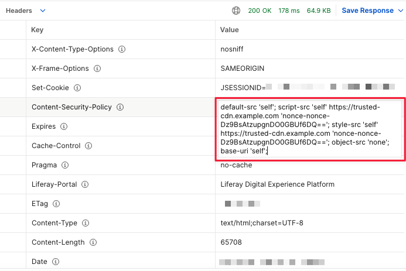

# Configuring Content Security Policy Headers

Modern browsers use [Content Security Policy](https://content-security-policy.com) HTTP response headers to enhance web pages' security to mitigate certain types of attacks (like Cross-Site Scripting or data injection). You can enable CSP on Liferay to send the configured headers on each HTTP request. 

CSP policies have many options. It is best to understand your users' needs and come up with a policy to suit their requirements. For an example of a browser implementation of Content Security Policies, read [Mozilla's implementation](https://developer.mozilla.org/en-US/docs/Web/HTTP/Headers/Content-Security-Policy) for more information.

## Content Security Policy Directives and Values

Content Security Policy can be separated in 2 distinct kinds: *Directives CSP* and *Values CSP*. They both can be used to form a robust security frameworks that helps protect web applications against a variety of threats, however, they operate differently from each other:

* Directives CSP -  It acts as commands that specify the types of content allowed to be loaded on a web page and from where it can be sourced. These directives serve as the blueprint for the security policy and include instructions for resources like scripts, stylesheets, images, fonts, and so on. Directives establish the boundaries and restrictions that dictates the behavior of web content.

* Values CSP - Values complement directives by defining the specific origins or sources from which the permitted content can be loaded. They provide granular control over the origins allowed for each type of resource specified by the directives. Specifying values restricts the loading of resources to only those from approved origins, increasing the security of the web application.

While working with CSP, you have access to directives. They are commands that specify the rules and restrictions for loading different types of resources on a web page, allowing you to define security guidelines that browsers should apply while rendering the page.

<!--
I had asked you specifically to explain the directives that were available in the tech draft linked in JIRA. DO NOT mention other directives because we still don't know if it is supported 

default-src 'self'; base-uri 'self' 'strict-dynamic'; connect-src 'self'; img-src data: 'self' w3.org/svg/2000; script-src 'self' 'strict-dynamic' '[$NONCE$]' 'unsafe-eval'; script-src-attr 'self' 'unsafe-inline'; style-src 'self' 'unsafe-inline';

These are the directives you need to explain
default-src, base-uri, connect-src, img-src, script-src, strict-dynamic, script-src-attr, style-src 

Explain what is 'self' 

- Aswin
- -->

| Directive     | Description                                                                        | Example                                                                  |
| :------------ | :--------------------------------------------------------------------------------- | :----------------------------------------------------------------------- |
| `default-src` | Specifies the source used as a fallback for other CSP directives.                  | 'self' https://cdn.example.com https://fonts.gstatic.com                 |
| `script-src`  | Defines valid sources for JavaScript.                                              | 'self' https://cdnjs.cloudflare.com/ajax/libs/jquery/3.6.0/jquery.min.js |
| `style-src`   | Specifies valid sources for CSS stylesheets.                                       | 'self' https://fonts.googleapis.com/css2?family=Roboto                   |
| `img-src`     | Specifies valid sources for images.                                                | 'self' data: https://www.example.com                                     |
| `font-src`    | Specifies valid sources for fonts.                                                 | 'self' https://fonts.gstatic.com/s/roboto                                |
| `connect-src` | Defines valid sources for network connections like XMLHttpRequest and EventSource. | 'self' https://api.example.com                                           |
| `frame-src`   | Defines valid sources for frames and iframes.                                      | 'self' https://www.youtube.com/embed/ABCDEFGHIJK                         |

## Configuring a Sample Content Security Policy

Imagine one of your company servers responsible for serving all the scripts to your website is compromised. This can lead to possible attacks like injection of malicious scripts to different web pages within your site. Using CSP, you can disable loading scripts if it originates from the compromised server. To do this,

1. Open the *Global Menu* () and navigate to *Control Panel* &rarr; *System Settings* &rarr; *Security* &rarr; *Content Security Policy*.

   

1. To enable CSP headers, check the *Enabled* checkbox. You can enter your policy in the *Content Security Policy* input field and specify a number of paths to exclude.

   * **Content Security Policy** - Specify the content security policy to enforce. The value entered here appears as the value for the `Content-Security-Policy` HTTP header. You can add a [nonce](https://developer.mozilla.org/en-US/docs/Web/HTTP/Headers/Content-Security-Policy#nonce-) by using the placeholder `'[$NONCE$]'` in your content security policy. The placeholder gets replaced with a generated nonce for the tags you specify.

   * **Excluded Paths** - Paths that start with the value added here are excluded from the content security policy. You can add multiple paths to exclude by clicking the  button or remove them using the  button.

1. Enter the following policy in the *Content Security Policy* input field.

   ```bash
   default-src 'self'; script-src 'self' https://trusted-cdn.example.com '[$NONCE$]'; style-src 'self' https://trusted-cdn.example.com '[$NONCE$]'; object-src 'none'; base-uri 'self';
   ```

1. Click *Update*.

!!! note
    This applies the configuration to all sites for all instances. If you want to configure CSP headers for all sites of a specific instance, go to *Control Panel* &rarr; *Instance Settings* &rarr; *Security* &rarr; *Content Security Policy*. If you want to configure CSP headers for a specific site, open the site menu and go to *Configuration* &rarr; *Site Settings* &rarr; *Security* &rarr; *Content Security Policy*.

This sample content security policy only allows resources to load from the same origin `self` and from the trusted content delivery network `https://trusted-cdn.example.com`. It also includes the nonce `'[$NONCE$]'` for scripts and stylesheets to secure their integrity and prevent unauthorized script execution.



The `object-src 'none'` entry instructs the browser to prevent loading any HTML `<object>` elements. The `base-url 'self'` entry instructs the browser to only allow loading resources from the same origin as the document.

## Current Limitations of CSP

<!--
Change these to H3.
 -->

Content Security Policy Constraints in Webpack Bundling
<!-- Consider rewriting it a little because it sounds confusing. -->
It is required to add `unsafe-eval` to Liferay's policy due to the webpack bundling settings `liferay.js`. The browser does not allow the evaluation of strings as *JavaScript* by default, so the code is being refused execution. By using `unsafe-eval`, it will be possible the use of dynamic code evaluation mechanisms like the `Function(\"return this\")()` constructor.

* Styles for HTML and Script Styling 
<!-- Consider rewriting it a little because it sounds confusing. -->
It is required to enable `unsafe-inline` for styles, since Liferay works with several `style` attributes inside HTML elements, and also as some style additions to head part by scripts.

* Inline Event Listeners

It is required to add `script-src-attr 'self' 'unsafe-inline';` since Content Security Policy treats *Event Listeners* as scripts.

* CSP Rules for CKEditor Integration

*CKEditor 4* functionalities may enter in conflict with CSP restrictions, so it is required to change the rule to `script-src ‘self' 'unsafe-inline' 'unsafe-eval';` or add `/group/guest/~/control_panel/manage` as excluded paths. Be aware that *7.3 CKEditor* is the only supported  *WYSIWYG* (What You See Is What You Get) editor, but Liferay uses *CKEditor 4* which cannot be used without unsafe-inline ‘https://csplite.com/csp/test347/#nonce_dynamic‘.

!!! note
    Content Security Police works best with SPA disabled. To disable it, add `javascript.single.page.application.enabled=false` to your [portal-ext.properties file](https://learn.liferay.com/dxp/latest/en/installation-and-upgrades/reference/portal-properties.html).
    Site level configuration panel and common pages (such as the 404 page) belong to the instance, so it uses the instance level CSP headers.
