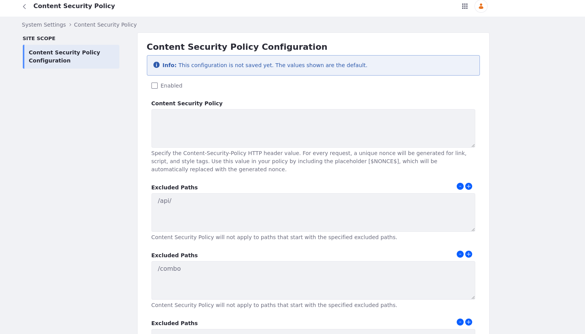

# Configuring Content Security Policy Headers

Modern browsers use [Content Security Policy](https://content-security-policy.com) HTTP response headers to enhance web pages' security to mitigate certain types of attacks (like Cross-Site Scripting or data injection). You can enable CSP on Liferay to send the configured headers on each HTTP request. 

CSP policies have many options. It is best to understand your users' needs and come up with a policy to suit their requirements. After enabling CSP headers, they’re enforced by the browsers. Visit the links below to learn more about how browsers handle CSP headers:

* [Mozilla](https://developer.mozilla.org/en-US/docs/Web/HTTP/Headers/Content-Security-Policy)
* [Google Chrome](https://developer.chrome.com/docs/privacy-security/csp)

!!! warning
    This feature is currently behind a beta feature flag. See [Beta Feature Flags](../../../system-administration/configuring-liferay/feature-flags.md#beta-feature-flags) for more information. Configuring an unsupported content security policy can cause your instance to malfunction.

## Content Security Policy Directives and Values

You can separate Content Security Policy into two: directives and values. Using directives and values, you can form a robust policy to protect web applications against a variety of threats.

* Directives - Directives specify the rules for resources (scripts, stylesheets, images, etc.) a browser can load or execute on a web page. Below are examples of some commonly used directives.

| Directive         | Description                                                                                |
| :---------------- | :----------------------------------------------------------------------------------------- |
| `default-src`     | Specifies the default source for content types not explicitly defined by other directives. |
| `base-uri`        | Specifies the base URL for resolving relative URLs.                                        |
| `connect-src`     | Specifies the sources to which you can make network requests.                              |
| `img-src`         | Specifies the sources from where you can load images.                                      |
| `script-src`      | Specifies the sources from where you can load JavaScript and execute them.                 |
| `script-src-attr` | Specifies the sources from where you can load inline script event handlers like onClick.   |
| `style-src`       | Specifies the sources from where you can load stylesheets.                                 |

* Values - Values complement directives by specifying the approved origins to load resources from. Below are examples of some commonly used values. In addition to these, you can also specify URLs.

| Value            | Description                                                                                                |
| :--------------- | :--------------------------------------------------------------------------------------------------------- |
| `self`           | Allows loading and execution of resources from the same origin.                                            |
| `unsafe-eval`    | Allows execution of code generated by eval() and other unsafe methods.                                     |
| `unsafe-inline`  | Allows the inclusion of inline stylesheets, scripts, inline event handlers, etc.                           |
| `[$NONCE$]`      | Allows execution of scripts or loading of stylesheets with a specific nonce value generated by the server. |
| `strict-dynamic` | Allows execution of scripts from trusted sources.                                                          |
| `none`           | Blocks execution of the specified directive from all sources.                                              |

It's important to note that while `unsafe-eval` and `unsafe-inline` provide flexibility in terms of code execution and styling, they come with increased security risks. Liferay currently cannot support a fully `unsafe-` free CSP due to certain limitations. See [Current Limitations of CSP](#current-limitations-of-csp) for more information.

## Configuring a Sample Content Security Policy

Let's get back to the examples above and see them working in practice.

### Configuring CSP Directives

To configure a sample content security policy in Liferay,

1. Open the *Global Menu* () and navigate to *Control Panel* &rarr; *System Settings* &rarr; *Security* &rarr; *Content Security Policy*.

   

1. To enable CSP headers, check the *Enabled* checkbox. You can enter your policy in the *Content Security Policy* input field and specify a number of paths to exclude.

   * **Content Security Policy** - Specify the content security policy to enforce. The value entered here appears as the value for the `Content-Security-Policy` HTTP header. You can add a [nonce](https://developer.mozilla.org/en-US/docs/Web/HTTP/Headers/Content-Security-Policy#nonce-) by using the placeholder `'[$NONCE$]'` in your content security policy. The placeholder gets replaced with a generated nonce for the tags you specify.

   * **Excluded Paths** - Paths that start with the value added here are excluded from the content security policy. You can add multiple paths to exclude by clicking the  button or remove them using the  button.

1. Enter the following policy in the *Content Security Policy* input field.

   ```bash
   default-src 'self'; script-src 'self' https://trusted-cdn.example.com '[$NONCE$]'; style-src 'self' https://trusted-cdn.example.com '[$NONCE$]' base-uri 'self';
   ```

  This sample content security policy only allows resources to load from the same origin `self` and from the trusted content delivery network `https://trusted-cdn.example.com`. It also includes the nonce `'[$NONCE$]'` for scripts and stylesheets to secure their integrity and prevent unauthorized script execution. The `base-url 'self'` value instructs the browser to only allow loading resources from the same origin as the document.

1. Click *Update*.

!!! note
    This applies the configuration to all sites for all instances. If you want to configure CSP headers for all sites of a specific instance, go to *Control Panel* &rarr; *Instance Settings* &rarr; *Security* &rarr; *Content Security Policy*. If you want to configure CSP headers for a specific site, open the site menu and go to *Configuration* &rarr; *Site Settings* &rarr; *Security* &rarr; *Content Security Policy*.

## Current Limitations of CSP

This feature is still in beta and has the following limitations.

* **CSP constraints with Webpack Bundling** - Liferay uses Webpack for bundling code and there are instances where strings get evaluated as code. For this to work with CSP, you must add the `unsafe-eval` value to the `script-src` directive.

* **CKEditor Conflicts** - CKEditor causes issues due to the above restrictions with the `script-src` directive. To overcome this, you can add the `unsafe-eval` value to the `script-src` directive. This is not recommended but Liferay uses CKEditor 4 which is the only supported WYSIWYG (What You See Is What You Get) editor and it cannot be used without `unsafe-inline`.

* **Inline styles and stylesheets added dynamically** - Liferay contains several inline style attributes within HTML elements and also adds stylesheets to the `<head>` tag using scripts. For this to work with CSP, you must add the `unsafe-inline` value to the `style-src` directive.

* **Inline event listeners** - Liferay contains inline event listeners within HTML elements. For this to work with CSP, you must add the `unsafe-inline` value to the `script-src-attr` directive.

!!! note
    Content Security Police works best with SPA disabled. To disable it, add `javascript.single.page.application.enabled=false` to your [portal-ext.properties file](https://learn.liferay.com/dxp/latest/en/installation-and-upgrades/reference/portal-properties.html).
    Site level configuration panel and common pages (such as the 404 page) belong to the instance, so it uses the instance level CSP headers.

## Related Topics

* [Securing Web Services](../securing-web-services/setting-service-access-policies.md)
* [Setting Up CORS](../securing-web-services/setting-up-cors.md)
* [Using Authentication Verifiers](../securing-web-services/using-authentication-verifiers.md)