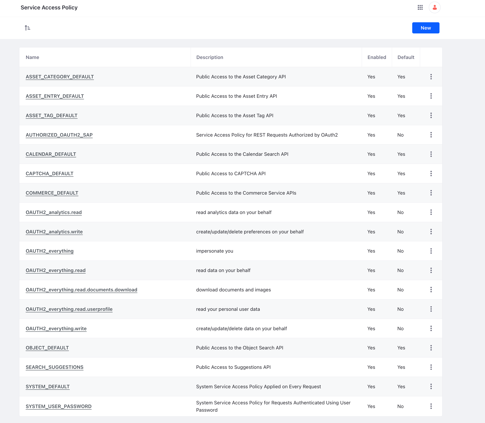
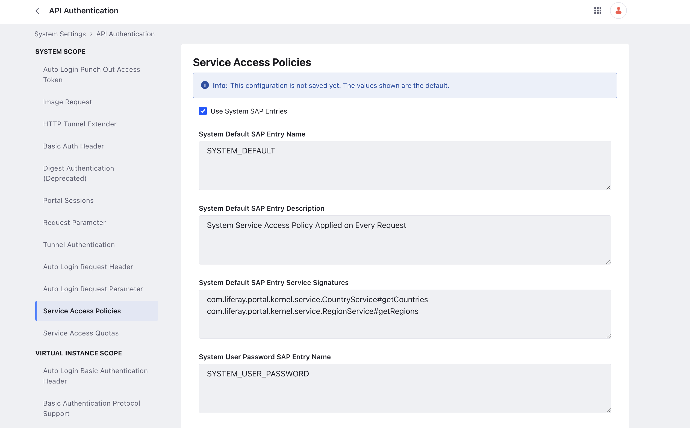

# Setting Service Access Policies

*Service Access Policies* define what services or service methods can be invoked remotely. You can apply many of them at once to produce a combined effect. They are the [second layer of security](../securing-web-services.md) (after IP permissions) for web services. Portal administrators can create custom service access policies. They are then applied by the portal's token authenticator (OAuth 2).

Service access policies define a whitelist for methods exposed via web service invocation. You can use wildcards to define whitelisted classes and methods. Note that service access policies respect the permissions system. If a policy grants a user access to a remote service, that user must still have the appropriate permissions to invoke that service.

## Default Service Access Policies

To view and manage service access policies, open the *Global Menu* () and navigate to *Control Panel* &rarr; *Configuration* &rarr; *Service Access Policy*.



There are 18 service access policies enabled by default. Eleven of these are system related:

| Service Access Policy      | Description                                                                                                                                                                                                                                                                                                                                                                                                                                                                                   | Enabled by Default |
| :------------------------- | :-------------------------------------------------------------------------------------------------------------------------------------------------------------------------------------------------------------------------------------------------------------------------------------------------------------------------------------------------------------------------------------------------------------------------------------------------------------------------------------------- | :----------------- |
| **ASSET_CATEGORY_DEFAULT** | Makes it possible to search for categories.                                                                                                                                                                                                                                                                                                                                                                                                                                                   | &#10004;           |
| **ASSET_ENTRY_DEFAULT**    | Allows the view counter for assets to be updated when an asset is retrieved.                                                                                                                                                                                                                                                                                                                                                                                                                  | &#10004;           |
| **ASSET_TAG_DEFAULT**      | Makes it possible to search for tags.                                                                                                                                                                                                                                                                                                                                                                                                                                                         | &#10004;           |
| **AUTHORIZED_OAUTH2_SAP**  | Allows all REST requests authorized by OAuth 2.                                                                                                                                                                                                                                                                                                                                                                                                                                               | &#10004;           |
| **CALENDAR_DEFAULT**       | Makes it possible to search public events in the calendar.                                                                                                                                                                                                                                                                                                                                                                                                                                    | &#10004;           |
| **CAPTCHA_DEFAULT**        | Makes it possible to access the headless captcha API by unauthenticated requests.                                                                                                                                                                                                                                                                                                                                                                                                             | &#10004;           |
| **COMMERCE_DEFAULT**       | Makes it possible to access all the Commerce Service APIs. calendar.                                                                                                                                                                                                                                                                                                                                                                                                                          | &#10004;           |
| **OBJECT_DEFAULT**         | Makes it possible to access all the Object entry APIs.                                                                                                                                                                                                                                                                                                                                                                                                                                        | &#10004;           |
| **SEARCH_SUGGESTIONS**     | Allows access to country/region services by JavaScript calls, so users can switch languages on the fly. Applies to every request, including unauthenticated requests.                                                                                                                                                                                                                                                                                                                         | &#10004;           |
| **SYSTEM_DEFAULT**         | Allows access to country/region services by JavaScript calls, so users can switch languages on the fly. Applies to every request, including unauthenticated requests.                                                                                                                                                                                                                                                                                                                         | &#10004;           |
| **SYSTEM_USER_PASSWORD**   | Allows any method to be invoked. Of course, since API functions include permission checks, this call works only if the user has the required permission. It applies to requests for which `AuthVerifierResult.isPasswordBasedAuthentication` is `true`: i.e., whenever user authentication took place using a password. If you want to completely disallow certain API functions from being invoked, you can change the `SYSTEM_USER_PASSWORD` policy to something more restrictive than `*`. | &#10004;           |

!!! note
    `SYSTEM_DEFAULT`, and other policies with `Default` configured to `Yes` are applied to all incoming requests, including unauthenticated requests.

The other seven policies are for OAuth and JSON web services:

| Service Access Policy                                  | Description                                                                                                                                                                                                                                                                                                                                | Enabled by Default |
| :----------------------------------------------------- | :----------------------------------------------------------------------------------------------------------------------------------------------------------------------------------------------------------------------------------------------------------------------------------------------------------------------------------------- | :----------------- |
| **OAUTH2_analytics.read/write**                        | Integrates with [Liferay Analytics Cloud](https://www.liferay.com/products/analytics-cloud), allowing it access to JSON web services.                                                                                                                                                                                                      | &#10004;           |
| **OAUTH2_everything/read/documents/userprofile/write** | The Everything policies grant access to all the JSON web services for various reasons. Everything is everything: all JSON web services (matches `*`). The others match method signatures appropriate to their description. For example, OAUTH2_everything.read matches all methods starting with `fetch`, `get`, `has`, `is`, or `search`. | &#10004;           |

The default configuration makes available corresponding scopes that provide access to all web services shipped with the system. The scopes must be assigned to OAuth 1 or 2 applications before they become usable. Administrators should review the ones you want to use and disable the others.

## Understanding Service Access Policies

When creating or editing service access policies, keep these points in mind:

* Service access policy names must be unique per portal instance.
* Service access policy names can include only these allowed characters:

   ```
   0123456789ABCDEFGHIJKLMNOPQRSTUVWXYZabcdefghijklmnopqrstuvwxyz#:@-./_
   ```

* Service access policy titles can be localized; service access policy names cannot be localized.
* Allowed service signatures must be entered one per line. Wildcards (`*`) are allowed for both class names and method names. The `#` symbol must be used to separate a class name from a method name.

For example, `com.liferay.portal.kernel.service.UserService` allows any method from the `UserService` class to be invoked. `com.liferay.document.library.kernel.service.DLAppService#get*` allows any method from the `DLAppService` that starts with `get` to be invoked.

The following example allows any method from the `UserService` class to be invoked and any method from the `DLAppService` whose name starts with `get` to be invoked:

```
com.liferay.portal.kernel.service.UserService
com.liferay.document.library.kernel.service.DLAppService#get*
```

## Creating a Service Access Policy

To create a new service access policy:

1. Open the *Global Menu* () and navigate to *Control Panel* &rarr; *Configuration* &rarr; *Service Access Policy*.

1. Click *New*.

1. Give your policy a name.

1. Switch the *Enabled* toggle to enable your policy.

1. (Optional) Switch the *Default* toggle if you want the policy applied to unauthenticated and authenticated requests.

1. Give your policy a localized title.

1. Under *Allowed Service Signatures*, type the fully qualified name of a service class that's installed.

1. Under Method Name, start typing a service method call.

   !!! note
       Code completion is available for both the `Service Class` and `Method Name` fields.

1. To specify another service or method, click the plus icon to add another entry.

1. When done, click *Save*.

!!! tip
    If you know all the method signatures ahead of time, you can click *Switch to Advanced Mode* and enter them all in one field on separate lines.

<!-- The following two paragraphs feel out of place; not sure where they should go. -->
Liferay applications can declare their own default policies. This policy can then be changed or disabled by administrators. In this case, the plugin can still verify that the policy exists so there is no need to redefine or update it.

By default, Liferay's tunneling servlet uses the `SYSTEM_USER_PASSWORD` service access policy. You can, however, create your own policy for the tunneling servlet and use the property `service.access.policy.name` for the `TunnelingServletAuthVerifier` to specify that your policy should be used instead.

## Understanding the Service Access Policy Module

Liferay's service access policy functionality is provided by the Service Access Policy module. This module includes the following important classes:

* `com.liferay.portal.kernel.security.service.access.policy.ServiceAccessPolicy`: defines the public interface for `ServiceAccessPolicy`.
* `com.liferay.portal.kernel.security.service.access.policy.ServiceAccessPolicyManager`: defines the public interface for retrieving instances of `ServiceAccessPolicy`.
* `com.liferay.portal.kernel.security.service.access.policy.ServiceAccessPolicyManagerUtil`: bridges service access policy functionality to the parts of Liferay's core that have not yet been modularized.
* `com.liferay.portal.kernel.security.service.access.policy.ServiceAccessPolicyThreadLocal`: makes `ServiceAccessPolicy` instances active.

Liferay's service access policy module resides in the `modules/apps/service-access-policy` folder in the source code. When running, these three bundles provide the service access policy functionality (they're in the `[Liferay Home]/osgi/modules` folder):

* `com.liferay.service.access.policy.api.jar`
* `com.liferay.service.access.policy.service.jar`
* `com.liferay.service.access.policy.web.jar`

These modules provide the service access policy management UI that's accessible from the Control Panel. They also provide the interface and default implementation for `ServiceAccessPolicy`.

## Configuring the Service Access Policy Module

1. Open the *Global Menu* () and navigate to *Control Panel* &rarr; *System Settings* &rarr; *API Authentication*.

    

1. Go to *Service Access Policies* in the Security section. Change the entry name if needed and click *Save*.

You can edit the default service access policy configuration. If the `AuthVerifier` doesn't apply any policies, you can force a default policy to be applied.

There's also an `AuthenticatedAccessControlPolicy`. This policy doesn't do anything if a `ServiceAccessPolicyManager` implementation is present. If the service access policy module is disabled, however, the `AuthenticatedAccessControlPolicy` provides a fallback that still requires authenticated access for web services.
