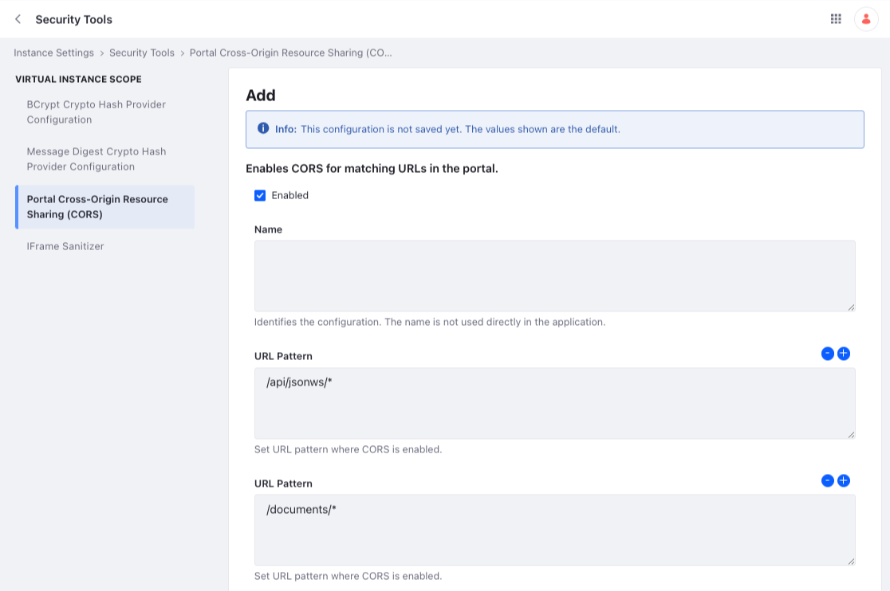
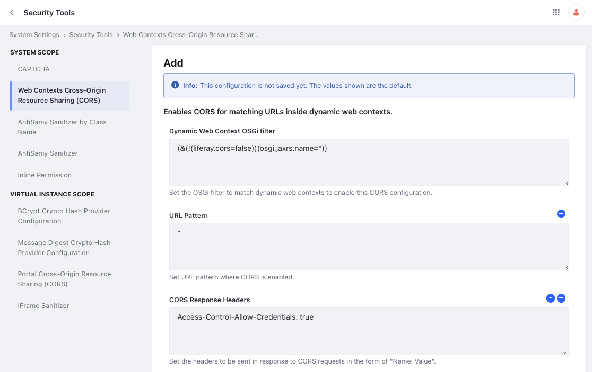

# Setting Up CORS

CORS stands for Cross-Origin Resource Sharing. An Origin is a web server at a different domain, and a Resource is some asset stored on the server, like an image, PDF, or HTML file. Sometimes you must request resources stored on another origin. This is called a cross-origin request, and web servers have policies to allow or deny such requests.

For example, browsers themselves don't allow cross-origin AJAX-style requests from scripts to help mitigate [cross-site scripting (XSS)](https://owasp.org/www-community/attacks/xss/) attacks. These APIs follow a *same origin* policy. But for certain resources, it can be convenient to allow Liferay DXP to serve them to different origins.

For example, if you manage images in Documents & Media, you may want to allow cross-origin requests for them. You can enable CORS for matching URLs in Liferay DXP or for JAX-RS application resources.

## Enabling CORS for Liferay DXP Services

To access these settings,

1. Open the *Global Menu* () and navigate to *Control Panel* &rarr; *Instance Settings*.

1. Go to *Security* &rarr; *Security Tools* &rarr; *Portal Cross-Origin Sharing (CORS)*:

1. Click *Add* to create a configuration entry.

1. Fill out the fields on the form.

1. Click *Save*.

### Portal CORS Configuration Reference

| Configuration             | Description                                                                                                                                                                                                                                                                                                                                                                                       |
| :------------------------ | :------------------------------------------------------------------------------------------------------------------------------------------------------------------------------------------------------------------------------------------------------------------------------------------------------------------------------------------------------------------------------------------------ |
| **Enabled**               | Check this box to enable the entry.                                                                                                                                                                                                                                                                                                                                                               |
| **Name**                  | Give the configuration entry a name.                                                                                                                                                                                                                                                                                                                                                              |
| **URL Pattern**           | Use the Plus button to add as many patterns as you need. Define patterns that match URLs to the resources you want to share. For example, if you have many attachments in the Knowledge Base application, you could define this pattern:   `/knowledge_base/*`   This would define resources stored in the Knowledge Base as applicable to the policy you set in the response header below. |
| **CORS Response Headers** | Use the Plus button to add as many headers as you need. Define policies for any of the [CORS headers](https://developer.mozilla.org/en-US/docs/Web/HTTP/Headers#CORS) here.                                                                                                                                                                                                                       |

You can also use a configuration file <!-- future link required --> to configure CORS.

!!! note
    There's also a Portal Cross-Origin Resource Sharing (CORS) entry under the Virtual Instance Scope in System Settings. This contains the Default Portal CORS Configuration that's already enabled for virtual instances.

## Enabling CORS for JAX-RS Applications

To access these settings,

1. Open the *Global Menu* () and navigate to *Control Panel* &rarr; *System Settings*.

1. Go to *Security* &rarr; *Security Tools* &rarr; *Web Contexts Cross Resource Origin Sharing (CORS)*:

1. Click *Add* to create a configuration entry.

1. Fill out the fields on the form. When finished, click *Save*.

   

### JAX-RS CORS Configuration Reference

| Configuration                       | Description                                                                                                                                                                                                                                                                                                                                                                                                                                                                                                    |
| :---------------------------------- | :------------------------------------------------------------------------------------------------------------------------------------------------------------------------------------------------------------------------------------------------------------------------------------------------------------------------------------------------------------------------------------------------------------------------------------------------------------------------------------------------------------- |
| **Dynamic Web Context OSGi Filter** | Define an LDAP-style [filter](https://osgi.org/specification/osgi.cmpn/7.0.0/service.http.whiteboard.html) to define which JAX-RS whiteboard applications the CORS headers in this entry apply to. This is the default filter:   `(&(!(liferay.cors=false))(osgi.jaxrs.name=*))`   It applies CORS headers to all deployed JAX-RS whiteboard applications without a `liferay.cors=false` property. This helps during development, but in production you should use the narrowest configuration possible. |
| **URL Pattern**                     | Use the Plus button to add as many patterns as you need. Define patterns that match URLs to the web services you want to access.                                                                                                                                                                                                                                                                                                                                                                               |
| **CORS Response Headers**           | Use the Plus button to add as many headers as you need. Define policies for any of the [CORS headers](https://developer.mozilla.org/en-US/docs/Web/HTTP/Headers#CORS) here.                                                                                                                                                                                                                                                                                                                                    |

JAX-RS<!-- future link required --> developers can use the `@CORS` annotation to set policies for their deployed applications.

## Related Topics

- [Securing Liferay](../../securing-liferay.md)
- [Introduction to Securing Web Services](../securing-web-services.md)
