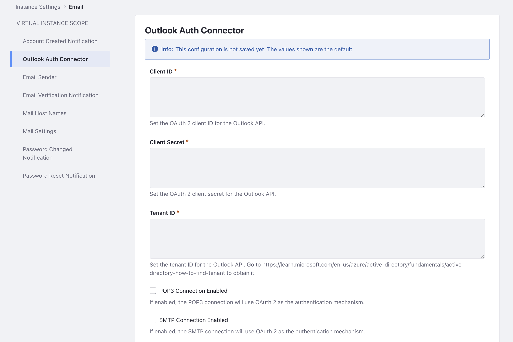

# Configuring Microsoft Office 365 with OAuth

{bdg-secondary}`Liferay DXP 7.4 U79+/Liferay Portal 7.4 GA79+`

Connect your Microsoft email service to Liferay with the use of OAuth 2.0 authorization. Note, Microsoft requires OAuth2 and no longer supports basic authentication (i.e. connecting with email address and password).

## App Registration in Microsoft

```{note}
For additional support or troubleshooting with this step, contact Microsoft.
```

1. [Create a new application in Microsoft Azure](https://learn.microsoft.com/en-us/azure/active-directory/develop/quickstart-register-app).

1. [Add a client secret for your application](https://learn.microsoft.com/en-us/azure/active-directory/develop/quickstart-register-app#add-a-client-secret).

    Take note of your application's `client ID` (A.K.A `application ID`), `client secret`, and `tenant ID` (A.K.A. `directory ID`). These values will be used in the steps below.

1. [Add POP and IMAP API permissions for the application](https://learn.microsoft.com/en-us/exchange/client-developer/legacy-protocols/how-to-authenticate-an-imap-pop-smtp-application-by-using-oauth#add-the-pop-and-imap-permissions-to-your-aad-application).

## Mail Configuration in Liferay

1. Navigate to _Global Menu_ () &rarr; _Control Panel_ &rarr; _Instance Settings_.

1. Click _Email_.

1. In the left navigation, click _Mail Settings_. Set the following configuration.

   * Enable POP Server Notifications: checked
   * Incoming POP Server: `outlook.office365.com`
   * Incoming Port: `995`
   * Use a Secure Network Connection: checked
   * User Name: Your username associated with the Microsoft application
   * Outgoing SMTP Server: `smtp.office365.com`
   * Outgoing Port: `587`
   * Enable StartTLS: checked
   * User Name: Your username associated with the Microsoft application

    Click _Save_.

1. In the left navigation, click _Outlook Auth Connector_. Paste in the client ID, client secret, and tenant ID into each input box.

    

1. Check the box for _POP3 Connection Enabled_ and for _SMTP Connection Enabled_.

Liferay is now configured with your Microsoft email service.