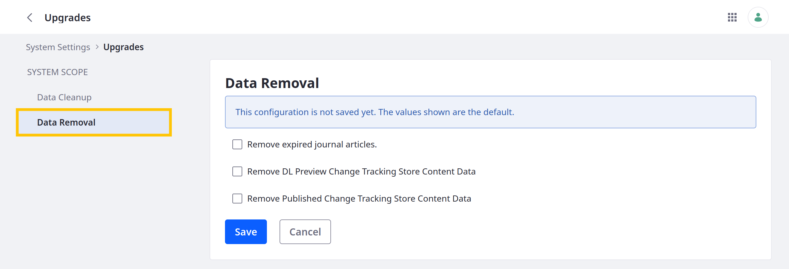

# Data Removal

{bdg-secondary}`Available 7.4+`

Use the Data Removal tool to erase unnecessary application data that's accumulated over time. Data for publications and expired journal articles can be removed with the tool.

To remove data,

1. Open the *Global Menu* () and go to *Control Panel* &rarr; *System Settings* &rarr; *Upgrades* &rarr; *Data Removal*.

   

1. Select the data to remove:

   * Expired Journal Articles

   * Document Library Preview Change Tracking Store Content Data (Publications)

   * Published Change Tracking Store Content Data (Publications)

1. Click *Save*.

Liferay immediately removes the selected data.

## Additional Information

* [Data Cleanup](./data-cleanup.md)
* [Upgrading Via Docker](../upgrade-basics/upgrading-via-docker.md)
* [Using the Upgrade Tool](../upgrade-basics/using-the-database-upgrade-tool.md)
