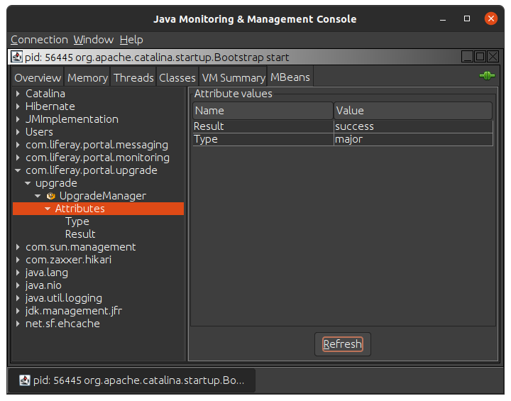

# Monitoring Upgrades with MBeans

{bdg-secondary}`Available Liferay DXP 7.4 U76 / Liferay Portal 7.4 GA76`

When doing upgrades upon startup, the upgrade process can be monitored with MBeans through a JVM management tool (e.g. JConsole). To enable MBeans monitoring for Liferay, set `upgrade.database.auto.run=true` in your [portal properties](../../reference/portal-properties.md).

In your JVM management tool, create a new connection and select Liferay's java process (e.g. `org.apache.catalina.startup.Bootstrap`).

Under the MBeans tab, select the `com.liferay.portal.upgrade` category. Select `Attributes`. Two attribute keys are available: `Result` and `Type`.

The following values are possible for `Result`:

* `pending`: The upgrade process has not started yet.
* `running`: The upgrade process is being executed.
* `failure`: The upgrade process finished and some errors were logged during the upgrade process.
* `unresolved`: The upgrade process finished and no errors were logged, but it was not possible to check the completeness of the upgrades by using OSGi. There may be pending upgrades and/or unresolved dependencies.
* `warning`: The upgrade process finished and no errors were logged, nor did any OSGi checks fail. But some warnings has been logged during the upgrade.
* `success`: The upgrade process finished and no errors or warnings were logged during the upgrade process.

The following values are possible for `Type`:

* `pending`: The upgrade has not finished yet.
* `no upgrade`: No upgrade processes have been executed at the end of the upgrade process.
* `major`: At least one upgrade involving a major change of schemaVersion.
* `minor`: At least one upgrade involving a minor change of schemaVersion has been executed.
* `micro`: At least one upgrade involving a micro change of schemaVersion has been executed.

Note, the information provided by MBeans is updated in real-time and is only available through upgrades performed at startup. Once the final values have been displayed at the end of the startup upgrade, it remains static. 

## Related Topics

[Using the Upgrade Database Tool](../upgrade-basics/using-the-database-upgrade-tool.md)
[Upgrade Report](./upgrade-report.md)
[Database Upgrade Tool Reference](./database-upgrade-tool-reference.md)
[Upgrade Log Context](./upgrade-log-context.md)
