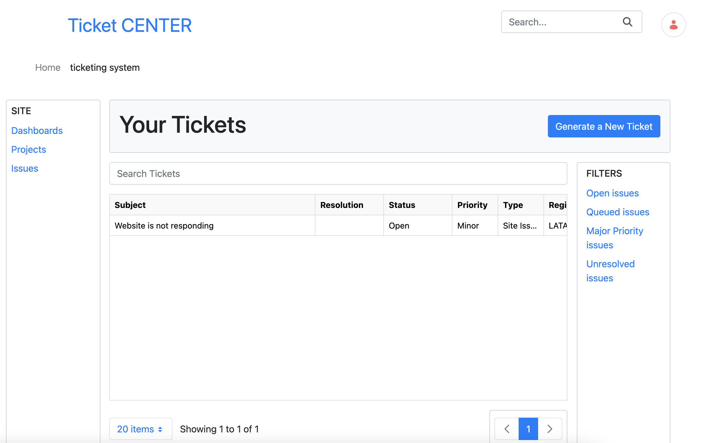

---
toc:
  - ./building-a-custom-ticketing-system/defining-a-custom-data-schema.md
  - ./building-a-custom-ticketing-system/applying-a-custom-theme.md
  - ./building-a-custom-ticketing-system/deploying-a-custom-application.md
  - ./building-a-custom-ticketing-system/implementing-a-documentation-referral-system.md
  - ./building-a-custom-ticketing-system/ticket-management-with-cron-jobs.md
uuid: e0218ddf-a7b1-4cc2-8f5d-ccc930d0704c
taxonomy-category-names:
- Development and Tooling
- Client Extensions
- Liferay Self-Hosted
- Liferay SaaS
---
# Building a Custom Ticketing System

Liferay makes it easy for you to build digital solutions. For example, you can create a custom ticketing application with the styling and features needed for your business.



Here, you'll learn how custom ticketing system works. You'll learn how to

* Define a custom data schema
* Apply a custom CSS theme
* Deploy a custom application
* Implement a documentation referral system

Each of these components are deployable through the use of [client extensions](../../building-applications/client-extensions.md). The configuration of each client extension is defined by its [`client-extension.yaml`](../../building-applications/client-extensions/working-with-client-extensions.md#configuring-client-extensions) file.

## Prerequisites

Before starting, download the appropriate files and set up your system.

1. To download the example workspace, run this command:

   ```bash
   curl -o com.liferay.ticket.workspace-latest.zip https://repository.liferay.com/nexus/service/local/artifact/maven/content\?r\=liferay-public-releases\&g\=com.liferay.workspace\&a\=com.liferay.ticket.workspace\&\v\=LATEST\&p\=zip
   ```

1. On the command line, navigate to the `liferay-ticket-workspace` folder.

   ```bash
   cd liferay-ticket-workspace
   ```

1. Generate a local Liferay bundle.

   ```bash
   ./gradlew initBundle
   ```

1. Run the Liferay bundle.

   ```bash
   ./bundles/tomcat-9.0.73/bin/catalina.sh run
   ```

1. Sign in to Liferay at <http://localhost:8080> using the email address _test@liferay.com_ and the password _test_. When prompted, change the password to _learn_.

1. Build all the sample projects.

   ```bash
   ./gradlew build
   ```

In the first step, you'll define a custom data schema.

[Let's Go!](./building-a-custom-ticketing-system/defining-a-custom-data-schema.md)
