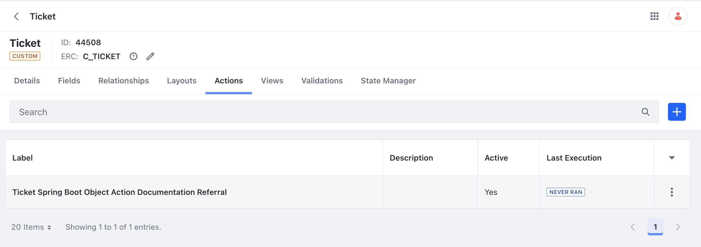

# Implementing a Documentation Referral System

The ticketing system can be further enhanced with a documentation referral system. The system searches automatically for relevant documentation based on a ticket's content and description, thereby enhancing the customer support workflow.

Follow the steps to enable and deploy the referral system:

1. Navigate to the previous `liferay-ticket-batch-object-definition` client extension's `/batch/object-defintion.batch-engine-data.json` file. In line 36, under the `objectActions` section, change the `active` value from `false` to `true`.

1. Redeploy the `liferay-ticket-batch-object-definition` client extension with the following command:

   ```bash
   ./gradlew :client-extensions:liferay-ticket-batch-object-definition:deploy
   ```

   Note, the [object action](../../objects/creating-and-managing-objects/actions.md) can also be enabled from the UI. In Liferay, navigate to _Control Panel_ &rarr; _Objects_. Click on the _Ticket_ object, and click the _Actions_ tab. See the action is `active`.

   

1. Next, run the following command:

   ```bash
   ./gradlew :client-extensions:liferay-ticket-etc-spring-boot:deploy
   ```

   Check your logs to verify successful deployment.

1. Next, run the following command to start the spring boot application:

   ```bash
   ./gradlew :client-extensions:liferay-ticket-etc-spring-boot:bootRun
   ```

   The documentation referral system is now running.

1. Navigate back to the ticketing system site page. Click _Generate a New Ticket_. A new ticket is generated.

1. Navigate to _Global Menu_ &rarr; _Control Panel &rarr; _J3Y7 Tickets_. Scroll to the right of the list of tickets. Click _Options_ () for the ticket that was just generated and click _View_.

   Scroll down to the suggestions field. See that the referral system has included links to relevant documentation.

   

## Examine the Referral System Code

The documentation referral system is a [microservice](../../client-extensions/microservice-client-extensions.md) type client extension. Specifically, this sample is a Spring Boot application that is built with `BootJar`. The `assemble` block section of the `client-extension.yaml` identifies this as follows:

assemble:
    - fromTask: bootJar

See [Assembling Client Extensions](../../client-extensions/working-with-client-extensions#assembling-client-extensions) to learn more.

Microservice client extensions require an OAuth2 user agent configuration to interact with Liferay. Therefore the `client-extension.yaml` file includes both a `oAuthApplicationUserAgent` type client extension along with a `objectAction` type client extension.

The `liferay-ticket-etc-spring-boot-oauth-application-user-agent` client extension creates an OAuth2 application within Liferay for the referral system application to use for authorization. It is defined as follows:

```yaml
liferay-ticket-etc-spring-boot-oauth-application-user-agent:
    .serviceAddress: localhost:58081
    .serviceScheme: http
    name: Liferay Ticket Etc Spring Boot OAuth Application User Agent
    scopes:
        - C_J3Y7Ticket.everything
    type: oAuthApplicationUserAgent
```

Note how the `C_J3Y7Ticket.everything` headless API is given access. The `serviceAddress` parameter defines where the service runs locally.

Next the `liferay-ticket-etc-spring-boot-object-action-ticket` client extension is a `objectAction` type client extension that triggers the microservice code when the object action occurs. It is defined as follows:

```yaml
liferay-ticket-etc-spring-boot-object-action-ticket:
    name: Liferay Ticket Etc Spring Boot Object Action Ticket
    oAuth2ApplicationExternalReferenceCode: liferay-ticket-etc-spring-boot-oauth-application-user-agent
    resourcePath: /object/action/ticket
    type: objectAction
```

Note, the `resourcePath` parameter defines the endpoint at which the microservice is running. The `oAuth2ApplicationExternalReferenceCode` parameter references the previous OAuth2 application configuration.

See [Object Action Yaml Configuration](../../client-extensions/microservice-client-extensions/object-action-yaml-configuration-reference.md) for an explanation of each property.

The relevant Spring Boot files for the application are contained in the `/src` folder. A full explanation of the Java code is beyond the scope of this tutorial, but there are a few things to note:

* In the `ObjectActionTicketRestController.java` file, the `@PostMapping` annotation matches the resource path referenced in the YAML file above. When a new ticket object is created, the object action triggers the microservice at this path and the referral results are returned to Liferay.

* The referral search logic also resides in this `ObjectActionTicketRestController.java` file. In the logic, relevant articles from [learn.liferay.com](https://learn.liferay.com) are found and added to the ticket object entry.

Next: [Ticket Management with Cron Jobs](./ticket-management-with-cron-jobs.md).

## Relevant Concepts

* [Developing a Java Web Application](../developing-a-java-web-application.md)
* [Microservice Client Extensions](../../integrating-microservices.md)
