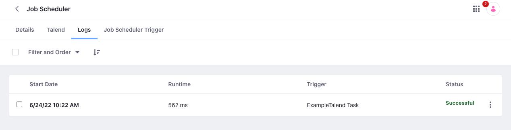

# Job Scheduler UI Reference

## Job Scheduler Triggers

The Job Scheduler Triggers tab lists all tasks added to the Liferay instance.

Click *Add* () to create a Job Scheduler Task using a Job Scheduler Task Executor template.

Once created, the following fields are displayed for each Job Scheduler Task:

| Field | Description |
| :--- | :--- |
| Name | The name of the Job Scheduler task |
| Task Executor Type | The Job Scheduler Task Executor template used to create the task |
| System | Indicates whether it is a system task |
| Create Date | Creation date of the Job Scheduler task |
| Next Run Date | The next time the Job Scheduler task is scheduled to run |
| Status | The Status of the Job Scheduler task's most recent execution (e.g., *Successful*, *Failed*) |
| Run Now | Button for manually executing the Job Scheduler task |

From here, click a Job Scheduler task to access the following details and configuration options.

### Details Tab

| Field | Description |
| :--- | :--- |
| Name | View/Edit the Job Scheduler task's name |
| Settings Editor | Code editor for defining properties that are injected into the Job Scheduler task at runtime |

### Talend Tab (For Talend Job Scheduler Tasks Only)

Upload a Talend *Job Archive* `.zip` file to your Job Scheduler task.

### Logs Tab

View and remove *Logs* for the Job Scheduler task.
Includes *Start Date*, *Runtime*, *Trigger*, and *Status*.

| Field | Description |
| :--- | :--- |
| Start Date | Timestamp for when the execution started |
| Runtime | The duration of the execution |
| Trigger | The name of the Job Scheduler task that was executed |
| Status | The status of the execution (e.g., *Successful*, *Failed*) |

Click on a Log entry to also see any errors and output from the execution.

### Job Scheduler Trigger Tab

Configure the Job Scheduler Trigger to schedule task executions.

| Field | Description |
| :--- | :--- |
| Active | Determines whether the configured schedule for execution is active or inactive |
| Task Execution Cluster Mode | Determines whether the Job Scheduler task is executed on a *Single Node* or *All Nodes* in a clustered environment |
| Overlap Allowed | Determines whether concurrent execution of Job Scheduler Tasks are allowed |
| Time Zone | Define a time zone independent of your instance time zone for the execution of Job Scheduler tasks. This field is available starting from Liferay DXP 7.4 U35+/GA35+. |
| Cron Expression | Defines time intervals for automatically executing Job Scheduler tasks |
| Start Date | Defines when the Job Scheduler task begins to be executed according to the cron schedule; set to current date and time by default |
| Never End | Determines whether the Job Scheduler task's automatic execution ever ends; checked by default |
| End Date | Defines when the Job Scheduler task is no longer automatically executed; disabled if *Never End* is checked |

## Scheduled Jobs

This page compiles a list of all jobs scheduled across the Liferay instance using the `MessageListener` interface.

| Field | Description |
| :--- | :--- |
| Name | The full name of the scheduled job |
| System | Indicates whether it is a system job |
| Next Run Date | The next time the job is scheduled to run |
| Status | The status of the job (e.g., `NORMAL`, `PAUSED`) |
| Run Now | Button to manually execute the job |
| Pause/Resume | Option to *Pause*/*Resume* the job, accessible via the Actions button |

## Related Topics

* [Using Job Scheduler](./using-job-scheduler.md)
* [Understanding the Job Scheduler Framework](./understanding-the-job-scheduler-framework.md)
