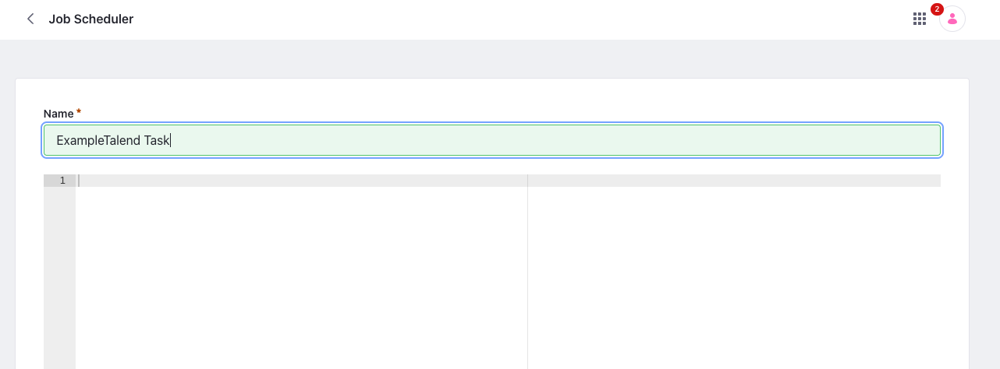
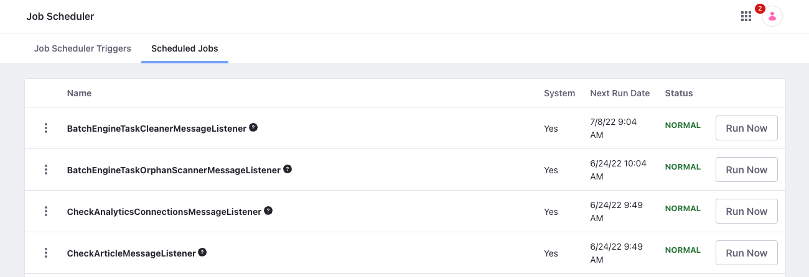

# Using Job Scheduler

[Job Scheduler](https://github.com/liferay/liferay-portal/tree/master/modules/apps/dispatch) is a flexible framework built on Liferay's scheduler engine for running and scheduling business logic. This framework uses the `DispatchTaskExecutor` interface to define templates with custom logic that you can use to [create tasks](#adding-a-new-job-scheduler-task) via the Control Panel. You can configure its behavior and execution [schedule](#scheduling-the-job-scheduler-task) after creating the Job Scheduler task.

!!! important
    Only administrators can view the Job Scheduler application. This means that new roles can't view it, regardless of their assigned permissions, unless they also have the Administrator role.

Job Scheduler provides a convenient UI for viewing and managing all instance [jobs scheduled using the `MessageListener` interface](#viewing-and-managing-scheduled-jobs).

!!! note
    When deciding whether to use Job Scheduler or `MessageListener` to schedule instance jobs, consider the following Job Scheduler benefits.

    Job Scheduler tasks are more flexible than jobs scheduled using `MessageListener`, because you can make changes to the tasks at runtime through the Job Scheduler UI. Changes to `MessageListener` jobs must be coded, compiled, and redeployed.

    The Job Scheduler UI also provides a more complete overview of each Job Scheduler task's execution properties (e.g., cron expression, start/end date, cluster mode) and execution history. This information is not provided in the UI for `MessageListener` jobs.

## Adding a New Job Scheduler Task

1. Open the *Global Menu* (), click *Control Panel*, and go to *Configuration* &rarr; *Job Scheduler*.

1. Click the *Add* button () and select the desired template for your Job Scheduler Task. The selected template defines the Task's essential logic.

   Each template is an implementation of the `DispatchTaskExecutor` interface, and each Job Scheduler task is an instance of the selected template. See [Understanding the Job Scheduler Framework](./understanding-the-job-scheduler-framework.md) for more information about how it works.

   

   !!! note
       Liferay DXP provides a variety of Job Scheduler task templates, while Liferay Portal only includes the Talend Job Scheduler Task Executor.

       You can also create your own templates. See [Creating a New Job Scheduler Task Executor](./creating-a-new-job-scheduler-task-executor.md) to learn how.

1. Enter a name for the Job Scheduler task.

1. (Optional) Use the settings editor to define properties for the Job Scheduler task that are injected at runtime.

   You can use these settings to fine-tune the execution flow and more.

   All settings added in this way are soft-coded, so you can configure your Job Scheduler tasks without having to edit and redeploy the Executor's code.

   !!! tip
       You can create multiple instances of the same Job Scheduler Task Executor and modify their properties and behavior using the settings editor.

1. Click *Save* to create a new Job Scheduler task for the selected template.

   

All Job Scheduler tasks added to an instance appear on the Job Scheduler page. From here, you can click the task to edit its settings or configure its Job Scheduler Trigger to schedule when it runs. You can also click *Run Now* to execute the task manually. The Logs tab shows a record of all executions for the selected Job Scheduler task.

## Scheduling the Job Scheduler Task

By default, all Job Scheduler task triggers are inactive at creation. Follow these steps to activate a Task's Job Scheduler Trigger and schedule when it runs:

1. Go to the *Job Scheduler Triggers* tab in the Job Scheduler page and click the desired task.

1. Click the *Job Scheduler Trigger* tab and configure the fields below.

1. Click *Save*.

   

**Active**: Activate or deactivate the Job Scheduler Trigger. To activate the trigger, you must enter a valid cron expression. When active, the Job Scheduler task executes according to the set schedule. Deactivating it prevents the Trigger from running.

**Task Execution Cluster Mode**: Determine whether the Job Scheduler task is run on one or all nodes in a clustered environment.

**Overlap Allowed**: Enable or disable concurrent execution for the Job Scheduler task. When enabled, new task executions are initiated according to the set schedule, regardless of whether a previous execution is still running.

**Time Zone**: Select a time zone for the execution of the Job Scheduler task. This is independent of the time zone of your Liferay instance. This field is available starting from Liferay DXP 7.4 U35+/GA35+.

**Cron Expression**: Enter a valid Cron expression to determine when the Job Scheduler task is executed.

**Start Date**: Determine the Job Scheduler task's start date.

**End Date**: Use the checkbox to determine when the Job Scheduler task is no longer executed by the cron schedule. It is set to the current date and time by default.

The Job Scheduler task now automatically starts and stops at your specified date/time and according to the cron intervals.

## Setting Up a Talend Job Scheduler Task

Talend is open source data integration software for defining custom data integration jobs. These jobs can be exported as a `.zip` archive and uploaded to any Job Scheduler task that uses the Talend executor template. Once uploaded, the Talend data integration job is executed whenever the Job Scheduler task is run.

Follow these steps to upload a Talend *Job Archive* to a Job Scheduler task:

1. Add a new Job Scheduler task to your instance using the Talend executor template. See [Adding a New Job Scheduler Task](#adding-a-new-job-scheduler-task) for detailed instructions.

1. Go to the *Job Scheduler Triggers* tab in the Job Scheduler page, and click on the desired task.

1. Click the *Talend* tab.

   

1. Upload the ZIP file for your Talend *Job Archive*.

1. Click *Save*.

## Viewing and Managing Scheduled Jobs

The Job Scheduler Page's *Scheduled Jobs* tab also lists all jobs scheduled on the Liferay instance using the `MessageListener` interface. Here you can view general details for each job (e.g., name, status), as well as manually initiate runs or pause/resume jobs individually.

## Related Topics

- [Job Scheduler UI Reference](./job-scheduler-ui-reference.md)
- [Understanding the Job Scheduler Framework](./understanding-the-job-scheduler-framework.md)
- [Creating a New Job Scheduler Task Executor](./creating-a-new-job-scheduler-task-executor.md)
