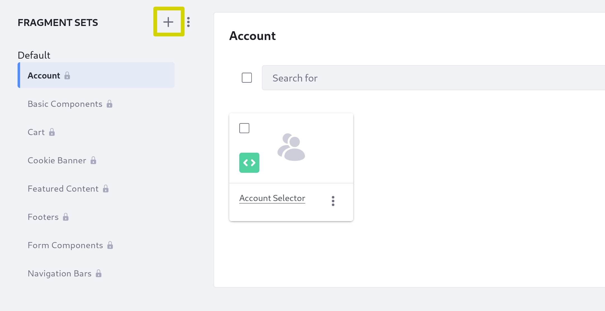
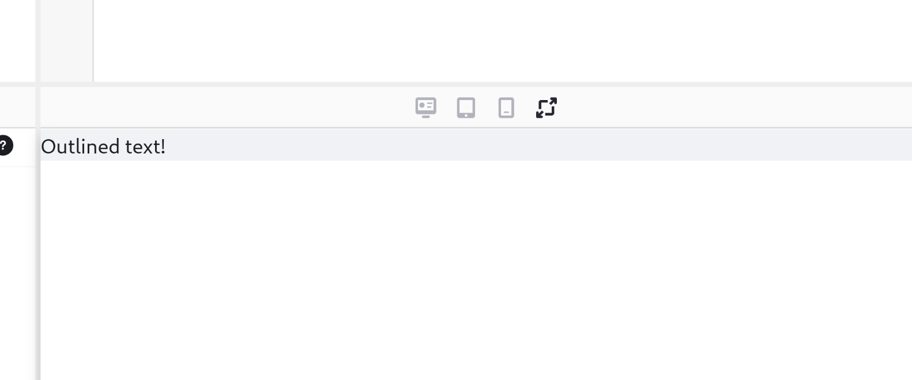

---
toc:
  - ./bundling-resources-in-a-javascript-import-map-entry-client-extension/javascript-import-map-entry-yaml-configuration-reference.md
taxonomy-category-names:
- Development and Tooling
- Frontend Client Extensions
- Liferay Self-Hosted
- Liferay SaaS
uuid: 751942b6-8d8b-4658-b4d4-9a835cd7144e
---
# Bundling Resources in a JavaScript Import Map Entry Client Extension

{bdg-secondary}`Liferay 7.4 2023.Q1+/GA92+`

JavaScript import map entry client extensions make JavaScript code or resources available to any page rendered in a Liferay instance. When you need to include JavaScript code or resouces from multiple locations, you can bundle them in one client extension in your Liferay workspace.

Define and export code in the client extension with a specifier that the [import map](https://developer.mozilla.org/en-US/docs/Web/HTML/Element/script/type/importmap) in Liferay provides to anything that imports it. For example, you can bundle a library like [jQuery](https://jquery.com/) into the client extension, and then import it into a fragment's code to use it.

Start making JavaScript import map entry client extensions with one from the [sample workspace](https://github.com/liferay/liferay-portal/tree/master/workspaces/liferay-sample-workspace).

## Prerequisites

To start developing client extensions,

1. Install Java (JDK 8 or JDK 11).

    !!! note
        Check the [compatibility matrix](https://help.liferay.com/hc/en-us/articles/4411310034829-Liferay-DXP-7-4-Compatibility-Matrix) for supported JDKs, databases, and environments. See [JVM Configuration](https://learn.liferay.com/web/guest/w/dxp/installation-and-upgrades/reference/jvm-configuration) for recommended JVM settings.

1. Download and unzip the sample workspace:

    ```bash
    curl -o com.liferay.sample.workspace-latest.zip https://repository.liferay.com/nexus/service/local/artifact/maven/content\?r\=liferay-public-releases\&g\=com.liferay.workspace\&a\=com.liferay.sample.workspace\&\v\=LATEST\&p\=zip
    ```

    ```bash
    unzip com.liferay.sample.workspace-latest.zip
    ```

Now you have the tools to deploy a client extension bundling multiple JavaScript resources.

## Examine and Add to the JavaScript Exports

The JavaScript import map entry client extension is in the sample workspace's `client-extensions/liferay-sample-js-import-maps-entry/` folder. It's defined in the `client-extension.yaml` file:

```yaml
liferay-sample-js-import-maps-entry:
    bareSpecifier: jquery
    name: Liferay Sample JS Import Maps Entry
    type: jsImportMapsEntry
    url: jquery.*.js
```

It also contains the `assemble` block:

```yaml
assemble:
    - from: build/static
      into: static
```

This specifies that every file created in the `build/static/` folder should be included as a static resource in the built client extension `.zip` file. The `liferay-sample-js-import-maps-entry` example uses [webpack](https://webpack.js.org/) (configured in the included `webpack.config.js` file) to define the exported entry and its output location. It imports jQuery, which provides various utilities for manipulating HTML via JavaScript.

In the `assets/` folder, the `index.js` file contains this JavaScript code:

```js
import jquery from 'jquery';

export default jquery;
```

This code uses the jQuery library and exports it using `default`. Exporting it here allows it to be used in Liferay when you import the defined `bareSpecifier` in `client-extension.yaml`.

You can also add another export that can be accessed using the same specifier. Add this JavaScript code to export a new function that doubles a value:

```js
export function doubleValue(value) {
    return value * 2;
}
```

Now deploy the client extension.

## Deploy the Import Map Entry

```{include} /_snippets/run-liferay-portal.md
```

Once Liferay starts, run this command from the client extension's folder in the sample workspace:

```bash
../../gradlew clean deploy -Ddeploy.docker.container.id=$(docker ps -lq)
```

This builds your client extension and deploys the zip to Liferay's `deploy/` folder.

!!! note
    The command used to deploy your client extension changes if you use a self-hosted instance outside of Docker, Liferay PaaS, or Liferay SaaS. See [Deploying to Your Liferay Instance](../client-extensions/working-with-client-extensions.md#deploying-to-your-liferay-instance) for more information.

!!! tip
    To deploy all client extensions in the workspace simultaneously, run the command from the `client-extensions/` folder.

Confirm the deployment in your Liferay instance's console:

```
STARTED liferaysamplejsimportmapsentry_7.4.13 [1459]
```

Now that you have imported a new entry into the JavaScript import map, create a new fragment to use it.

## Add a Fragment Importing the Code

1. On any site in your running Liferay instance, click *Design* &rarr; *Fragments*.

1. Click *Add* () to add a new fragment set.

    

1. Enter `FS` as the name and click *Save*.

1. Click *New* to add a new fragment.

1. With *Basic Fragment* selected, click *Next*.

1. In the Add Fragment modal, enter *Outlined Text* as the name and click *Add*.

1. On the fragment design screen, click into the *HTML* editor and add a paragraph (`<p>`) tag in the existing `div` with text to be outlined:

    ```html
    <div class="fragment_1">
        <p>
            Outlined text!
        </p>
    </div>
    ```

    The text appears in the preview panel in the lower-right corner.

    

1. Click into the *JavaScript* editor and add this code to import from your client extension:

    ```js
    const jq = await import('jquery'); // dynamic import

    var outline = jq.doubleValue(2) + "px solid blue";

    jq.default("div.fragment_1").css("border", outline);
    ```

    This code imports the code from your client extension into the `jq` constant. Then it uses your exported `doubleValue` function to double the number of pixels in an outline string, and finally uses [jQuery's `css` function](https://api.jquery.com/css/) to add an outline using that string with the `default` export.

    The text now appears in the preview panel with a 4-pixel wide, blue outline.

    ![The fragment's JavaScript uses your client extension to use two functions to define and add a blue border to the tebundling-resources-in./using-a-javascript-map-entry-client-extension/images/03.png)

    !!! tip
        If the outline does not appear correctly, make sure the `div` element's class name in the HTML editor (e.g., `fragment_1`) matches the code you copied into the JavaScript editor.

Now you can publish the fragment and use it on any page.

You have successfully used a JavaScript import map entry client extension in Liferay. Next, learn about [other types of frontend client extensions](../customizing-liferays-look-and-feel.md).

## Related Topics

* [Frontend Data Set Cell Renderer YAML Reference](./using-a-frontend-data-set-cell-renderer-client-extension/frontend-data-set-cell-renderer-yaml-reference.md)
* [Customizing Liferay's Look and Feel](../customizing-liferays-look-and-feel.md)
* [Working with Client Extensions](../client-extensions/working-with-client-extensions.md)