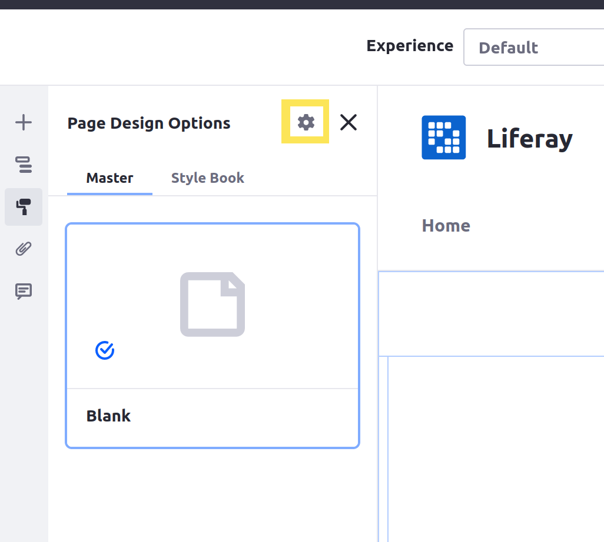

# Using a CSS Client Extension

{bdg-secondary}`Liferay 7.4+`

CSS client extensions introduce new CSS styling to pages. A deployed CSS client extension on a page adds to the page’s existing styling, including theme and style book settings. Start with a client extension (from the [sample workspace](https://github.com/liferay/liferay-portal/tree/master/workspaces/liferay-sample-workspace)).

## Prerequisites

To start developing client extensions,

1. Install Java (JDK 8 or JDK 11).

   ```{note}
   Check the [compatibility matrix](https://help.liferay.com/hc/en-us/articles/4411310034829-Liferay-DXP-7-4-Compatibility-Matrix) for supported JDKs, databases, and environments. See [JVM Configuration](../../../../installation-and-upgrades/reference/jvm-configuration.md) for recommended JVM settings.
   ```

1. Download and unzip the sample workspace:

   ```bash
   curl -o com.liferay.sample.workspace-latest.zip https://repository.liferay.com/nexus/service/local/artifact/maven/content\?r\=liferay-public-releases\&g\=com.liferay.workspace\&a\=com.liferay.sample.workspace\&\v\=LATEST\&p\=zip
   ```

   ```bash
   unzip com.liferay.sample.workspace-latest.zip
   ```

Now you have the tools to deploy your first CSS client extension.

## Examine and Modify the Client Extension

The CSS client extension is in the sample workspace's `client-extensions/liferay-sample-global-css/` folder. It's defined in the `client-extension.yaml` file:

```yaml
liferay-sample-global-css:
    name: Liferay Sample Global CSS
    type: globalCSS
    url: global.css
```

The client extension has the ID `liferay-sample-global-css` and contains the key configurations for a CSS client extension, including the `type` and the CSS file to add. See the [CSS YAML configuration reference](../css-yaml-configuration-reference.md) for more information on the available properties.

It also contains the `assemble` block:

```yaml
assemble:
    - from: assets
      into: static
```

This specifies that everything in the `assets/` folder should be included as a static resource in the built client extension `.zip` file. The CSS file in a CSS client extension is used as a static resource in Liferay.

The `assets/global.css` file contains this CSS:

```css
.logo::after {
   color: #0054f0;
   content: 'Liferay Sample Global CSS';
   margin-left: 2rem;
}
```

This modifies the color of the Liferay logo for the home page when the client extension is enabled.

Add CSS to modify the background color for buttons. Open the `global.css` file, add a declaration for the `.btn-primary` class, and specify the `background-color`:

```css
.btn-primary {
    background-color: purple;
}
```

Now deploy the client extension.

## Deploy the Client Extension to Liferay

```{include} /_snippets/run-liferay-portal.md
```

Once Liferay starts, run this command from the client extension's folder in the sample workspace:

```bash
../../gradlew clean deploy -Ddeploy.docker.container.id=$(docker ps -lq)
```

This builds your client extension and deploys the zip to Liferay's `deploy/` folder.

```{note}
To deploy your client extension to Liferay SaaS, use the Liferay Cloud [Command-Line Tool](https://learn.liferay.com/w/liferay-cloud/reference/command-line-tool) to run [`lcp deploy`](https://learn.liferay.com/w/liferay-cloud/reference/command-line-tool#deploying-to-your-liferay-cloud-environment).
```

```{tip}
To deploy all client extensions in the workspace simultaneously, run the command from the `client-extensions/` folder.
```

Confirm the deployment in your Liferay instance's console:

```
STARTED sample-global-css_1.0.0
```

Now that your client extension is deployed, configure Liferay to use it.

## Use the Client Extension on a Page

Configure a page in Liferay to use your deployed client extension:

1. On a page with at least one button, click the *Edit* (  ) at the top.

1. In the sidebar, navigate to the Page Design Options menu (  ) and click the *Configuration* icon () at the top of the menu.

   

1. In the CSS Client Extensions section toward the bottom of the page, click *Add CSS Client Extensions*.

   

1. Select your CSS client extension from the pop-up modal and click *Add*.

1. Click  *Save*.

Now your client extension is configured. In the page editor, the background color on the buttons is now the color your CSS specifies. To see your CSS applied on the page outside Edit mode, you must publish the page.


```{tip}
If the buttons on the page still show the default background color, do a hard refresh of the page to clear your browser's cache (`CTRL + SHIFT + R` for most browsers). If you change your client extension and redeploy it, you may need to remove it from the page and re-add it to see the changes.
```

## Next Steps

You have successfully used a CSS client extension in Liferay. Next, try deploying other client extension types.

* [Using a JS Client Extension](./using-a-javascript-client-extension.md)
