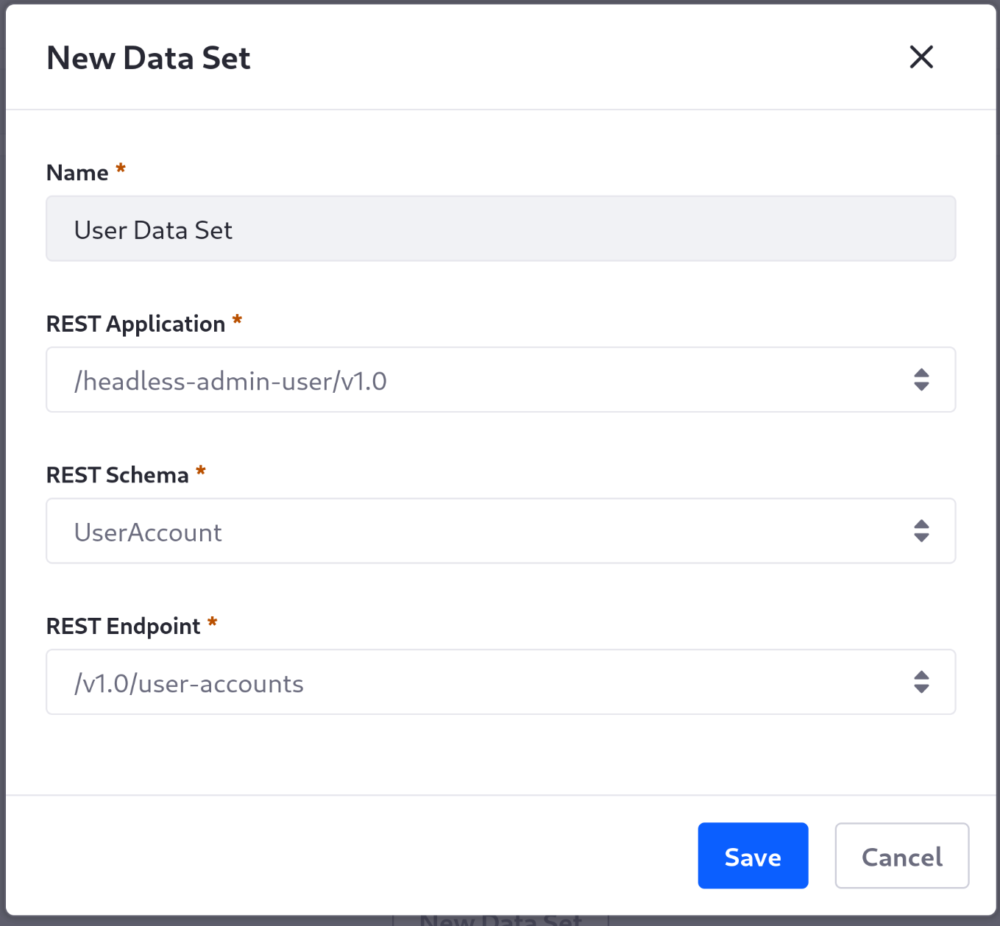
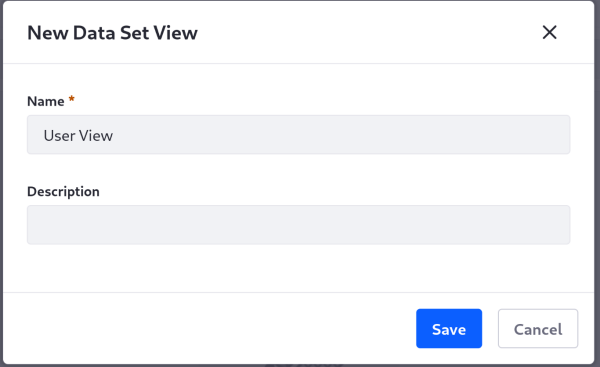
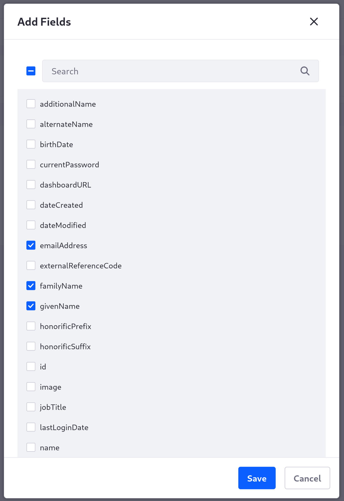
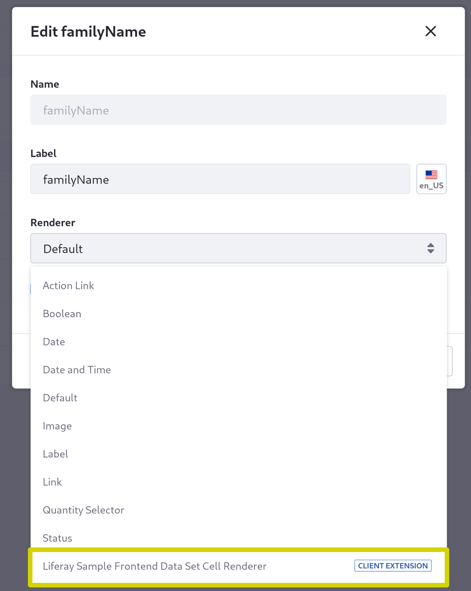
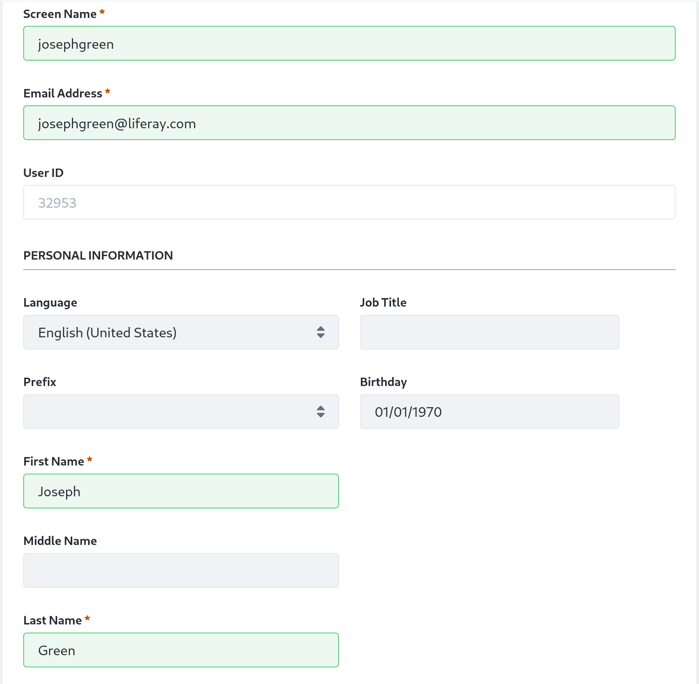
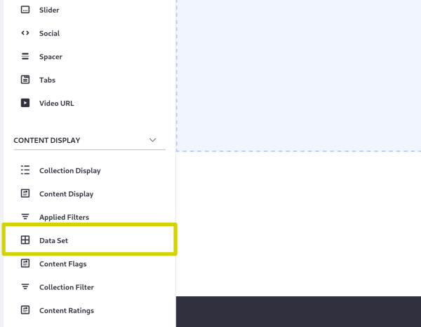
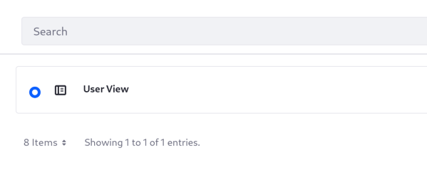
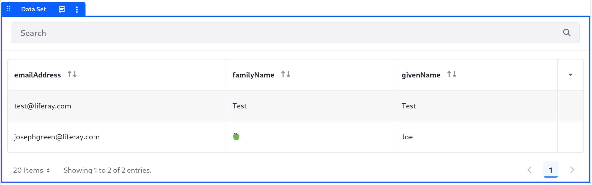

---
toc:
  - ./using-a-frontend-data-set-cell-renderer-client-extension/frontend-data-set-cell-renderer-yaml-reference.md
taxonomy-category-names:
- Development and Tooling
- Frontend Client Extensions
- Liferay Self-Hosted
- Liferay SaaS
uuid: 70f9b20d-c553-49eb-9b6a-7014b6f55501
---
# Using a Frontend Data Set Cell Renderer Client Extension

{bdg-secondary}`Liferay 7.4+`

You can use Frontend Data Set (FDS) cell renderer client extensions to customize the display for your [data set views](../data-sets/data-set-views.md). Use this type to process information in your data sets with a separately deployed function for the display. Start with a client extension from the [sample workspace](https://github.com/liferay/liferay-portal/tree/master/workspaces/liferay-sample-workspace).

## Prerequisites

1. Install a [supported version of Java](https://help.liferay.com/hc/en-us/articles/4411310034829-Liferay-DXP-Quarterly-Releases-Compatibility-Matrix).

   !!! note
       Check the [compatibility matrix](https://help.liferay.com/hc/en-us/articles/4411310034829-Liferay-DXP-7-4-Compatibility-Matrix) for supported JDKs, databases, and environments. See [JVM Configuration](https://learn.liferay.com/web/guest/w/dxp/installation-and-upgrades/reference/jvm-configuration) for recommended JVM settings.

1. Download and unzip the sample workspace:

   ```bash
   curl -o com.liferay.sample.workspace-latest.zip https://repository.liferay.com/nexus/service/local/artifact/maven/content\?r\=liferay-public-releases\&g\=com.liferay.workspace\&a\=com.liferay.sample.workspace\&\v\=LATEST\&p\=zip
   ```

   ```bash
   unzip com.liferay.sample.workspace-latest.zip
   ```

Now you have the tools to deploy your first Frontend Data Set cell renderer client extension.

## Examine and Modify the Client Extension

The FDS cell renderer client extension is in the sample workspace's `client-extensions/liferay-sample-fds-cell-renderer/` folder. It's defined in the `client-extension.yaml` file:

```yaml
liferay-sample-fds-cell-renderer:
    name: Liferay Sample Frontend Data Set Cell Renderer
    type: fdsCellRenderer
    url: index.*.js
```

The client extension has the ID `liferay-sample-fds-cell-renderer` and contains the key configurations for a Frontend Data Set cell renderer client extension, including the `type` and a URL where the exported renderer is located on deployment. See the [YAML configuration reference](./using-a-frontend-data-set-cell-renderer-client-extension/frontend-data-set-cell-renderer-yaml-reference.md) for more information on the available properties.

It also contains the `assemble` block:

```yaml
assemble:
    - from: build/static
      into: static
```

This specifies that every file created in the `build/static/` folder should be included as a static resource in the built client extension `.zip` file. The included `tsconfig.json` and `webpack.config.js` files include boilerplate configurations to build JavaScript from the entry point `src/index.ts` into the `build/static/` folder for the client extension.

The `index.ts` file contains this JavaScript code:

```javascript
const fdsCellRenderer: FDSTableCellHTMLElementBuilder = ({value}) => {
    const element = document.createElement('div');

    element.innerHTML = value === 'Green' ? '🍏' : value.toString();

    return element;
};

export default fdsCellRenderer;
```

This defines a function `fdsCellRenderer` that retrieves the data set cell's data (`value`) and sets its `innerHTML` property depending on the value: either the existing value used as a string, or a green apple icon (🍏) if the value is `Green`. Then it exports the function for use as a client extension.

On the line before the `innerHTML` property is set, add this code to shorten any value with `Joseph` to the nickname `Joe`:

```javascript
if (value === 'Joseph')
{
    value = 'Joe';
}
```

Now deploy the client extension.

## Deploy the Data Set Cell Renderer

```{include} /_snippets/run-liferay-portal.md
```

Once Liferay starts, run this command from the client extension's folder in the sample workspace:

```bash
../../gradlew clean deploy -Ddeploy.docker.container.id=$(docker ps -lq)
```

This builds your client extension and deploys the zip to Liferay's `deploy/` folder.

!!! note
    The command used to deploy your client extension changes if you use a self-hosted instance outside of Docker, Liferay PaaS, or Liferay SaaS. See [Deploying to Your Liferay Instance](../client-extensions/working-with-client-extensions.md#deploying-to-your-liferay-instance) for more information.

!!! tip
    To deploy all client extensions in the workspace simultaneously, run the command from the `client-extensions/` folder.

Confirm the deployment in your Liferay instance's console:

```
STARTED liferaysamplefdscellrenderer_7.4.13 [1459]
```

Now that your custom data set cell renderer is deployed, create and populate a data set to use it.

## Create a Data Set of Users

!!! note
    Currently, the Frontend Data Set cell renderer client extension is behind a [beta feature flag](../../system-administration/configuring-liferay/feature-flags.md#beta-feature-flags). You must enable the feature flag before you can use it.

Create a data set that uses your client extension to render cells.

1. In your running Liferay instance, navigate to the *Applications Menu* () &rarr; *Control Panel* &rarr; *Data Sets*.

1. Click *Add* () to add a new data set.

1. Fill in the New Data Set form with these values:

   * **Name**: `User Data Set`

   * **REST Application**: `/headless-admin-user/v1.0`

   * **REST Schema**: `UserAccount`

   * **REST Endpoint**: `/v1.0/user-accounts`
    
   

1. Click *Save*.

1. Click the new data set and click *New Data Set View*.

1. Enter *User View* as the name for the view and click *Save*.

   

1. Click the *Visualization Modes* tab.

1. With the Table view selected, click *Add* ().

1. Select the `emailAddress`, `familyName`, and `givenName` fields and click *Save*.

   

   The `givenName` and `familyName` fields represent the user's first and last name, respectively.

1. On the `familyName` row, click *Actions* () &rarr; *Edit*.

1. From the *Renderer* drop-down menu, select *Liferay Sample Frontend Data Set Cell Renderer*.

   

1. Click *Save*.

1. On the `givenName` row, click *Actions* () &rarr; *Edit*.

1. From the *Renderer* drop-down menu, select *Liferay Sample Frontend Data Set Cell Renderer*.

1. Click *Save*.

1. Click the *Details* tab and click *Save* to confirm the changes.

Now your data set uses your new client extension to render users' first and last names.

## Display the Data Set on a Page

Next, add a user for the data set to display.

1. Navigate to the *Applications Menu* () &rarr; *Control Panel* &rarr; *Users and Organizations*.

1. Click *Add* ().

1. Fill in the user form's required fields with these values:

   * **Screen Name**: `josephgreen`

   * **Email Address**: `josephgreen@liferay.com`

   * **First Name**: `Joseph`

   * **Last Name**: `Green`

   

1. Click *Save*.

1. Navigate to a blank page on any site.

1. Click *Edit* () at the top of the page.

1. From the *Fragments and Widgets* menu on the left, scroll down to the *Content Display* section and drag a *Data Set* fragment onto the page.

   

1. Click on the *Data Set* fragment.

1. Click *Add* () beside the Data Set View field in the configuration menu on the right.

1. Select *User View* as the data set view.

   

1. Click *Save*.

The data set fragment updates to display your data set of users. The first and last name for the new user, Joseph Green, display using values altered by your data set cell renderer code (the nickname "Joe" and the green apple icon, 🍏).



## Next Steps

You have successfully used a Frontend Data Set cell renderer client extension in Liferay. Next, learn about [other types of frontend client extensions](../customizing-liferays-look-and-feel.md).

## Related Topics

* [Frontend Data Set Cell Renderer YAML Reference](./using-a-frontend-data-set-cell-renderer-client-extension/frontend-data-set-cell-renderer-yaml-reference.md)
* [Customizing Liferay's Look and Feel](../customizing-liferays-look-and-feel.md)
* [Working with Client Extensions](../client-extensions/working-with-client-extensions.md)