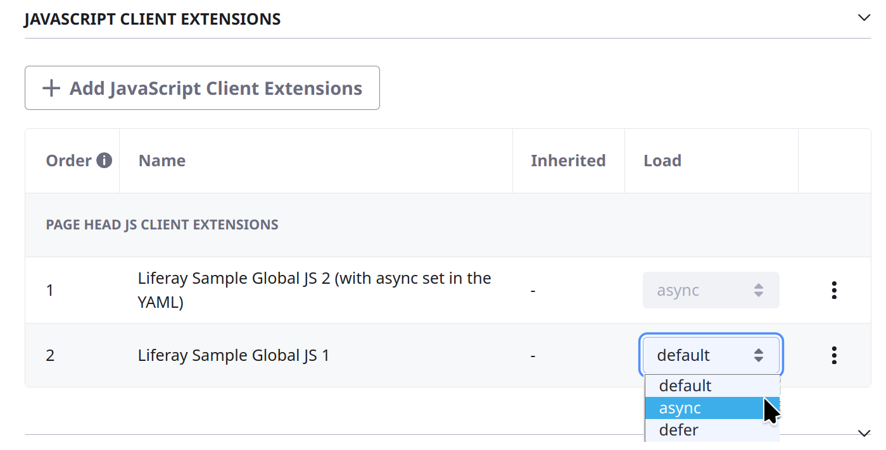

# Using a JavaScript Client Extension

{bdg-secondary}`Liferay 7.4+`

With a JavaScript (JS) client extension, you can run your own JavaScript on any page in Liferay without worrying about dependencies on Liferay code or developing a theme. Here you'll start with a JavaScript client extension (from a [sample workspace](https://github.com/liferay/liferay-portal/tree/master/workspaces/liferay-sample-workspace)).

## Prerequisites

To start developing client extensions,

1. Install a [supported version of Java](https://help.liferay.com/hc/en-us/articles/4411310034829-Liferay-DXP-Quarterly-Releases-Compatibility-Matrix).

   ```{note}
   Check the [compatibility matrix](https://help.liferay.com/hc/en-us/articles/4411310034829-Liferay-DXP-7-4-Compatibility-Matrix) for supported JDKs, databases, and environments. See [JVM Configuration](../../installation-and-upgrades/reference/jvm-configuration.md) for recommended JVM settings.
   ```

1. Download and unzip the sample workspace:

   ```bash
   curl -o com.liferay.sample.workspace-latest.zip https://repository.liferay.com/nexus/service/local/artifact/maven/content\?r\=liferay-public-releases\&g\=com.liferay.workspace\&a\=com.liferay.sample.workspace\&\v\=LATEST\&p\=zip
   ```

   ```bash
   unzip com.liferay.sample.workspace-latest.zip
   ```

All the necessary tools and a JS client extension are included in the sample workspace.

## Examine the Client Extension

The JS client extension is in the workspace's `client-extensions/liferay-sample-global-js-2/` folder. It's defined in the `client-extension.yaml` file:

```yaml
liferay-sample-global-js-2:
    name: Liferay Sample Global JS 2
    scriptElementAttributes:
        async: true
        data-attribute: "value"
        data-senna-track: "permanent"
        fetchpriority: "low"
    type: globalJS
    url: global.*.js
```

The client extension has the ID `liferay-sample-global-js-2` and contains the key configurations for a JS client extension, including the script element attributes, the `type`, and the JavaScript file to add. See the [JavaScript YAML configuration reference](./using-a-javascript-client-extension/javascript-yaml-configuration-reference.md) for more information on the properties.

The optional `scriptElementAttributes` configuration was added in Liferay DXP 2024.Q2/Portal 7.4 GA120. With it you can add Boolean and string attributes to the generated `script` HTML element. [Booleans](https://www.w3.org/TR/2008/WD-html5-20080610/semantics.html#boolean) that are `true` appear without a value in the HTML, and do not appear if set to `false`. For example, you can set `foo-boolean: true` in the YAML to generate this HTML: `<script foo-boolean foo-string="bar" ...>...</script>`.

The YAML file also contains the `assemble` block:

```yaml
assemble:
    - from: build/static
      into: static
```

This specifies that everything in the `build/static` folder should be included as a static resource in the built client extension `.zip` file. The JavaScript code in a JS client extension is used as a static resource in Liferay.

The `assets/global.js` file contains this line of code:

```js
window.alert('Sample Global JS 2 deployed.');
```

An alert box appears with the message when you open the page. Run additional JavaScript by adding to this file.

## Deploy the Client Extension to Liferay

```{include} /_snippets/run-liferay-portal.md
```

Once Liferay starts, run this command from the client extension's folder in the sample workspace:

```bash
../../gradlew clean deploy -Ddeploy.docker.container.id=$(docker ps -lq)
```

This builds your client extension and deploys the zip to Liferay's `deploy/` folder.

```{note}
To deploy your client extension to Liferay SaaS, use the Liferay Cloud [Command-Line Tool](https://learn.liferay.com/w/liferay-cloud/reference/command-line-tool) to run [`lcp deploy`](https://learn.liferay.com/w/liferay-cloud/reference/command-line-tool#deploying-to-your-liferay-cloud-environment).
```

```{tip}
To deploy all client extensions in the workspace simultaneously, run the command from the `client-extensions/` folder.
```

Confirm the deployment in your Liferay instance's console:

```
STARTED sample-global-js-2_1.0.0
```

Once your client extension is deployed successfully, configure Liferay to use it. 

## Use the Client Extension on a Page

Configure a page in Liferay to use your deployed client extension:

1. On a page in your instance, click the *Edit* icon  at the top.

1. In the sidebar, navigate to the Page Design *Options* menu (), and click the *Configuration* icon () at the top of the menu.

   

1. Click the *Advanced* tab and expand the *JavaScript* section toward the bottom of the page to find the *JavaScript Client Extensions* configuration section.

1. Click *Add JavaScript Client Extensions* to add the new client extension to the page head or page bottom.

   

   !!! note
       If you set the Boolean `async` or `defer` attributes in the client extension, you cannot configure this behavior when adding the client extension to a page (see the above screenshot). If you set both `async` and `defer` in the client extension, the `async` attribute is applied, and the `defer` attribute is ignored.

1. Click *Save*.

1. Optionally, publish the page so your JavaScript executes on the page outside of Edit mode.

Now your client extension is configured and active. On the page you configured, you can see the alert window pop up with the client extension's message.


```{tip}
If the alert window does not appear at first, do a hard refresh of the page to clear your browser's cache (`CTRL + SHIFT + R` for most browsers). If you change your client extension and redeploy it, you may need to remove it from the page and re-add it to see the changes.
```

## Use the Client Extension throughout the Instance

{bdg-secondary}`Liferay DXP 2024.Q4+/Portal 7.4 GA129+`

You can set the `scope` property of the client extension to `instance` to apply the JavaScript Client Extension to all the pages of an instance, including the administrative pages. For example, see the `client-extension.yaml` file for the [Liferay Sample Global JS 3](https://github.com/liferay/liferay-portal/tree/master/workspaces/liferay-sample-workspace) project:

```yaml
assemble:
    - from: build/static
      into: static
liferay-sample-global-js-3:
    name: Liferay Sample Global JS 3
    scope: instance
    scriptLocation: head
    type: globalJS
    url: global.*.js
```

Once deployed, you can visit any page in the instance and look at the browser console to see the JavaScript that ran in the page head:

```js
console.log('Sample Global JS 3 deployed.');
```

## Next Steps

You have successfully used a JS client extension in Liferay. Next, try deploying other client extension types.

* [Using a CSS Client Extension](./using-a-css-client-extension.md)

## Related Topics

[JavaScript Client Extension YAML Configuration Reference](./using-a-javascript-client-extension/javascript-yaml-configuration-reference.md)
