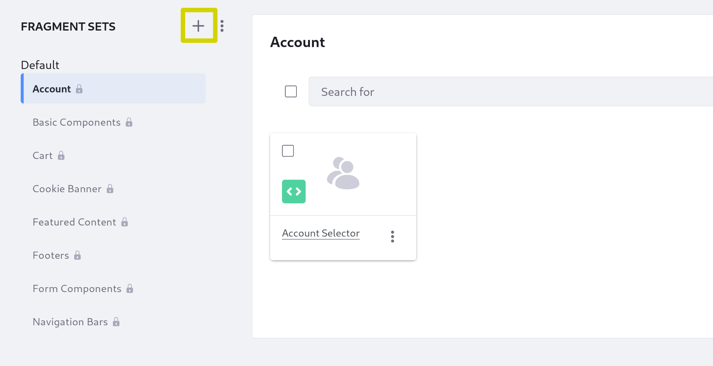

---
toc:
  - ./using-a-javascript-import-map-entry-client-extension/javascript-import-map-entry-yaml-configuration-reference.md
taxonomy-category-names:
- Development and Tooling
- Frontend Client Extensions
- Liferay Self-Hosted
- Liferay SaaS
uuid: 751942b6-8d8b-4658-b4d4-9a835cd7144e
---
# Using a JavaScript Import Map Entry Client Extension

{bdg-secondary}`Liferay 7.4 2023.Q1+/GA92+`

You can use JavaScript import map entry client extensions to make JavaScript code or resources available to any page rendered in a Liferay instance. Define and export code in the client extension with a specifier that the [import map](https://developer.mozilla.org/en-US/docs/Web/HTML/Element/script/type/importmap) in Liferay provides to anything that imports it. For example, you can bundle a library like [jQuery](https://jquery.com/) into the client extension, and then import it into a fragment's code to use it.

Start making JavaScript import map entry client extensions with one from the [sample workspace](https://github.com/liferay/liferay-portal/tree/master/workspaces/liferay-sample-workspace).

## Prerequisites

To start developing client extensions,

1. Install Java (JDK 8 or JDK 11).

    !!! note
        Check the [compatibility matrix](https://help.liferay.com/hc/en-us/articles/4411310034829-Liferay-DXP-7-4-Compatibility-Matrix) for supported JDKs, databases, and environments. See [JVM Configuration](https://learn.liferay.com/web/guest/w/dxp/installation-and-upgrades/reference/jvm-configuration) for recommended JVM settings.

1. Download and unzip the sample workspace:

    ```bash
    curl -o com.liferay.sample.workspace-latest.zip https://repository.liferay.com/nexus/service/local/artifact/maven/content\?r\=liferay-public-releases\&g\=com.liferay.workspace\&a\=com.liferay.sample.workspace\&\v\=LATEST\&p\=zip
    ```

    ```bash
    unzip com.liferay.sample.workspace-latest.zip
    ```

Now you have the tools to deploy your first JavaScript import map entry client extension.

## Examine and Add to the JavaScript Exports

The JavaScript import map entry client extension is in the sample workspace's `client-extensions/liferay-sample-js-import-maps-entry/` folder. It's defined in the `client-extension.yaml` file:

```yaml
liferay-sample-js-import-maps-entry:
    bareSpecifier: jquery
    name: Liferay Sample JS Import Maps Entry
    type: jsImportMapsEntry
    url: jquery.*.js
```

It also contains the `assemble` block:

```yaml
assemble:
    - from: build/static
      into: static
```

This specifies that every file created in the `build/static/` folder should be included as a static resource in the built client extension `.zip` file. The `liferay-sample-js-import-maps-entry` example uses [webpack](https://webpack.js.org/) (configured in the included `webpack.config.js` file) to define the exported entry and its output location. It imports jQuery, which provides various utilities for manipulating HTML via JavaScript.

In the `assets/` folder, the `index.js` file contains this JavaScript code:

```js
import jquery from 'jquery';

export default jquery;
```

This code uses the jQuery library and exports it using `default`. Exporting it here allows it to be used in Liferay when you import the defined `bareSpecifier` in `client-extension.yaml`.

You can also add another export that can be accessed using the same specifier. Add this JavaScript code to export a new function that doubles a value:

```js
export function doubleValue(value) {
    return value * 2;
}
```

Now deploy the client extension.

## Deploy the Import Map Entry

```{include} /_snippets/run-liferay-portal.md
```

Once Liferay starts, run this command from the client extension's folder in the sample workspace:

```bash
../../gradlew clean deploy -Ddeploy.docker.container.id=$(docker ps -lq)
```

This builds your client extension and deploys the zip to Liferay's `deploy/` folder.

!!! note
    The command used to deploy your client extension changes if you use a self-hosted instance outside of Docker, Liferay PaaS, or Liferay SaaS. See [Deploying to Your Liferay Instance](../client-extensions/working-with-client-extensions.md#deploying-to-your-liferay-instance) for more information.

!!! tip
    To deploy all client extensions in the workspace simultaneously, run the command from the `client-extensions/` folder.

Confirm the deployment in your Liferay instance's console:

```
STARTED liferaysamplejsimportmapsentry_7.4.13 [1459]
```

Now that you have imported a new entry into the JavaScript import map, create a new fragment to use it.

## Add a Fragment Importing the Code

1. On any site in your running Liferay instance, click *Design* &rarr; *Fragments*.

1. Click *Add* () to add a new fragment set.

    

1. Enter `FS` as the name and click *Save*.

1. Click *New* to add a new fragment.

1. With *Basic Fragment* selected, click *Next*.

1. In the Add Fragment modal, enter *Outlined Text* as the name and click *Add*.

1. On the fragment design screen, click into the *HTML* editor and add a paragraph (`<p>`) tag in the existing `div` with text to be outlined:

    ```html
    <div class="fragment_1">
        <p>
            Outlined text!
        </p>
    </div>
    ```

    The text appears in the preview panel in the lower-right corner.

    

1. Click into the *JavaScript* editor and add this code to import from your client extension:

    ```js
    const jq = await import('jquery'); // dynamic import

    var outline = jq.doubleValue(2) + "px solid blue";

    jq.default("div.fragment_1").css("border", outline);
    ```

    This code imports the code from your client extension into the `jq` constant. Then it uses your exported `doubleValue` function to double the number of pixels in an outline string, and finally uses [jQuery's `css` function](https://api.jquery.com/css/) to add an outline using that string with the `default` export.

    The text now appears in the preview panel with a 4-pixel wide, blue outline.

    

    !!! tip
        If the outline does not appear correctly, make sure the `div` element's class name in the HTML editor (e.g., `fragment_1`) matches the code you copied into the JavaScript editor.

Now you can publish the fragment and use it on any page.

You have successfully used a JavaScript import map entry client extension in Liferay. Next, learn about [other types of frontend client extensions](../customizing-liferays-look-and-feel.md).

## Related Topics

* [Frontend Data Set Cell Renderer YAML Reference](./using-a-frontend-data-set-cell-renderer-client-extension/frontend-data-set-cell-renderer-yaml-reference.md)
* [Customizing Liferay's Look and Feel](../customizing-liferays-look-and-feel.md)
* [Working with Client Extensions](../client-extensions/working-with-client-extensions.md)