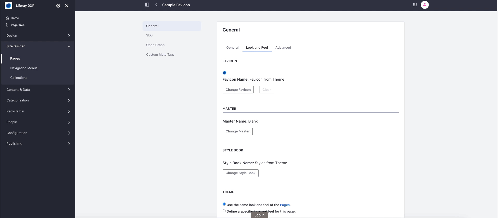

# Using a Theme Favicon Client Extension

{bdg-secondary}`Liferay 7.4+`

With a theme favicon client extension, you can override the theme's favicon on the selected page. Start with the [sample workspace](https://github.com/liferay/liferay-portal/tree/master/workspaces/liferay-sample-workspace) to build and deploy your client extension.

## Prerequisites

To start developing client extensions,

1. Install Java (JDK 8 or JDK 11).

    ```{note}
    Check the [compatibility matrix](https://help.liferay.com/hc/en-us/articles/4411310034829-Liferay-DXP-7-4-Compatibility-Matrix) for supported JDKs, databases, and environments. See [JVM Configuration](../../../../installation-and-upgrades/reference/jvm-configuration.md) for recommended JVM settings.
    ```

1. Download and unzip the sample workspace:

   ```bash
   curl -o com.liferay.sample.workspace-latest.zip https://repository.liferay.com/nexus/service/local/artifact/maven/content\?r\=liferay-public-releases\&g\=com.liferay.workspace\&a\=com.liferay.sample.workspace\&\v\=LATEST\&p\=zip
   ```

   ```bash
   unzip com.liferay.sample.workspace-latest.zip
   ```

Now you have the tools to deploy your first theme favicon client extension.

## Examine the Client Extension

The theme favicon client extension is in the sample workspace's `client-extensions/liferay-sample-theme-favicon/` folder. It is defined in the `client-extension.yaml` file:

```yaml
liferay-sample-theme-favicon:
    name: Liferay Sample Theme Favicon
    type: themeFavicon
    url: favicon.ico
```

The client extension has the ID `liferay-sample-theme-favicon` and contains the key configurations for a theme favicon client extension, including the type and the favicon file to add. See the [Theme Favicon YAML Configuration Reference](../theme-favicon-yaml-configuration-reference.md) for more information on the available properties.

It also contains the `assemble` YAML block:

```yaml
assemble:
    - from: assets
      into: static
```

This specifies that everything in the `assets/` folder should be included as a static resource in the built client extension `.zip` file. The favicon file in a theme favicon client extension is used as a static resource in Liferay.

## Deploy the Client Extension to Liferay

```{include} /_snippets/run-liferay-portal.md
```

Once Liferay starts, run this command from the client extension's folder in the sample workspace:

```bash
../../gradlew clean deploy -Ddeploy.docker.container.id=$(docker ps -lq)
```

This builds your client extension and deploys the zip to Liferay's `deploy/` folder.

```{note}
To deploy your client extension to Liferay SaaS, use the Liferay Cloud [Command-Line Tool](https://learn.liferay.com/w/liferay-cloud/reference/command-line-tool) to run [`lcp deploy`](https://learn.liferay.com/w/liferay-cloud/reference/command-line-tool#deploying-to-your-liferay-cloud-environment).
```

```{tip}
To deploy all client extensions in the workspace simultaneously, run the command from the `client-extensions/` folder.
```

Confirm the deployment in your Liferay instance's console:

```bash
STARTED liferay-sample-theme-favicon_1.0.0
```

## Use the Client Extension on a Page

<!-- Should we suggest doing this to the pages of a Site Template? -->
Configure a page in Liferay to use your deployed client extension:

1. On a page, click _Edit_ () at the top.

1. In the sidebar, navigate to the Page Design Options menu () and click _configuration_ () at the top of the menu.

1. In the _Favicon_ section under the _Look and Feel_ tab, click _Change Favicon_.

1. Click _Client Extensions_ and select the newly deployed favicon, _Sample Theme Favicon_.

   

1. Scroll down and click _Save_.

1. Go back to the page. The new favicon appears on the browser tab.


## Next Steps

You have successfully used a theme favicon client extension in Liferay. Next, try deploying other client extension types.

* [Using a CSS Client Extension](./using-a-css-client-extension.md)
* [Using a JS Client Extension](./using-a-javascript-client-extension.md)
