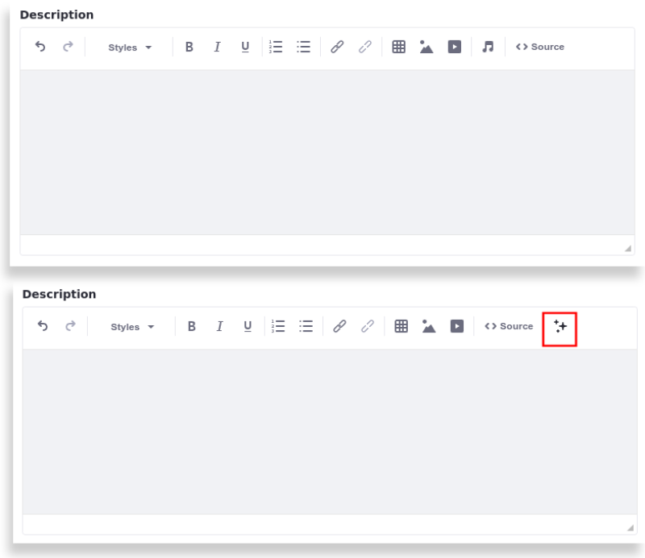

# Using an Editor Config Contributor Client Extension

{bdg-secondary}`Liferay DXP 2024.Q1+/Portal 7.4 GA112+`

!!! important
    The translation status feature is currently behind a release feature flag (LPS-186870). Read [Release Feature Flags](../../system-administration/configuring-liferay/feature-flags.md#release-feature-flags) for more information. Other features may differ without this feature flag.

Editor Config Contributor client extensions override existing CKEditor configuration in a `ConfigContributor.java` file. Start with a client extension (from the [sample workspace](https://github.com/liferay/liferay-portal/tree/master/workspaces/liferay-sample-workspace)).

## Prerequisites

To start developing client extensions,

1. Install a [supported version of Java](https://help.liferay.com/hc/en-us/articles/4411310034829-Liferay-DXP-Quarterly-Releases-Compatibility-Matrix).

   !!! note
       Check the [compatibility matrix](https://help.liferay.com/hc/en-us/articles/4411310034829-Liferay-DXP-7-4-Compatibility-Matrix) for supported JDKs, databases, and environments. See [JVM Configuration](../../installation-and-upgrades/reference/jvm-configuration.md) for recommended JVM settings.

1. Download and unzip the sample workspace:

   ```bash
   curl -o com.liferay.sample.workspace-latest.zip https://repository.liferay.com/nexus/service/local/artifact/maven/content\?r\=liferay-public-releases\&g\=com.liferay.workspace\&a\=com.liferay.sample.workspace\&\v\=LATEST\&p\=zip
   ```

   ```bash
   unzip com.liferay.sample.workspace-latest.zip
   ```

Now you have the tools to deploy your first Editor Config Contributor client extension.

## Examine and Modify the Client Extension

The Editor Config Contributor client extension is in the sample workspace's `client-extensions/liferay-sample-editor-config-contributor/` folder. It's defined in the `client-extension.yaml` file:

```yaml
liferay-sample-editor-config-contributor:
    editorConfigKeys:
        - description
        - sampleAlloyEditor
        - sampleClassicEditor
        - sampleLegacyEditor
    name: Liferay Sample Editor Config Contributor
    type: editorConfigContributor
    url: index.js
```

The client extension has the ID `liferay-sample-editor-config-contributor` and contains the key configurations for an Editor Config Contributor client extension, including the `type`, the `editorConfigKeys`, and the `url` property that defines the JavaScript resource file's location. See the [Editor Config Contributor YAML configuration reference](./using-an-editor-config-contributor-client-extension/editor-config-contributor-yaml-configuration-reference.md) for more information on the available properties.

It also contains the `assemble` block:

```yaml
assemble:
    - from: build
      into: static
```

This specifies that everything in the `build/` folder should be included as a static resource in the built client extension `.zip` file. The JavaScript file in an Editor Config Contributor client extension is used as a static resource in Liferay.

The `build/index.js` file contains this code that adds a video button to the Alloy Editor Configuration and a Create AI Content button to the CKEditor configuration.

```javascript
// This function is a transformer for editor configurations.
// It adds custom functionalities to the configuration object based on the editor type.

const editorConfigTransformer = (config) => {
    // Alloy Editor Configuration Modification.
    const toolbars = config.toolbars;
    if (typeof toolbars === 'object') {
        // Adds a "video" button to the text selection toolbar.
        const textSelection = toolbars.styles?.selections?.find((selection) => selection.name === 'text');
        if (textSelection.buttons) {
            textSelection.buttons.push('video');
            // Return the updated configuration with the modified toolbars
            return {
                ...config,
                toolbars,
            };
        }
    }

    // CKEditor Configuration Modification
    const toolbar = config.toolbar;
    const buttonName = 'AICreator';
    let transformedConfig;
    if (typeof toolbar === 'string') {
        // Modify the toolbar defined by its name
        const activeToolbar = config[`toolbar_${toolbar}`];
        activeToolbar.push([buttonName]);
        transformedConfig = {
            ...config,
            [`toolbar_${toolbar}`]: activeToolbar,
        };
    } else if (Array.isArray(toolbar)) {
        // Modify the toolbar if it's an array
        toolbar.push([buttonName]);
        transformedConfig = {
            ...config,
            toolbar,
        };
    }

    // Adds an "aicreator" button to the list of extra plugins.
    const extraPlugins = config.extraPlugins;
    return {
        ...transformedConfig,
        extraPlugins: extraPlugins ? `${extraPlugins},aicreator` : 'aicreator',
    };
};

// Object containing the editor configuration transformer function
const editorTransformer = {
    editorConfigTransformer,
};

// Export the editor transformer object
export default editorTransformer;
```

Now deploy the client extension.

## Deploy the Client Extension to Liferay

```{include} /_snippets/run-liferay-portal.md
```

Once Liferay starts, run this command from the client extension's folder in the sample workspace:

```bash
../../gradlew clean deploy -Ddeploy.docker.container.id=$(docker ps -lq)
```

This builds your client extension and deploys the zip to Liferay's `deploy/` folder.

!!! note
    To deploy your client extension to Liferay SaaS, use the Liferay Cloud [Command-Line Tool](https://learn.liferay.com/w/liferay-cloud/reference/command-line-tool) to run [`lcp deploy`](https://learn.liferay.com/w/liferay-cloud/reference/command-line-tool#deploying-to-your-liferay-cloud-environment).

!!! tip
    To deploy all client extensions in the workspace simultaneously, run the command from the `client-extensions/` folder.

Confirm the deployment in your Liferay instance's console:

```
STARTED liferaysampleeditorconfigcontributor_7.4.3.99
```

Now that your client extension is deployed, check if it's running properly.

1. Open the *Global Menu* (), go to the *Applications* tab, and click *Client Extensions* under Custom Apps.

1. If the deployment is successful, the Liferay Sample Editor Config Contributor client extension appears in the client extensions manager.

   

1. Click *Add* () and choose any option as they all use a WYSIWYG editor. In the new page, a Create AI Content button is displayed at the end of the editor.



You have successfully used an Editor Config Contributor client extension in Liferay. Next, try deploying other client extension types.

## Related Topics

- [Editor Config Contributor YAML Configuration Reference](./using-an-editor-config-contributor-client-extension/editor-config-contributor-yaml-configuration-reference.md)
- [Using a CSS Client Extension](./using-a-css-client-extension.md)
- [Using a JS Client Extension](./using-a-javascript-client-extension.md)
- [Creating a Basic Custom Element](../integrating-external-applications/creating-a-basic-custom-element.md)


