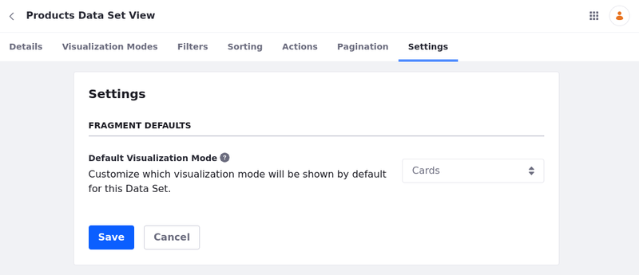
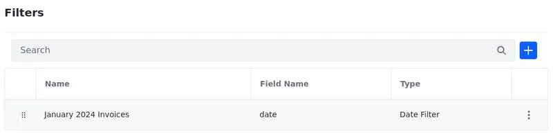
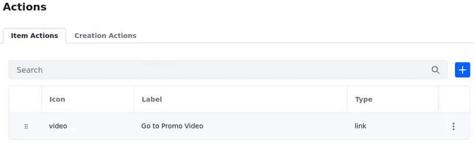
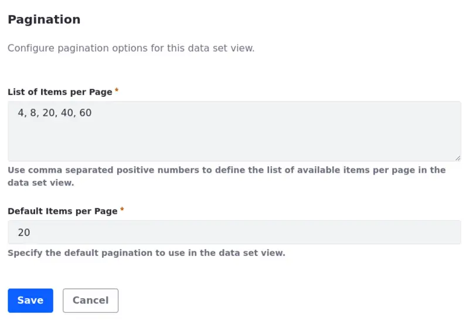

---
toc:
  - ./data-set-views/data-set-view-actions.md
  - ./data-set-views/data-set-view-visualization-modes.md
  - ./data-set-views/data-set-view-filters.md
  - ./data-set-views/using-data-set-view-actions.md
uuid: a996ebe0-1f91-4867-a50d-dd81652cd9be
taxonomy-category-names:
    - Development and Tooling
    - Data Sets
    - Liferay Self-Hosted
    - Liferay SaaS
---

# Data Set Views

{bdg-secondary}`Liferay DXP 2024.Q1+/Portal 7.4 GA112+`
{bdg-link-primary}`[Beta Feature](../../system-administration/configuring-liferay/feature-flags.md#beta-feature-flags)`

With the data set manager, you can create data set views and customize how users see your data set. Choose which fields are displayed, define and pre-apply filters, set default sorting rules, redirect users to a different URL where they can perform actions, and configure pagination options for your data set view.

## Creating Data Set Views

1. Open the *Global Menu* (), select the *Control Panel* tab, and click *Data Sets* under Object.

1. Click on the *Name* of the data set where you're adding the view.

   Alternatively, click *Actions* () next to the data set entry and select *Edit*.

1. Click *Add* (), name your data set, and add a description (optional).

1. Click the name of the data set view to start editing it.

   Alternatively, click *Actions* () next to the data set view entry and select *Edit*.

   You can also delete a data set view using the Actions menu.

## Managing Data Set Views

The Data Set View application is divided into tabs:

- Details tab: see and edit the name (1) and description (2) of your data set view. Click *Save* once the alterations are complete.

   You can also see the information about the REST Application, Schema, and Endpoint (3) used with that data set.

   

- {bdg-secondary}`Liferay DXP 2024.Q2+/Portal 7.4 GA120+` [Visualization Modes](./data-set-views/data-set-view-visualization-modes.md) tab: select fields and manage how they are displayed in your data set using three different visualization modes: Table, List, and Cards.

   Edit the fields, add friendly labels and localize them, choose a renderer for the fields, and define them as sortable or not sortable.

   You can also customize the list and the card visualization modes by mapping their elements to fields from your data set.

   

- [Filters](./data-set-views/data-set-view-filters.md) tab: define filters that users can apply to the data set fragment.

   You can apply customized filters using [Client Extensions](../client-extensions.md), use date-type fields and show entries within a given period, or configure [Picklists](../objects/picklists.md) as the source of the options for the filter.

   

- Sorting tab: set default sorting rules that are applied to the entries once the user visits a page with a Data Set fragment.

   Sort entries using a specific field as a criterion and in ascending or descending order.

   You can also select multiple fields. The first field serves as the primary criterion for sorting the entries. If there are entries with the same value in the first field, the second field is used as the secondary criterion for sorting.

   

- {bdg-secondary}`Liferay DXP 2024.Q2+/Portal 7.4 GA120+` [Actions](./data-set-views/data-set-view-actions.md) tab: create actions linked to the elements in the data set.

   With *Item Actions*, you can perform many actions related to items in the data set, depending on the specific needs and context of the data. For example, if a data set item represents a user, possible actions include activating/deactivating it or impersonating it. Similarly, for a web content item, actions could include expiring content or viewing its history and usage.

   With *Creation Actions*, users can create new data or you can redirect them to a different location where they can create it.

   See [Using Data Set View Actions](./data-set-views/using-data-set-view-actions.md) for more information.

   

- Pagination tab: configure the pagination options for the data set view. Pagination divides a large set of data into smaller, more manageable parts.

   Set a default number of items per page and provide users with a list of options from which they can select their preferred number of items to display on each page.

   Use positive numbers separated by commas to define the list of options.

   

- Settings tab: configure your data set view (e.g., set a default visualization mode).

   

## Relevant Topics

- [Creating Data Sets](./creating-data-sets.md)
- [Data Set View Visualization Modes](./data-set-views/data-set-view-visualization-modes.md)
- [Data Set View Filters](./data-set-views/data-set-view-filters.md)
- [Data Set View Actions](./data-set-views/data-set-view-actions.md)
- [Using Data Set View Actions](./data-set-views/using-data-set-view-actions.md)
