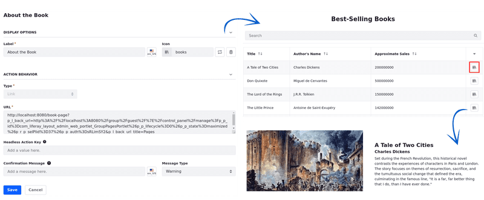

# Data Set View Actions

{bdg-secondary}`Liferay DXP 2024.Q1+/Portal 7.4 GA112+`
{bdg-link-primary}`[Beta Feature](../../../system-administration/configuring-liferay/feature-flags.md#beta-feature-flags)`

While managing data set views, define actions to be used in the data set fragment. There are two types of action, item and creation.

Use item actions to interact directly with individual items in the data set and perform actions such as deleting, editing, or viewing details of an item.

Use creation actions to add new data by directing users to appropriate locations for data creation.

Begin by [adding an action to the data set view](#adding-actions-to-the-data-set-view) and configure it as an [item or creation action](#configuring-item-and-creation-actions).

## Adding Actions to the Data Set View

1. Open the *Global Menu* (), select the *Control Panel* tab, and click *Data Sets* under Object.

1. Click the *Name* of the data set you want to access.

   Alternatively, click *Actions* () next to the data set entry and select *Edit*.

1. Click the *Name* of the data set view to start editing it.

1. Select the Actions tab, open the [*Item Actions* or the *Creation Actions*](#configuring-item-and-creation-actions) tab, and click *Add* (); a page appears where you must configure your action before creating it.

Under the Display Options section, you can find general settings common to all actions.

1. Fill in the Label and, optionally, [localize](./data-set-view-visualization-modes.md#editing-and-localizing-labels) it.

1. (Optional) Choose an icon to show in your Data Set fragment.

   <!-- Choose from a list of out-of-the-box icons or type in the name of an icon registered through the SVG sprite map client extension. The custom icon requires configuring the client extension. - This is to be added once the article about this client extension is on. Eric -->

   !!! tip
       When an item has a single action, its label appears as text inside a button component if no icon is selected.

       Conversely, if multiple actions exist, an action menu icon () appears, revealing available actions on click.

   

Under the Action Behavior section, select the action type. You can find specific configurations for each action you choose. See [Configuring Item and Creation Actions](#configuring-item-and-creation-actions) to learn more about each action type.

Once the action is configured, click *Save*.

## Configuring Item and Creation Actions

{bdg-secondary}`Liferay DXP 2024.Q2+/Portal 7.4 GA126+`

You can further customize your data set view with item and creation actions.

With item actions, set actions (e.g., delete, edit, or display the details of items) users can perform for each of the data set items.

There are five item actions: [Async](#async-action), [Headless](#headless-action), [Link](#link-action), [Modal](#modal-action), and [Side Panel](#side-panel-action)

With creation actions, create new items for the data set. You can direct users to a URL where the new entry is created, and choose whether to open the link directly or in a modal or side panel.

There are three creation actions: [Link](#link-action), [Modal](#modal-action), and [Side Panel](#side-panel-action).

For hands-on examples of how to implement these actions, read [Using Data Set View Actions](./using-data-set-view-actions.md).

Before creating actions for your data set, review the [General Observations](#general-observations) section for additional guidance.

### General Observations

- API Information: Access action keys and endpoint details through your [API Explorer](../../../headless-delivery/consuming-apis/consuming-rest-services.md).

- Confirmation Messages: These are only available for Item Actions.

- Permissions: When an action is associated with a headless endpoint, the user must have the necessary permissions to use the endpoint (e.g. to edit the document). The information returned by the endpoint may vary depending on the user's permissions.

- URL Interpolation: Use interpolated parameters in URLs to dynamically send information to the API. Enclose parameterized values in curly braces `{}`.

   For example, replace static values like `(...)externalReferenceCode=9ad3e87f-0a7b-4624(...)` with `externalReferenceCode={externalReferenceCode}` so the value is dynamically retrieved based on the item.

- URL Best Practices: Use relative URLs and try to make them as universal as possible.

   Avoid including the hostname/port in the action URL.

   Avoid specifying site names whenever possible.

   Do not use `p_p_auth` values in URLs, as they are session-specific and are not be valid in different contexts.

### Async Action

Async actions are designed to operate behind the scenes, allowing complex or time-consuming operations to be carried out in the background while users continue interacting with the application.

To create an async action,

1. Under the Action Behavior section, select *Async* as the Type.

1. Specify the *URL* for the REST endpoint where the selected method is implemented, and select the *Method*: Delete, Get, Patch, or Post.

1. (Optional) Enter a *Headless Action Key* which must match or be compatible with the selected method. With the key, administrators can associate an action to a headless endpoint. If no key is defined, the action still works, but any user can see and use it, as no restrictions are set without the key.

1. (Optional) [Set *Confirmation* and *Status Messages*](#setting-confirmation-and-status-messages) for your async action.

Once configured, use the async action to invoke and execute the selected method.

### Headless Action

Headless actions are controlled via a "Headless Action Key," which determines the specific permissions and functionalities that can be executed through the API. For example, a headless action with the key "delete" would allow an API to carry out a deletion operation on a specific resource.

To create a headless action,

1. Under the Action Behavior section, select *Headless* as the Type.

1. Enter a *Headless Action Key*. With the key, administrators can associate an action to a headless endpoint. If no key is defined, the action still works, but any user can see and use it, as no restrictions are set without it.

1. (Optional) [Set *Confirmation* and *Status Messages*](#setting-confirmation-and-status-messages) for your headless action.

Once configured, use the headless action to initiate and manage the associated API call.

### Link Action

Link actions direct users to a specified URL. They can be used both as item actions, which facilitate operations such as deleting, modifying, or viewing details of data set items, and as creation actions to add new items to the data set.

The primary distinction is the specific purpose of the URL and whether you can set a confirmation message, which is only available for item actions.

To create a link action,

1. Under the Action Behavior section, select *Link* as the Type.

1. Specify the URL for redirecting the user.

1. (Optional) Enter a Headless Action Key. With the Action key, administrators can associate an action to a headless endpoint (e.g. GET, POST, and DELETE).

   For example, use `replace` to modify an entry as an item action, or use `create` to add a new entry as a creation action.

   

1. (Optional) If you are using the Link action as an item type, you can [set a *Confirmation Message*](#setting-confirmation-and-status-messages) for it.

Once configured, users are redirected to the designated URL upon clicking the action button or icon.

### Modal Action

Modal actions redirect users to a specified URL that is rendered in a modal window. Depending on the specific intent behind the action, they can be used as item or creation actions. The key difference is that only item actions include confirmation messages.

To create a modal action,

1. Under the Action Behavior section, select *Modal* as the Type.

1. Select a *Variant* for your modal: Full Screen, Large, or Small.

1. Enter a *Title* for your modal.

1. Specify the URL for redirecting the user.

1. (Optional) Enter a Headless Action Key. With the Action key, administrators can associate an action to a headless endpoint (e.g. GET, POST, and DELETE).

   For example, use `replace` to modify an entry as an item action, or use `create` to add a new entry as a creation action.

1. (Optional) If you are using the Modal action as an item type, you can [set a *Confirmation Message*](#setting-confirmation-and-status-messages) for it.

Once configured, users are redirected to the chosen URL rendered in a modal when they click on the action button or icon.

### Side Panel Action

Side Panel actions redirect users to a specified URL that is rendered in a side panel. Depending on the specific intent behind the action, they can be used as item or creation actions. The key difference is that only item actions include confirmation messages.

To create a side panel action,

1. Under the Action Behavior section, select *Side Panel* as the Type.

1. Enter a *Title* for your Side Panel.

1. Specify the URL for redirecting the user.

1. (Optional) Enter a Headless Action Key. With the Action key, administrators can associate an action to a headless endpoint (e.g. GET, POST, and DELETE).

   For example, use `replace` to modify an entry as an item action, or use `create` to add a new entry as a creation action.

1. (Optional) If you are using the Side Panel action as an item type, you can [set a *Confirmation Message*](#setting-confirmation-and-status-messages) for it.

Once configured, users are redirected to the chosen URL rendered in a side panel when they click on the action button or icon.

### Setting Confirmation and Status Messages

Display confirmation messages before executing an action or status messages to indicate the final status of an action, whether it was successful or not.

!!! tip
    Both fields are optional. If the confirmation message is empty, no message is displayed and the action is performed immediately. Similarly, if the status message is left empty, a generic success or error message is displayed.

To create confirmation messages for item actions,

1. Follow the steps to [create a data set view *Item Action*](#adding-actions-to-the-data-set-view).

1. Under Action Behavior, enter a *Confirmation Message*.

1. Choose the Message Type: Warning, Info, Secondary, Success, and Danger.

To create status messages for [async](#async-action) and [headless](#headless-action) actions,

1. Follow the steps to [create a data set view *Item Action*](#adding-actions-to-the-data-set-view).

1. Select either *Async* or *Headless* as the type.

1. Under Status Messages, select the *Success* tab and enter a success message.

1. Select the *Error* tab and enter an error message.

!!! tip
    Confirmation and status messages can be localized. Read [Editing and Localizing Labels](./data-set-view-visualization-modes.md#editing-and-localizing-labels) to learn more.

## Related Topics

- [Data Set View Item Actions](./data-set-view-actions/data-set-view-item-actions.md)
- [Data Set View Creation Actions](./data-set-view-actions/data-set-view-creation-actions.md)
- [Data Set Views](../data-set-views.md)
- [Creating Data Sets](../creating-data-sets.md)