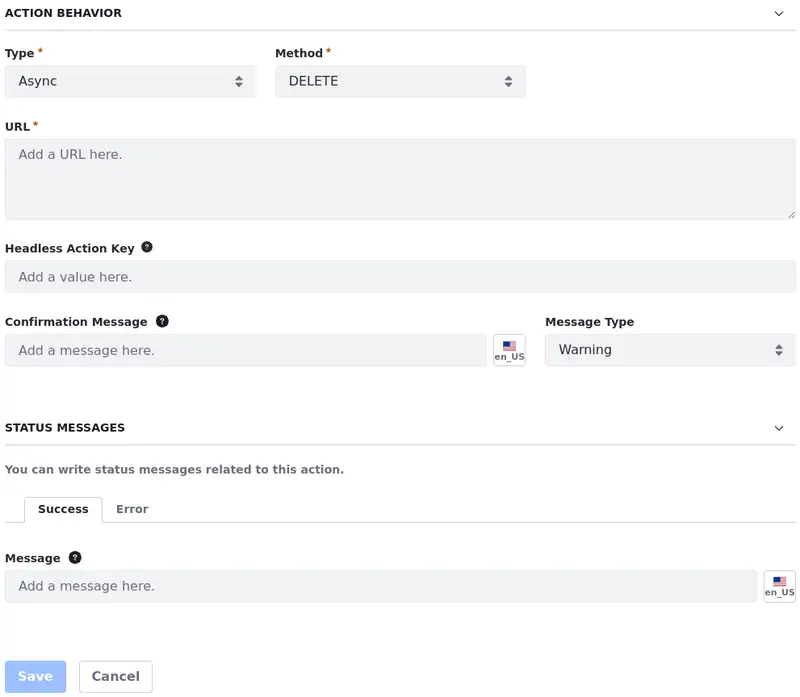
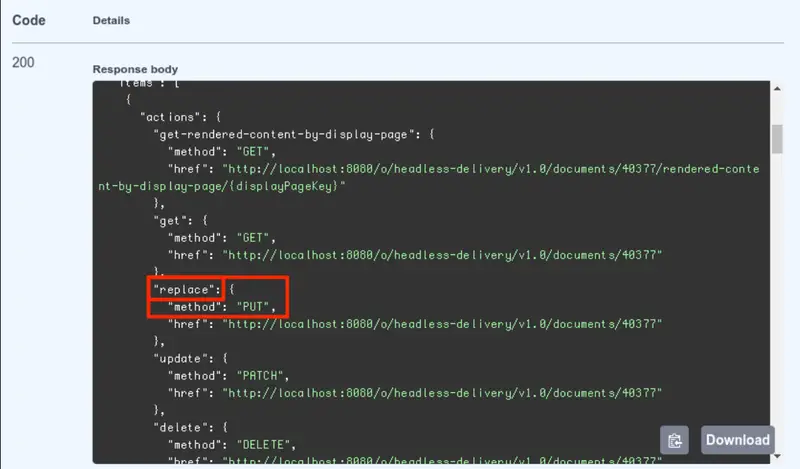
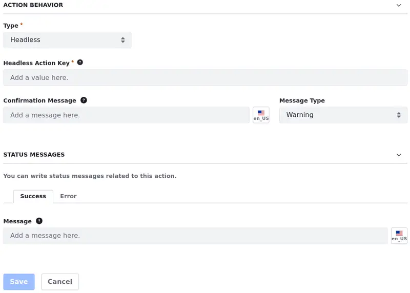

# Data Set View Item Actions

With Data Set View *Item Actions*, you can delete, edit, or display the details of a single item in the data set (e.g., a row in the table or an item from a list).

To create item actions,

1. [Create a data set view action](../data-set-view-actions.md).

1. Under the Display Options section, configure the general settings common to all actions.

1. Under the Action Behavior section, select the action type. You can find specific configurations for each item action you choose.

First, let's start with the general configurations found under the Action Behavior section. Then, move to the actions and their specificities.

## Action Behavior Section General Configurations

## Async Action

Async actions define actions that are executed in the background, generally long-running tasks.

Under the Action Behavior section,

1. Select *Async* as the Type.

1. Specify the *URL* for the REST endpoint where the selected method is implemented and select the *Method*: Delete, Get, Patch, or Post.

   !!! important
       Ensure that the API implements the selected method.

1. (Optional) Enter a *Headless Action Key* which must be the same as the selected method or, at least, compatible with it. With the key, administrators can associate an action to a headless endpoint. If no key is defined, the action still works, but any user can see and use it, as no restrictions are set without it.

   Find action keys through your [API Explorer](../../../../headless-delivery/consuming-apis/consuming-rest-services.md).

   

   !!! important
       As the action is associated with a headless endpoint, the user must have the necessary permissions to use the endpoint (e.g. to edit the document). Otherwise, the action is not shown.

1. (Optional) Enter a Confirmation Message. The message appears before the action is executed. No message appears if this field is left blank.

   Choose the Message Type: Warning, Info, Secondary, Success, and Danger.

1. (Optional) Enter success or error Status Messages to be displayed in a toast component after the action is complete. If no message is entered, a default message is displayed.

Once you're done, the selected method should be performed once activated.

## Headless Action

Headless actions are similar to [Async Actions](#async-action). With a headless action, you can define asynchronous actions based only on a headless action key from the API that feeds the displayed data set view.

Under the Action Behavior section,

1. Select *Headless* as the Type.

1. Enter a *Headless Action Key*. With the key, administrators can associate an action to a headless endpoint. If no key is defined, the action still works, but any user can see and use it, as no restrictions are set without it.

   Find action keys through your [API Explorer](../../../../headless-delivery/consuming-apis/consuming-rest-services.md).

   

   !!! important
       As the action is associated with a headless endpoint, the user must have the necessary permissions to use the endpoint (e.g. to edit the document). Otherwise, the action is not shown.

1. (Optional) Enter a Confirmation Message. The message appears before the action is executed. No message appears if this field is left blank.

   Choose the Message Type: Warning, Info, Secondary, Success, and Danger.

1. (Optional) Enter success or error Status Messages to be displayed in a toast component after the action is complete. If no message is entered, a default message is displayed.

Once you're done, use the action to activate the headless api call.

## Link Action

Link actions redirect users to a specified URL once they click on the action button/icon.

Under the Action Behavior section,

1. Specify the URL for redirecting the user.

1. (Optional) Enter a Headless Action Key. With the Action key, administrators can associate an action to a headless endpoint (e.g. GET, POST, and DELETE).

   If you want to create a button with an action to edit a document, use `replace` as the Headless Action Key.

   Find Action keys through your [API Explorer](../../../headless-delivery/consuming-apis/consuming-rest-services.md). See [Use Case: Using Actions to Edit Documents](./using-data-set-view-actions.md#use-case-using-actions-to-edit-documents) to learn more.

   

   !!! important
       As the action is associated with a headless endpoint, the user must have the necessary permissions to use the endpoint (e.g. to edit the document). Otherwise, the action is not shown.

1. (Optional) Enter a Confirmation Message. The message appears before the action is executed. No message appears if this field is left blank.

   Choose the Message Type: Warning, Info, Secondary, Success, and Danger.

1. (Optional) Enter success or error Status Messages to be displayed in a toast component after the action is complete. If no message is entered, a default message is displayed.

Once you're done, users should be redirected to the selected URL once they click on the action button/icon.

## Modal Action

## Side Panel Action

## Related Topics

- [Data Set View Item Actions](./data-set-view-item-actions.md)
- [Data Set View Creation Actions](./data-set-view-actions/data-set-view-creation-actions.md)
- [Data Set View Actions](../data-set-view-actions.md)