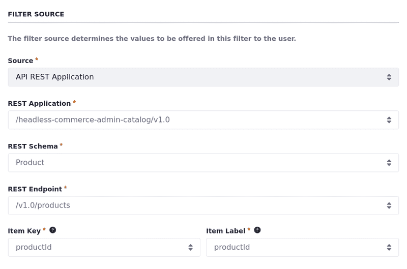

# Data Set View Filters

{bdg-secondary}`Liferay DXP 2024.Q1 U112`
{bdg-link-primary}`[Beta Feature](../../../system-administration/configuring-liferay/feature-flags.md#beta-feature-flags)`

While managing data set views, you can define pre-applied filters to be used in the data set fragment. Although you can set those filters, users can change their parameters anytime.

## Adding Filters to the Data Set View

1. Open the *Global Menu* (), select the *Control Panel* tab, and click *Data Sets* under Object.

1. Click on the *Name* of the data set you want to access.

   Alternatively, click *Actions* () next to the data set entry and select *Edit*.

1. Click on the *Name* of the data set view to start editing it.

1. Select the *Filters* tab.

1. Click *Add* () and choose one of the available options: [Client Extension](#client-extension-filter), [Date Range](#date-range-filter), or [Selection](#selection-filter).

## Selecting the Filter Field

{bdg-secondary}`Liferay DXP 2024.Q4+`

For any type of filter, clicking *Select* under the *Filter By* field opens the *Select Field* pop-up, with a tree view that includes all of the selected entry type's fields. If the entry has other parent or related entries (such as a [related object](../../objects/creating-and-managing-objects/relationships/defining-object-relationships.md)), you can also expand the related entry's fields.

The chosen type of filter determines which fields in the tree are selectable:

* [Client extension filter](#client-extension-filter): Any field is selectable. The client extension's implementation determines how the filter is applied.

* [Date range filter](#date-range-filter): Only date fields are selectable. The user can change the date range from the default when selecting the filter.

* [Selection filter](#selection filter): Only string or numeric fields are selectable.

Selecting a field that belongs to a related entry can be useful for more complex filters. For example, if you have a Student object with a relationship to a School object, you can filter a Student data set view by their related School's name or ID.

!!! warning
    Data set view filters are intended for object endpoints. The automatically generated filter syntax for other kinds of endpoints (such as `/o/headless-*` endpoints) may not work for filters using related entries' fields.

## Client Extension Filter

Use a [frontend data set filter client extension](../../customizing-liferays-look-and-feel/using-a-frontend-data-set-filter-client-extension.md) or deploy a [client extension from your workspace](../../client-extensions/working-with-client-extensions.md) to customize the filter experience and add new types of filters to your data set view.

1. Choose *Client Extension* when adding a new filter.

   Each field can be associated with only one filter at a time.

1. Fill in the *Name* of the filter and, optionally, [localize](./data-set-view-visualization-modes.md#editing-and-localizing-labels) it.

1. [Select the *Field*](#selecting-the-filter-field) by which you want to filter the entries.

1. Select the *Frontend Data Set Filter* client extension and click *Save*.

## Date Range Filter

Use date-type fields to pre-filter the displayed entries.

1. Choose *Date Range* when adding a new filter.

1. Fill in the *Name* of the filter and, optionally, [localize](./data-set-view-visualization-modes.md#editing-and-localizing-labels) it.

1. [Select the *Field*](#selecting-the-filter-field) by which you want to filter the entries.

   Each field can be associated with only one filter at a time.

1. (Optional) Set *From* and *To* dates to pre-filter the entries, and the filter shows entries within the specified range.

1. Click *Save*.

## Selection Filter

Use API REST endpoints or picklist options as parameters for the filter.

Start by choosing *Selection* when adding a new filter.

   The Selection filter has three sections: Configuration, Filter Source, and Filter Option.

Under Configuration,

1. Fill in the *Name* of the filter and, optionally, [localize](./data-set-view-visualization-modes.md#editing-and-localizing-labels) it.

1. [Select the *Field*](#selecting-the-filter-field) by which you want to filter the entries.

Under Filter Source,

1. Configure the *Filter Source* to determine the values offered in the filter. Choose an Object Picklist or an {bdg-secondary}`Liferay DXP 2024.Q3+/Portal 7.4 GA125+` API REST Application to associate with the filter.

   - With Object Picklists, choose a picklist to associate with the filter.

      

   - {bdg-secondary}`Liferay DXP 2024.Q3+/Portal 7.4 GA125+` With API REST Applications, select a *REST Application*, *REST Schema*, *REST Endpoint*, *Item Key*, and *Item Label*.

     !!! tip
         The Item Key and Item Label define which fields of the API response are used to build the filter. The Item Key constructs the OData object as a filter parameter, and the Item Label displays the values in the filter UI. Since APIs can return a wide range of data, specifying these fields is crucial for proper integration and data handling.

     

Under Filter Options,

1. Preselect values for the filter.

   If you choose the Single selection option, you can only preselect one value.

1. Determine if users can select multiple or single values.

1. Click *Save*.

## Related Topics

- [Creating Data Sets](../creating-data-sets.md)
- [Data Set Views](../data-set-views.md)
- [Data Set View Visualization Modes](./data-set-view-visualization-modes.md)
- [Data Set View Actions](./data-set-view-actions.md)