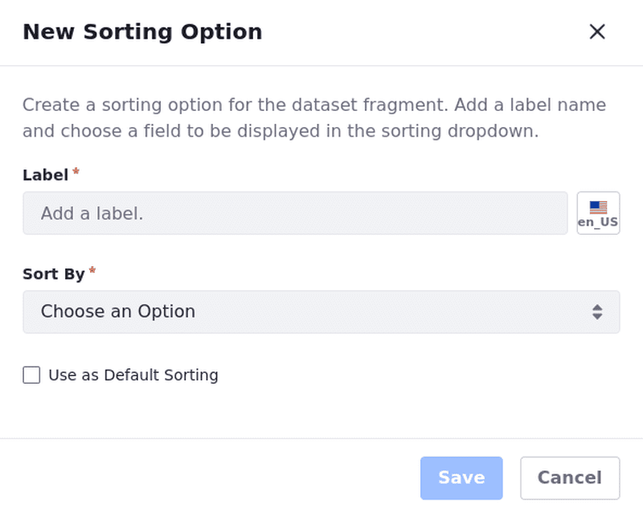
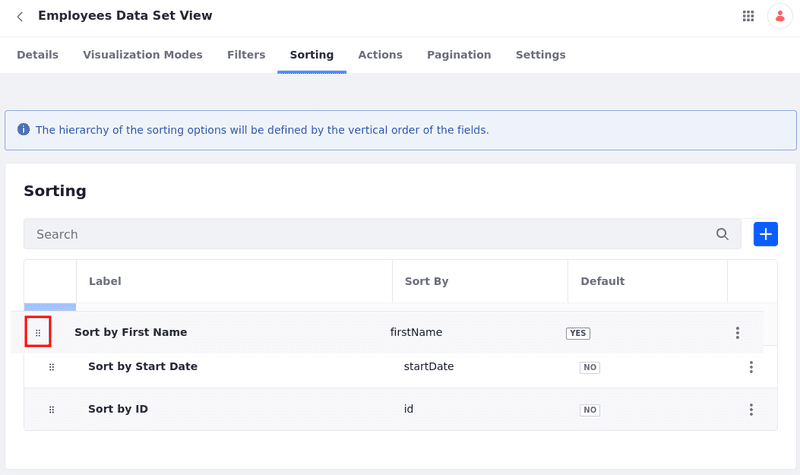
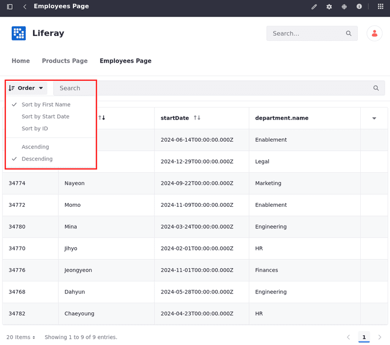
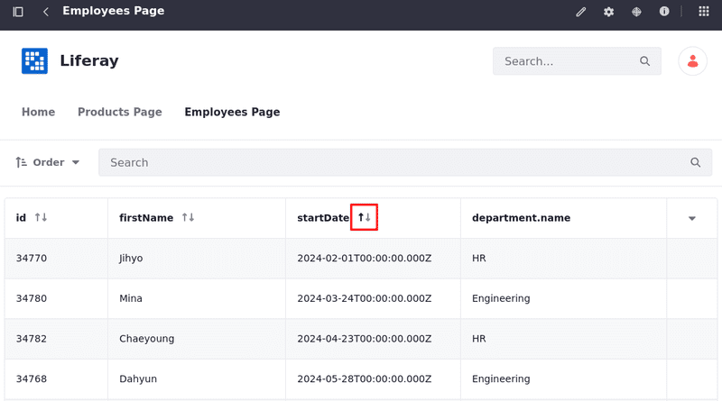

# Data Set View Sorting

{bdg-secondary}`Liferay DXP 2024.Q1 U112`
{bdg-link-primary}`[Beta Feature](../../../system-administration/configuring-liferay/feature-flags.md#beta-feature-flags)`

While managing data set views, you can set default sorting rules for Data Sets displayed in Data Set fragments.

## Adding Sorting Options to the Data Set View

1. Open the *Global Menu* (), select the *Control Panel* tab, and click *Data Sets* under Object.

1. Choose the *Name* of the data set you want to access.

   Alternatively, click *Actions* () next to the data set entry and select *Edit*.

1. Click on the *Name* of the data set view to start editing it.

1. Select the *Sorting* tab.

1. Click *Add* () and enter the information in the modal window that opens.

   

1. Enter the *Label* for the sorting option and, optionally, [localize](./data-set-view-visualization-modes.md#editing-and-localizing-labels) it.

1. Choose a field to be used for sorting.

1. Check *Use as Default Sorting* to set it as the default sorting option.

1. (Optional) Use the *drag icon* () to reorder the sorting options.

   

After configuring the sorting options, data sets are sorted automatically in Data Set fragments according to the options you set.

Open the *Order* drop-down to choose other sorting options and specify whether the items are ordered in ascending or descending order.

Alternatively, you can use the arrows next to the fields to sort. The up arrow indicates ascending order, while the down arrow indicates descending order.

## Related Topics

- [Creating Data Sets](../creating-data-sets.md)
- [Data Set Views](../data-set-views.md)
- [Data Set View Visualization Modes](./data-set-view-visualization-modes.md)
- [Data Set View Filters](./data-set-view-filters.md)
