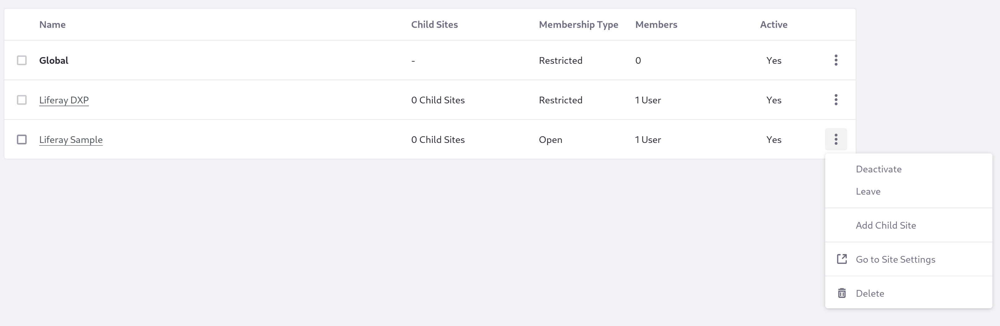
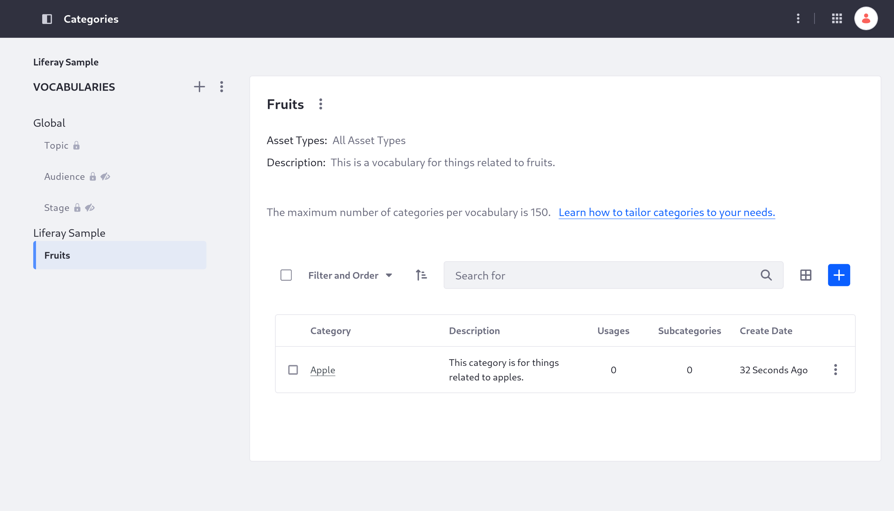

---
toc:
  - ./using-a-site-initializer-client-extension/site-initializer-yaml-configuration-reference.md
uuid: 4304a080-3e0d-461e-bdc0-10321549e41e
taxonomy-category-names:
- Development and Tooling
- Client Extensions
- Liferay Self-Hosted
- Liferay SaaS
---
# Using a Site Initializer Client Extension

{bdg-secondary}`Liferay 7.4 2023.Q4+/GA100+`

Use site initialier client extensions to quickly start up a site, complete with configurations and content. Start with the [sample workspace](https://github.com/liferay/liferay-portal/tree/master/workspaces/liferay-sample-workspace) to build and deploy your client extension.

## Prerequisites

To start developing client extensions,

1. Install a [supported version of Java](https://help.liferay.com/hc/en-us/articles/4411310034829-Liferay-DXP-Quarterly-Releases-Compatibility-Matrix).

1. Download and unzip the sample workspace:

```bash
curl -o com.liferay.sample.workspace-latest.zip https://repository.liferay.com/nexus/service/local/artifact/maven/content\?r\=liferay-public-releases\&g\=com.liferay.workspace\&a\=com.liferay.sample.workspace\&\v\=LATEST\&p\=zip
```

```bash
unzip com.liferay.sample.workspace-latest.zip
```

All the necessary tools and a site initializer client extension are included in the sample workspace.

## Examine the Site Initializer

The site initializer client extension is in the sample workspace's `client-extensions/liferay-sample-site-initializer/` folder. It's defined in the `client-extension.yaml` file:

```yaml
liferay-sample-site-initializer:
    name: Liferay Sample Site Initializer
    oAuthApplicationHeadlessServer: liferay-sample-site-initializer-oauth-application-headless-server
    siteExternalReferenceCode: liferaySample
    siteName: Liferay Sample
    type: siteInitializer
```

This YAML has the ID `Liferay-sample-site-initializer` and contains the key configurations for a site initializer client extension, including the type and the new site's name ("Liferay Sample").

It also contains an [OAuth headless server client extension definition](../configuration-as-code.md#oauth-headless-server-client-extensions), which is necessary to authenticate when you deploy the client extension:

```yaml
liferay-sample-site-initializer-oauth-application-headless-server:
    .serviceAddress: localhost:8080
    .serviceScheme: http
    name: Liferay Sample OAuth Application Headless Server
    scopes:
        - Liferay.Headless.Site.everything
    type: oAuthApplicationHeadlessServer
```

The sample client extension also has a `site-initializer/` folder, with some pre-defined content. The `documents/group/` folder contains a single document, and `journal-articles/` has a web content article. See [Adding Content to a Site Initializer](../../site-building/developer-guide/site-initializers.md#adding-content-to-a-site-initializer) for more information.

## Add a New Vocabulary to the Site

To add more content to a site initializer, you must add the correct files [in a specific location that depends on the asset type](../../site-building/developer-guide/site-initializers.md#adding-files-to-import-assets).

Add a new vocabulary with a category for the Liferay Sample site.

1. In your `site-initializer/` folder, add a new `taxonomy-vocabularies/` folder.

1. Navigate into the new `taxonomy-vocabularies/` folder and add a `group/` subfolder in it.

    Adding the vocabulary inside a `group/` folder ensures the vocabulary is scoped to the new site.

1. Navigate into the new `group/` folder and create a new JSON file named `fruits.json`.

    ```bash
    touch fruits.json
    ```

1. Open `fruits.json` and save this JSON into it for a new Fruits vocabulary:

    ```json
    {
        "description": "This is a vocabulary for things related to fruits.",
        "externalReferenceCode": "FruitVocabulary",
        "name": "Fruits",
        "numberOfTaxonomyCategories": 1
    }
    ```

    !!! tip
        You can get JSON for a new vocabulary like this by creating one on an existing site and exporting it via REST API (at `https://[your domain]/o/api`), using the `headless-admin-taxonomy` REST application. Find the vocabulary's full JSON details by retrieving it (with either the vocabulary ID or the site ID you created it on), then [remove the unnecessary information](../../site-building/developer-guide/site-initializers.md#adjusting-the-data). See [here](../../site-building/developer-guide/site-initializers.md#adding-content-to-a-site-initializer) for more information.

1. Alongside the `fruits.json` file, create a new folder called `fruits/`.

    Giving the folder the same name as a vocabulary's JSON file signals that the folder contains that vocabulary's categories. You can do the same thing by creating folders next to category JSON files to add subcategories.

1. In the `fruits/` folder, add a new file called `apple.json`.

1. Open `apple.json` and save this JSON into it for an Apple category:

    ```json
    {
        "description": "This category is for things related to apples.",
        "externalReferenceCode": "AppleCategory",
        "name": "Apple",
        "numberOfTaxonomyCategories": 0,
        "taxonomyCategoryProperties": []
    }
    ```

Now you have added enough information to include a new vocabulary, complete with one contained category, with your new site.

## Deploy the Site to Liferay

```{include} /_snippets/run-liferay-portal.md
```

Next, run this command from the client extension project's folder in the sample workspace:

```bash
../../gradlew clean deploy -Ddeploy.docker.container.id=$(docker ps -lq)
```

This builds your client extension and deploys the zip to Liferay's `deploy/` folder.

```{note}
To deploy your client extension to Liferay SaaS, use the Liferay Cloud [Command-Line Tool](https://learn.liferay.com/w/liferay-cloud/reference/command-line-tool) to run [`lcp deploy`](https://learn.liferay.com/w/liferay-cloud/reference/command-line-tool#deploying-to-your-liferay-cloud-environment).
```

```{tip}
To deploy all client extensions in the workspace simultaneously, run the command from the `client-extensions/` folder.
```

Confirm the deployment in your Liferay instance's console:

```
STARTED liferaysamplesiteinitializer_7.4.13
```

## Find the Site and Vocabulary

1. Log into your Liferay instance as an administrator.

1. Click the Applications menu () &rarr; *Control Panel* &rarr; *Sites*.

    On the Sites page, the *Sample* site from the client extension is present on the list.

1. For the Sample site, click Actions () &rarr; *Go to Site Settings*.

    

1. In the site menu on the left, click *Categorization* &rarr; *Categories*.

On the Categories page, you can see the Fruits vocabulary is added to the site. With the Fruits vocabulary selected, you can also see the contained Apple category.



## Next Steps

You have successfully used a site initializer client extension to start up a new site. Next, try deploying other client extension types.

## Related Topics

[Exporting/Importing Data](../importing-exporting-data.md)
[Working with Client Extensions](../client-extensions/working-with-client-extensions.md)
[Site Initializer YAML Configuration Reference](./using-a-site-initializer-client-extension/site-initializer-yaml-configuration-reference.md)