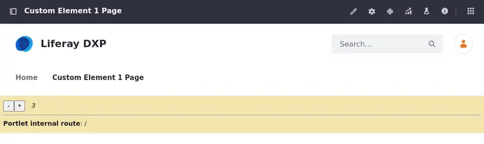

# Creating a Basic Custom Element

{bdg-secondary}`Liferay 7.4+`

Custom element client extensions use Liferay's frontend infrastructure to register external, remote applications with the Liferay platform and render them as widgets.

!!! note
    Custom Element client extensions can use any technology, regardless of how it's built, packaged, or hosted.

## Prerequisites

To start developing client extensions,

1. Install Java (JDK 8 or JDK 11).

   !!! note
       Check the [compatibility matrix](https://help.liferay.com/hc/en-us/articles/4411310034829-Liferay-DXP-7-4-Compatibility-Matrix) for supported JDKs, databases, and environments. See [JVM Configuration](../../installation-and-upgrades/reference/jvm-configuration.md) for recommended JVM settings.

1. Download and unzip the sample workspace:

   ```bash
   curl -o com.liferay.sample.workspace-latest.zip https://repository.liferay.com/nexus/service/local/artifact/maven/content\?r\=liferay-public-releases\&g\=com.liferay.workspace\&a\=com.liferay.sample.workspace\&\v\=LATEST\&p\=zip
   ```

   ```bash
   unzip com.liferay.sample.workspace-latest.zip
   ```

Now you have the tools to deploy your first Custom Element client extension.

## Examine and Modify the Custom Element Client Extension

The Custom Element client extension is in the sample workspace's `client-extensions/liferay-sample-custom-element-1/` folder. It's defined in the `client-extension.yaml` file:

```yaml
liferay-sample-custom-element-1:
   cssURLs:
      - style.css
   friendlyURLMapping: vanilla-counter
   htmlElementName: vanilla-counter
   instanceable: false
   name: Liferay Sample Custom Element 1
   portletCategoryName: category.client-extensions
   type: customElement
   urls:
      - index.js
   useESM: false
```

The client extension has the ID `liferay-sample-custom-element-1` and contains the key configurations for a Custom Element client extension, including the `type` and the `url` property that defines the JavaScript resource file's location. See the [Custom Element YAML configuration reference](./creating-a-basic-custom-element/custom-element-yaml-configuration-reference.md) for more information on the available properties.

It also contains the `assemble` block:

```yaml
   assemble:
      - from: assets
      into: static
```

This specifies that everything in the `assets/` folder should be included as a static resource in the built client extension `.zip` file. The JavaScript and CSS files in a client extension are used as static resources in Liferay.

The `assets/index.js` file defines a custom HTML element named `vanilla-counter` that represents a simple counter component. It creates buttons to increment and decrement the counter, displays the current counter value, and shows the internal route based on the URL. Additionally, it attaches event listeners for button clicks and provides methods to handle counter updates and route information.

```javascript
(function () {
   // Enable strict mode for error handling.
   'use strict';

   // Define a custom HTML element as a subclass of HTMLElement.
   class VanillaCounter extends HTMLElement {
      // Constructor function to initialize the element.
      constructor() {
         super(); // Call the constructor of the superclass (HTMLElement).

         // Initialize instance variables.
         this.friendlyURLMapping = this.getAttribute('friendly-url-mapping');
         this.value = 0;

         // Create DOM elements for counter, buttons, and route.
         this.counter = document.createElement('span');
         this.counter.setAttribute('class', 'counter');
         this.counter.innerText = this.value;

         this.decrementButton = document.createElement('button');
         this.decrementButton.setAttribute('class', 'decrement');
         this.decrementButton.innerText = '-';

         this.incrementButton = document.createElement('button');
         this.incrementButton.setAttribute('class', 'increment');
         this.incrementButton.innerText = '+';

         // Create a <style> element to apply CSS styles.
         const style = document.createElement('style');
         style.innerHTML = `
            button {
               height: 24px;
               width: 24px;
            }

            span {
               display: inline-block;
               font-style: italic;
               margin: 0 1em;
            }
         `;

         // Create a <div> element to display portlet route information
         this.route = document.createElement('div');
         this.updateRoute();

         // Create a root <div> element to hold all elements.
         const root = document.createElement('div');
         root.setAttribute('class', 'portlet-container');
         root.appendChild(style);
         root.appendChild(this.decrementButton);
         root.appendChild(this.incrementButton);
         root.appendChild(this.counter);
         root.appendChild(this.route);

         // Attach the shadow DOM to the custom element.
         this.attachShadow({mode: 'open'}).appendChild(root);

         // Bind event handlers to the current instance.
         this.decrement = this.decrement.bind(this);
         this.increment = this.increment.bind(this);
      }

      // Called when the custom element is added to the DOM.
      connectedCallback() {
         this.decrementButton.addEventListener('click', this.decrement);
         this.incrementButton.addEventListener('click', this.increment);
      }

      // Handles the decrement button click event.
      decrement() {
         this.counter.innerText = --this.value;
      }

      // Called when the custom element is removed from the DOM.
      disconnectedCallback() {
         this.decrementButton.removeEventListener('click', this.decrement);
         this.incrementButton.removeEventListener('click', this.increment);
      }

      // Handles the increment button click event.
      increment() {
         this.counter.innerText = ++this.value;
      }

      // Method to update the portlet route information based on the current URL
      updateRoute() {
         const url = window.location.href;
         const prefix = `/-/${this.friendlyURLMapping}/`;
         const prefixIndex = url.indexOf(prefix);
         let route;

         if (prefixIndex === -1) {
            route = '/';
         } else {
            route = url.substring(prefixIndex + prefix.length - 1);
         }

         this.route.innerHTML = `<hr><b>Portlet internal route</b>: ${route}`;
      }
   }

   // Check if the custom element has already been defined
   if (!customElements.get('vanilla-counter')) {
      // Define the custom element with the tag name 'vanilla-counter'
      customElements.define('vanilla-counter', VanillaCounter);
   }
})();
```

Other Custom Element client extension samples that use different frameworks/programming languages/libraries are available through the sample workspace. Try deploying and using them too.

Now, deploy the client extension.

## Deploy the Custom Element Client Extension to Liferay

```{include} /_snippets/run-liferay-portal.md
```

Once Liferay starts, run this command from the client extension's folder in the sample workspace:

```bash
../../gradlew clean deploy -Ddeploy.docker.container.id=$(docker ps -lq)
```

This builds your client extension and deploys the zip to Liferay's `deploy/` folder.

!!! note
    To deploy your client extension to Liferay SaaS, use the Liferay Cloud [Command-Line Tool](https://learn.liferay.com/w/liferay-cloud/reference/command-line-tool) to run [`lcp deploy`](https://learn.liferay.com/w/liferay-cloud/reference/command-line-tool#deploying-to-your-liferay-cloud-environment).

!!! tip
    To deploy all client extensions in the workspace simultaneously, run the command from the `client-extensions/` folder.

Confirm the deployment in your Liferay instance's console:

```
STARTED liferaysamplecustomelement1_7.4.13
```

Now that your client extension is deployed, check if the widget is working properly.

## Add the Custom Element Client Extension as a Widget

1. Click *Edit* () at the top of any page.

1. Add the widget to the page. In the Fragments and Widgets sidebar (), click *Widgets*.

1. Find the Client Extensions &rarr; Liferay Sample Custom Element 1 widget and drag it onto the page. Click *Publish*.

   

Confirm the widget app is working by using the buttons to increase/decrease the counter.

You have successfully used a Custom Element client extension in Liferay. Next, try working with the [routes](./using-routes-with-custom-elements.md) in a React custom element.

## Related Topics

- [Custom Element YAML Configuration Reference](./creating-a-basic-custom-element/custom-element-yaml-configuration-reference.md)
- [Integrating External Applications](../integrating-external-applications.md)
- [Using an Editor Config Contributor Client Extension](../customizing-liferays-look-and-feel/using-an-editor-config-contributor-client-extension.md)
- [Client Extensions UI Reference](../customizing-liferays-look-and-feel/client-extensions-ui-reference.md)
