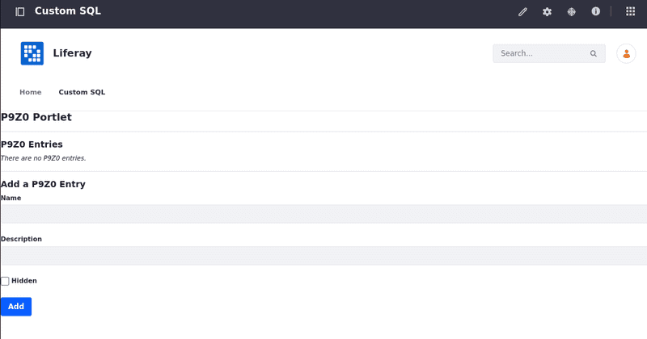

# Using Custom SQL Queries

Service Builder creates finder methods that retrieve entities by their attributes (their column values). When you add a column as a parameter for the finder in your `service.xml` file and run Service Builder, it generates the finder method in your persistence layer and adds methods to your service layer that invoke the finder. If your queries are simple enough, you can use Dynamic Query to access Liferay's database. If you want to do something more complicated (like JOINs), you can write your own custom SQL queries.

## Deploy an Example

```{include} /_snippets/run-liferay-portal.md
```

Then, follow these steps to deploy the example:

1. Download and unzip the `liferay-p9z0.zip` example project.

   ```bash
   curl https://resources.learn.liferay.com/dxp/latest/en/liferay-development/liferay-internals/extending-liferay/liferay-p9z0.zip -O
   ```

   ```bash
   unzip liferay-p9z0.zip
   ```

1. Build and deploy the project module.

   ```bash
   cd liferay-p9z0
   ```

   ```bash
   ./gradlew deploy -Ddeploy.docker.container.id=$(docker ps -lq)
   ```

   !!! note
       This command is the same as copying the deployed jars to `/opt/liferay/osgi/modules` on the Docker container.

1. Confirm the deployment in the Liferay Docker container console.

   ```bash
   STARTED com.liferay.p9z0.web_1.0.0 [1386]
   STARTED com.liferay.p9z0.api_1.0.0 [1384]
   STARTED com.liferay.p9z0.service_1.0.0 [1385]
   ```

1. To verify the example module is working, open your browser to `https://localhost:8080`.

1. Add the P9Z0 Portlet to a page. You can find the example portlet under Sample in Widgets.

   

1. Add an entry by entering a name and a description. Leave *Hidden* unchecked. Click *Add*, and the new entry appears under P9Z0 Entries.

1. Add another entry with a different name and description. This time, check *Hidden*. The new entry doesn't appear under P9Z0 Entries.

This example uses custom SQL to retrieve only entries with a specified value in the database (`hidden_ = false`).

## Adding Custom SQL to the Code

1. Open `P9Z0EntryLocalServiceImpl.java`. The code for the custom SQL request is defined in the `getEntries` method.

   ```{literalinclude} using-custom-sql-queries/resources/liferay-p9z0.zip/p9z0-service/src/main/java/com/liferay/p9z0/service/impl/P9Z0EntryLocalServiceImpl.java
      :dedent: 1
      :language: java
      :lines: 46-72
   ```

1. Store your SQL query in a string, replacing any variable values with a `?`.

   ```{literalinclude} using-custom-sql-queries/resources/liferay-p9z0.zip/p9z0-service/src/main/java/com/liferay/p9z0/service/impl/P9Z0EntryLocalServiceImpl.java
      :dedent: 2
      :language: java
      :lines: 52
   ```

1. Create an `SQLQuery` object. Liferay uses this object to handle SQL queries. The session creates an `SQLQuery` object to avoid issues in a clustered environment. Use the `addEntity` method to define the class of the object your query returns.

   ```{literalinclude} using-custom-sql-queries/resources/liferay-p9z0.zip/p9z0-service/src/main/java/com/liferay/p9z0/service/impl/P9Z0EntryLocalServiceImpl.java
      :dedent: 2
      :language: java
      :lines: 54-56
   ```

1. If you used the `?` placeholder in the string, create a `QueryPos` object from the `SQLQuery`. Add the values to be replaced in the order they appear on the string. This example only uses one.

   ```{literalinclude} using-custom-sql-queries/resources/liferay-p9z0.zip/p9z0-service/src/main/java/com/liferay/p9z0/service/impl/P9Z0EntryLocalServiceImpl.java
      :dedent: 2
      :language: java
      :lines: 58-60
   ```

1. `QueryUtil` executes the query in the database. The `list` method is used to make `GET` calls and returns a list of the values in the response.

   ```{literalinclude} using-custom-sql-queries/resources/liferay-p9z0.zip/p9z0-service/src/main/java/com/liferay/p9z0/service/impl/P9Z0EntryLocalServiceImpl.java
      :dedent: 2
      :language: java
      :lines: 62-64
   ```

## Related Topics

- [Business Logic with Service Builder](../../building-applications/data-frameworks/service-builder/business-logic-with-service-builder.md)
- [Module Projects](../fundamentals/module-projects.md)