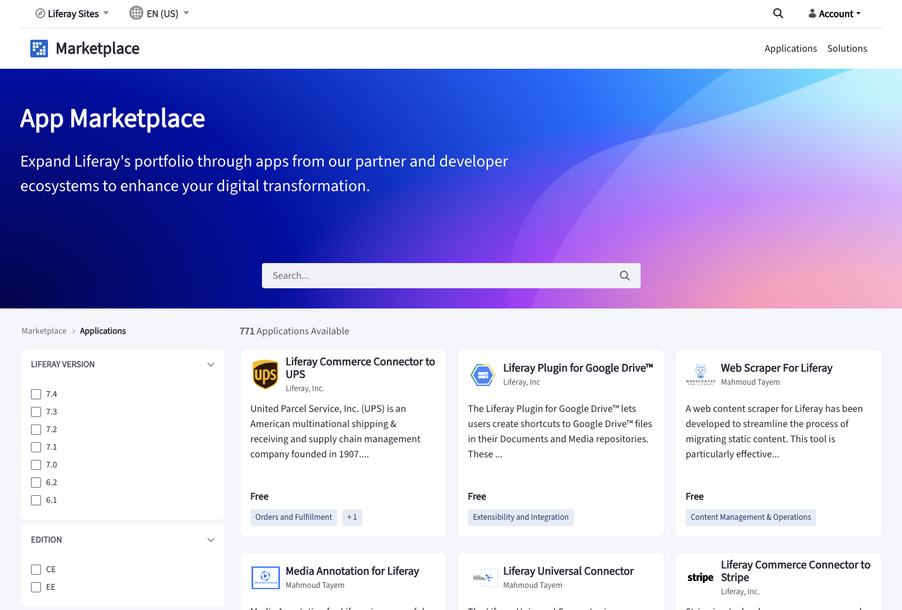

---
toc:
  - ./marketplace/become-a-publisher.md
  - ./marketplace/publishing-apps-in-marketplace.md
  - ./marketplace/publishing-solutions-in-marketplace.md
uuid: 1a9e675b-cec5-484f-822d-6e7d67012b47
taxonomy-category-names:
- Platform
- Liferay Self-Hosted
- Liferay PaaS
- Liferay SaaS
---
# Marketplace

Liferay's new Marketplace is a platform where you find, download, and share apps. It comes with a revamped UI and also supports Liferay SaaS. To access the new Marketplace, go to [marketplace.liferay.com](https://marketplace.liferay.com/).

To start using Marketplace, sign up for a Liferay account, or sign in to your existing account. There are three entities you can publish on the Marketplace.

* DXP Apps - These are module-based apps delivered as `.lpkg` files that you can install to modify native Liferay behavior.
* Cloud Apps - These are apps based on client extensions that you can install only if you have a cloud project associated with your Liferay account. These apps don't contain any methods that modify a Liferay module nor do they require the deployment of a module to Liferay.
* Solutions (for existing partners only)

To publish apps and solutions on the Marketplace, you must [become a publisher](./marketplace/become-a-publisher.md). Once you're a publisher, see [Publishing Apps in Marketplace](./marketplace/publishing-apps-in-marketplace.md) and [Publishing Solutions in Marketplace](./marketplace/publishing-solutions-in-marketplace.md) for more information.