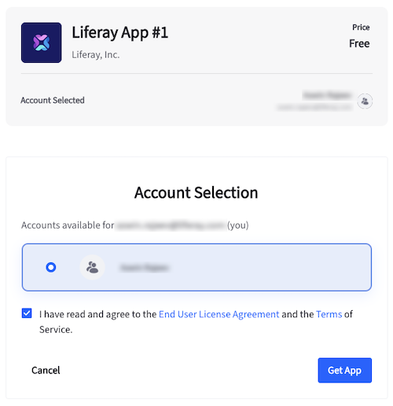
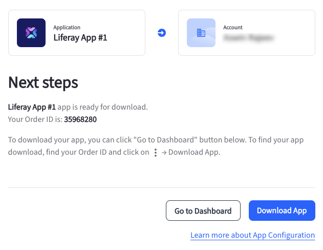
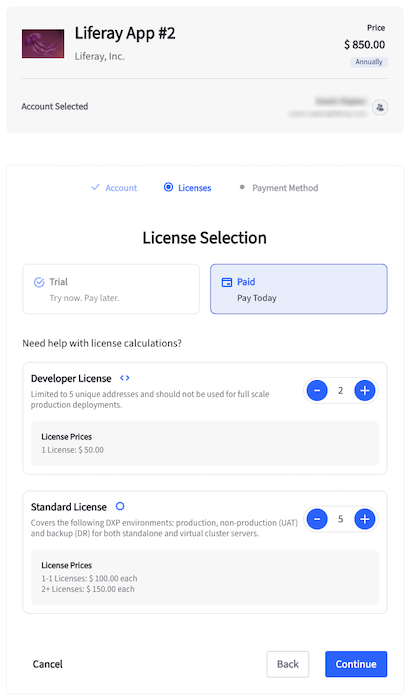

# Provisioning DXP Apps

There are different types of licenses associated with DXP apps. Free apps have a standard license. Customers don’t need to create or deploy these licenses after installing a free app, they can directly download and deploy the `.lpkg` file to Liferay DXP.

Paid apps can have trial, developer, and standard licenses based on the publisher’s requirements. After installing the app, customers must create a license file and deploy it to Liferay DXP before deploying the `.lpkg` file.

## Provisioning a Free DXP App

1. Log in to your Liferay account at [marketplace.liferay.com](https://marketplace.liferay.com/).

1. Find the free app you want and click *Get App*.

1. Select your account and check the box to confirm you've read the End User License Agreement and the Terms of Service.

   

1. Click *Get App*.

The app is ready for download. Clicking *Download App* redirects you to the app’s Download page on your dashboard. This page contains a list of the app versions and the supported Liferay DXP version. One app version can support multiple Liferay DXP versions. After finding the right version, click Download to download the `.lpkg` file.

This page also has a Details tab where you can view the order details.

## Provisioning a Paid DXP App

To install a paid DXP app, the process is slightly different.

1. Log in to your Liferay account at [marketplace.liferay.com](https://marketplace.liferay.com/).

1. Find the free app you want and click *Get App*.

1. Select your account and click *Continue*.

1. Click *Paid*.

   !!! note
       Some apps offer a trial period where you can try the app before you pay. Click *Trial* for such apps.

1. Select the number of Standard licenses you require. If the app offers a trial period, you cannot purchase standard or developer licenses along with it. The developer license is only available if the publisher has configured such an option.

   | License           | Description                                                                                                                          |
   | :---------------- | ------------------------------------------------------------------------------------------------------------------------------------ |
   | Trial License     | These are only valid for a limited period of time. During this period, the customer can test the app to see if it meets their needs. |
   | Developer License | Each license is limited to 5 unique addresses and shouldn't be used in production.                                                   |
   | Standard License  | You can use a standard license in production, non-production (UAT), and backup (DR) for both standalone and virtual cluster servers. |

   

1. Click *Continue*.

1. Click *New Address* to add a new billing address. This is mandatory before making a payment.

1. Check the box to confirm you've read the End User License Agreement and the Terms of Service.

1. PayPal is the only accepted form of payment currently. Click *Pay Now*.

After making the payment, the app is ready for download. Clicking *Download App* redirects you to the app page on your dashboard. There are three tabs on this page:

* **Details** - Displays the order details.
* **Download** - Contains a list of the app versions and the supported Liferay DXP versions. One app version can support multiple Liferay DXP versions. After finding the right version, click Download to download the .lpkg file. 
* **Licenses** - Create an .xml license file for the app to deploy to Liferay DXP.

### Creating a License

You must deploy a license file to activate paid DXP apps. To create a license file for the app purchased above,

1. Go to your customer dashboard and select the app.

1. Click *Licenses* and click *Create License Key*.

1. Select the type of license you want to generate based on your purchase.

1. Click *Continue*.

1. In the page that appears, enter the host name, a list of IP addresses, and a list of MAC addresses. You can enter one IP/MAC address per line. You can also change the description that's already filled.

   

1. Click *Generate Key*.

This generates an `.xml` license key and downloads it automatically. To view license details, click *Actions* () and select *View License Details*. This opens a modal with more details about the license.

If you want to download the license again, you can click *Actions* () and select *Download License Key*.

To deactivate the license, click *Actions* () and select *Deactivate License Key*.

!!! note
    You can also download and delete the license key in the modal that appears after clicking *View License Details*

To create additional licenses, you must go back to your customer dashboard, click *Actions* () next to the paid DXP app and select *Create License Key*.