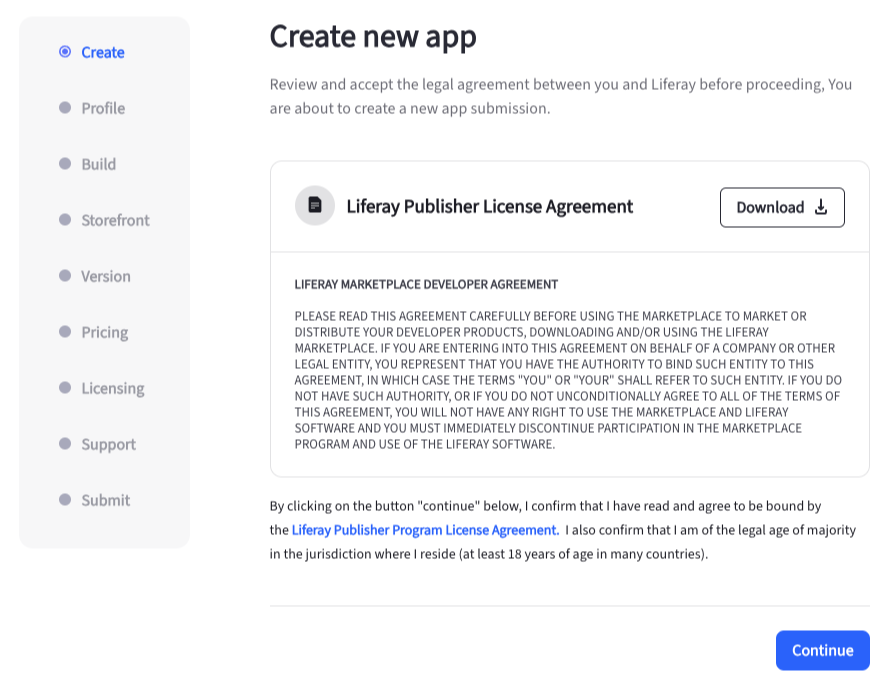

# Publishing Apps in Marketplace

The Liferay Marketplace contains both Cloud apps (for Liferay SaaS, PaaS, and self-hosted) and DXP apps (for Liferay PaaS and Liferay Self-Hosted). As a publisher, you may want to publish your apps on the Marketplace. The process of publishing a DXP app differs slightly from that of Cloud apps. If you haven't signed up to become a publisher, see [Become a Publisher](./become-a-publisher.md) for more information.

## Overview

The publishing process for both DXP and Cloud applications involves a 9-step process.

| Step       | Description                                                                                                                                                  |
| :--------- | :----------------------------------------------------------------------------------------------------------------------------------------------------------- |
| Create     | Download and view the Liferay Publisher License Agreement                                                                                                    |
| Profile    | Enter a name, description, and choose one or more tags and categories for your application.                                                                  |
| Build      | Choose whether your application is cloud compatible or not. Select the compatible offerings and upload artifacts linked to each Liferay update, if selected. |
| Storefront | Select up to 10 images that appear in the storefront.                                                                                                        |
| Version    | Enter a version and notes about the version. Customers view this while purchasing or updating your application.                                              |
| Pricing    | Choose whether your app is paid or free.                                                                                                                     |
| Licensing  | Select the type of license associated with your app. For paid apps, enter the unit price for each license.                                                   |
| Support    | Enter contact information for your app.                                                                                                                      |
| Submit     | Review and submit your app.                                                                                                                                  |

## Publishing a DXP Application

1. Log in to your Liferay account at [marketplace.liferay.com](https://marketplace.liferay.com/).

1. Open the *Dashboard* drop-down and select *Publisher*.

1. Click *New App*.

   In the new page that appears, you can download the Liferay Publisher License Agreement. Ensure that you've gone through it fully before continuing.

1. Click *Continue*.

1. Enter a name and description for your app. You must also choose one or more categories and tags. Click *Continue*.

1. Now, choose whether the app is cloud compatible. Choose *No*. This opens up more options for configuring your app.

1. In the Compatible Offering section, choose if the app is compatible with the *Self-Hosted*, *Self-Managed*, or *Fully-Managed* offering from Liferay. You can choose multiple options here.

1. In the App Build section, click *Add Package(s)* and choose one or more compatible versions of Liferay. For each version you select, you must upload a `JAR/WAR` file.

1. To upload a `JAR/WAR` file, drag and drop it to the specified area or click *Select File* to upload one from your file system. You can remove a version by clicking on *Remove Version*.

1. Click *Continue*.

1. Here, you can add up to 10 images that appear in the storefront. Drag and drop the images to the specified area or click *Select File* to upload them from your file system. You must upload at least one image. After uploading an image, you can enter an optional description for it.

1. Click *Continue*.

1. Enter a version and notes about the specific version. The customer sees when they purchase or update the app. Click *Continue*.

1. Select if the app is *Free* or *Paid*. For paid apps, ensure that you're a business and that you've entered payment information on your Marketplace profile. Click *Continue*.

1. Now, select if the app comes with a *Perpetual License* or a *Subscription License*. In the section below, choose whether you provide a 30-day free trial. For free apps, there's no option for a subscription license or a 30-day trial.

   For paid apps, you can select a license type and then enter the unit price for a license. You can also set price tiers for multiple quantities if needed. Once done, click *Continue*.

   

1. Enter details for the following and click *Continue*. These are all optional.

   * Support URL
   * Publisher Website URL
   * Support Email
   * Support Phone
   * App Usage Terms (EULA) URL
   * App documentation URL
   * App installation and uninstallation guide URL

1. Finally, review all the information you've entered. Check the box to confirm that you cannot edit these details once submitted and click *Submit App*.

An administrator receives your request after submission. Once approved, your customers can start using your app from the Marketplace.

## Publishing a Cloud Application

1. Log in to your Liferay account at [marketplace.liferay.com](https://marketplace.liferay.com/).

1. Open the *Dashboard* drop-down and select *Publisher*.

1. Click *New App*.

   In the new page that appears, you can download the Liferay Publisher License Agreement. Ensure that you've gone through it fully before continuing.

1. Click *Continue*.

1. Enter a name and description for your app. You must also choose one or more categories and tags. Click *Continue*.

1. Now, choose whether the app is cloud compatible. Choose *No*. This opens up more options for configuring your app.

1. For Cloud apps, you must set the Resource Requirements by entering the number of required CPUs and RAM (in GB).

1. In the Compatible Offering section, choose if the app is compatible with the *Self-Hosted*, *Self-Managed*, or *Fully-Managed* offerings from Liferay. You can choose multiple options here.

1. In the App Build section, click *Add Package(s)* and choose one or more compatible versions of Liferay. For each version you select, you must upload a `ZIP` file.

1. To upload a  `ZIP` file, drag and drop it to the specified area or click *Select File* to upload one from your file system. You can remove a version by clicking on *Remove Version*.

1. Click *Continue*.

1. Here, you can add up to 10 images that appear in the storefront. Drag and drop the images to the specified area or click *Select File* to upload them from your file system. You must upload at least one image. After uploading an image, you can enter an optional description for it.

1. Click *Continue*.

1. Enter a version and notes about the specific version. The customer sees when they purchase or update the app. Click *Continue*.

1. Select if the app is *Free* or *Paid*. For paid apps, ensure that you're a business and that you've entered payment information on your Marketplace profile. Click *Continue*.

1. Now, select if the app comes with a *Perpetual License* or a *Subscription License*. In the section below, choose whether you provide a 30-day free trial. For free apps, there's no option for a subscription license or a 30-day trial.

   For paid apps, you can select a license type and then enter the unit price for a license. You can also set price tiers for multiple quantities if needed. Once done, click *Continue*.

   

1. Enter details for the following and click *Continue*. These are all optional.

   * Support URL
   * Publisher Website URL
   * Support Email
   * Support Phone
   * App Usage Terms (EULA) URL
   * App documentation URL
   * App installation and uninstallation guide URL

1. Finally, review all the information you've entered. Check the box to confirm that you cannot edit these details once submitted and click *Submit App*.

An administrator receives your request after submission. Once approved, your customers can start using your app from the Marketplace.

## Related Topics

* [Become a Publisher](./become-a-publisher.md)