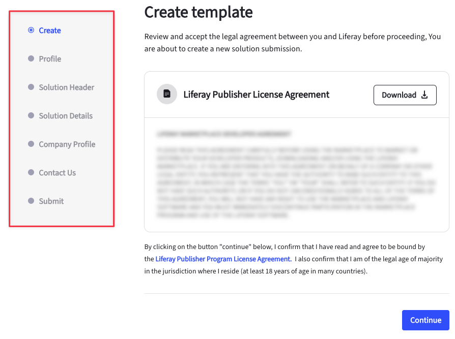

# Publishing Solutions in Marketplace

The Liferay Marketplace contains business solutions you can use to improve productivity and reduce your time to market. Currently, only existing Liferay partners can publish a solution.

If you're an existing partner and wish to publish solutions, see [Become a Publisher](./become-a-publisher.md) for more information.

## Overview

The publishing process for solutions involves a 7-step process.

 | Step             | Description                                                                               |
 | :--------------- | :---------------------------------------------------------------------------------------- |
 | Create           | Download and view the Liferay Publisher License Agreement                                 |
 | Profile          | Enter a name, description, and choose tags and categories for your solution.              |
 | Solution Header  | Customize the header of your solution's storefront page.                                  |
 | Solution Details | Customize the content of your solution's storefront page. You must add at least 2 blocks. |
 | Company Profile  | Enter details for your company profile.                                                   |
 | Contact Us       | Enter an email address for your solution.                                                 |
 | Submit           | Review and submit your solution.                                                          |

## Publishing a Solution

1. Log into your Liferay account at [marketplace.liferay.com](https://marketplace.liferay.com/).

1. Open the *Dashboard* drop-down and select *Publisher*.

1. Go to *Solutions* and click *New Solution Template*.

   In the new page that appears, you can download the Liferay Publisher License Agreement. Ensure that you've gone through it fully before continuing.

1. Click *Continue*.

1. Enter a name and description for your solution. You must also choose one or more categories and tags. Click *Continue*.

1. Now, customize the solution page's header. You must enter a title and description. In the section below, you can choose to upload up to five images or embed a video from a URL. Click *Continue*.

1. Next, customize the solution page's content. You must add a minimum of 2 blocks. To add a block, click *Add Content Block*. There are three types of content blocks: *Text Block*, *Text & Images Block*, and *Text & Videos Block*.

   1. **Text Block:** You can enter a title and description.

   1. **Text & Images Block:** You can enter a title, description, and upload up to five images.

   1. **Text & Videos Block:** You can enter a title, description, and a video URL.

   You can rearrange blocks by clicking up () or down (). To minimize a block, click *Down* (). You can also click *Actions* () to move a block up, down, to the top, to the bottom, or delete it.

1. Click *Continue*.

1. Enter details for your company profile. You must enter a description, website URL, email address, and phone number. Click *Continue*.

1. Enter an email address for customers to contact you regarding the solution and click *Continue*.

1. Finally, review all the information you've entered. Check the box to confirm that you cannot edit these details once submitted and click *Submit Solution*.

An administrator receives your request after submission. Once approved, customers can contact you to start using your solution.

## Related Topics

- [Become a Publisher](./become-a-publisher.md)
