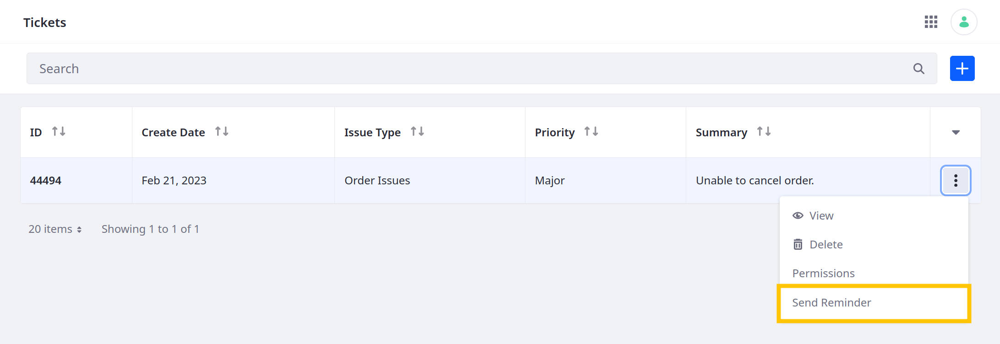
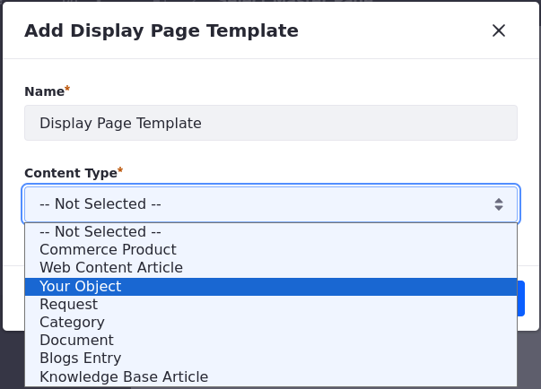
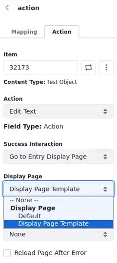

# Using Manual Actions

{bdg-secondary}`Liferay 7.4 U60+/GA60+`

When you use the standalone trigger for object actions, the actions become manual instead of automatic. Trigger these actions using these methods:

- [The object's UI](#trigger-actions-via-the-object-entry-ui)
- [Dedicated action APIs](#trigger-actions-via-apis)
- [Buttons in pages](#trigger-actions-via-pages)

This example creates a standalone action for sending notifications.


See [Defining Object Actions](./defining-object-actions.md) for more information.

## Trigger Actions via the Object Entry UI

Active standalone actions appear in the Actions menu for object entries. To trigger these actions via the UI,

1. Navigate to the object definition's application page.

1. Click the *Actions* button () for the desired entry and select the standalone action.

   In this example, the action is Send Reminder.

   

## Trigger Actions via APIs

Liferay automatically generates REST APIs for published object definitions. These include APIs for active standalone actions.

To view these APIs,

1. Open Liferay's API Explorer at `[server]:[port]/o/api` (e.g., `localhost:8080/o/api`).

1. Click *REST Applications* and select the desired object definition. Custom objects use the `c/[pluralobjectlabel]` naming pattern (e.g., `c/tickets`).

For each standalone action, Liferay generates two PUT APIs: one that uses the entry's ID and another that uses the entry's external reference code (ERC).


Calling either API triggers the action for the specified entry.


## Trigger Actions via Pages

You can map standalone actions to buttons on pages ([content pages](#mapping-buttons-to-object-actions-in-content-pages) or [display page templates](#mapping-buttons-to-object-actions-in-display-page-templates)).

If Liferay's out-of-the-box button fragment doesn't satisfy your use case, you can map actions to custom buttons by adding the attributes `data-lfr-editable-id="action"`  and `data-lfr-editable-type="action"` to their HTML tag. To learn more about adding attributes to fragments, see [Fragment Specific Tags and Attributes Reference](../../../../site-building/developer-guide/developing-page-fragments-reference/fragment-specific-tags-and-attributes-reference.md).

Here is an example of an action-ready custom button:

```html
<button class="btn btn-${configuration.buttonSize} btn-${configuration.buttonType}"
        data-lfr-editable-id="action" data-lfr-editable-type="action">
    Go Somewhere
</button>
```

### Mapping Buttons to Object Actions in Content Pages

1. [Create a Page](../../../../site-building/creating-pages.md).

1. Add a *Button* fragment to your layout. See [Adding Elements to Content Pages](../../../../site-building/creating-pages/using-content-pages/adding-elements-to-content-pages.md) to learn how to edit a content page.

1. Click on the button once. Under Button Options, select *Action* as the type. Now you can map actions to the button.

1. Click on the button a second time. An action menu opens on the right.

1. Under the Mapping tab, click on the *Item* field or the *Select Item* icon () beside the field.

1. Select your object from the list at the top.

   The available object entries appear at the bottom.

1. Choose a specific object entry.

   

1. Select the *Field* to be mapped to the button label.

1. Under the Action tab, select a specific object entry.

1. Choose an action.

1. Optionally, set the Success and Error interactions. See [Managing Success and Error Interactions](#managing-success-and-error-interactions) for more information.

!!! tip
    You can use collection display fragments or form fragments with components mapped to actions. See [Displaying Collections](../../../../site-building/displaying-content/collections-and-collection-pages/displaying-collections.md) and [Using Fragments to Build Forms](../../using-fragments-to-build-forms.md) for more information.

The button now executes the selected action when clicked.

### Mapping Buttons to Object Actions in Display Page Templates

1. [Create a Display Page Template](../../../../site-building/displaying-content/using-display-page-templates/creating-and-managing-display-page-templates.md) and choose your object as the content type.

   This makes your object the default source when mapping the button or the action.

   

1. Add a *Button* fragment to your layout.

1. Click on the button once. Under Button Options, select *Action* as the type.

   This configuration allows you to map actions to the button.

1. Click on the button a second time.

   An action menu opens on the right. Under the Mapping and Action tabs, your object is already set as a default source.

   !!! note
       If you need to choose specific content, click on the *Source* field, select *Specific Content*, and choose the specific *Item*.

1. Select the *Field* to be mapped to the button label.

1. Under the Action tab, choose an action to trigger once a user clicks the button.

1. Optionally, set the Success and Error interactions. See [Managing Success and Error Interactions](#managing-success-and-error-interactions) for more information.

The button now executes the selected action when clicked.

### Managing Success and Error Interactions

When a user clicks on a component mapped to an action, you can choose what happens when that action succeeds or fails.

There are four options available for both outcomes and an extra success interaction:

1. **None**: Nothing happens after the action is performed.

1. **Show Notification**: Notify the user. You can write your custom success/error message, preview the notification, and configure the page to reload after the action is triggered.

1. **Go to Page**: Navigate to a Success/Error Page in your site.

1. **Go to External URL**: Navigate to an external URL.

1. **Go to Entry Display Page** (Success Interactions only): When mapped to a specific object entry with an action in place, you can select this option as a success interaction. It redirects the user to a display page template.



The selected option is executed after the user triggers the action.

## Action Permissions

Liferay automatically generates permissions for managing which roles can trigger standalone actions. Each permission follows the `action.[actionName]` naming pattern (e.g., `action.sendReminder`). See [Permissions Framework Integration](../../understanding-object-integrations/permissions-framework-integration.md) for more information on object permissions.

![Standalone permissions use the action.[actionName] naming pattern.](./using-manual-actions/images/08.png)

## Related Topics

- [Defining Object Actions](./defining-object-actions.md)
- [Understanding Action Types](./understanding-action-types.md)
- [Headless Framework Integration](../../understanding-object-integrations/using-custom-object-apis.md)
