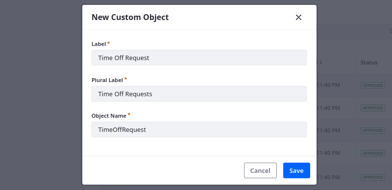
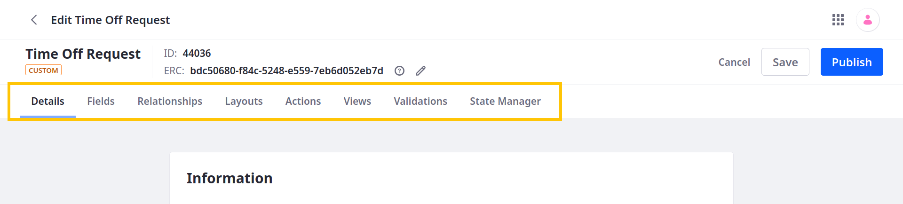
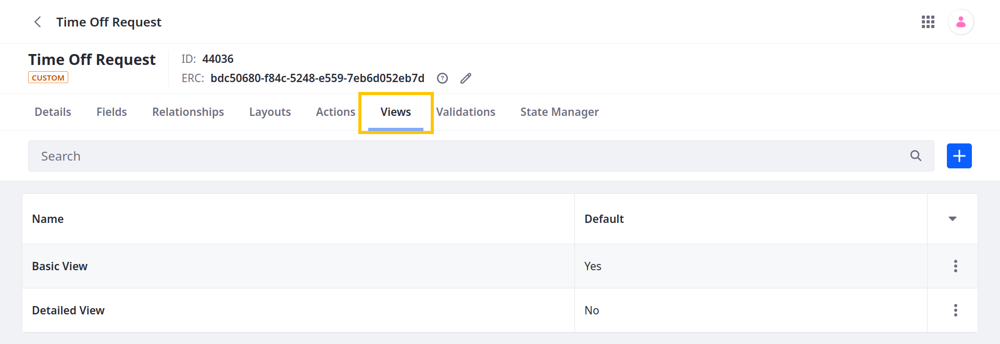
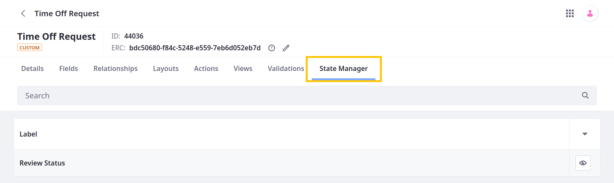

# Creating Objects

{bdg-secondary}`Liferay 7.4 2023.Q4+/GA102+`

Liferay Objects provides development capabilities in the Liferay UI. Using Objects, you can build fully integrated Liferay applications without writing any code or manually deploying modules. This process includes [creating](#creating-object-drafts) object drafts, [editing](#editing-object-drafts) them, and finally [publishing](#publishing-object-drafts) them to create the new application.

Here you'll learn how to create object definitions using the default Objects UI, but you can also create, manage, and extend object definitions using the Model Builder GUI. See [Using the Objects Model Builder](./using-the-objects-model-builder.md) for more information.

!!! important 
    Liferay creates database tables when you publish object definitions, so you cannot use Objects with the high security database practices described in [Database Configurations](../../../installation-and-upgrades/reference/database-configurations.md#high-security-database-user-practices).

## Creating Object Drafts

Object drafts are application templates that store the necessary data for creating an object application. To create a draft object,

1. Open the *Global Menu* (), go to the *Control Panel* tab, and click *Objects*.

   !!! note
       For Liferay 7.4 2023.Q4+/GA102+, you must also have the *Object Folder > View* permissions to access the Objects UI. See [Objects Application Permissions](../objects-application-permissions.md) for more information.

1. Go to the desired [object folder](./organizing-objects-with-folders.md) and click the *Add* button ().

1. Provide these details for the draft.

   **Label**: Identifies the object in the Objects admin and supported application contexts (e.g., Workflow, Display Page Templates, Forms).

   **Plural Label**: Determines the display name for the object application in the UI.

   **Object Name**: Determines the object's `definition.name` and cannot be changed after publishing.

   

1. Click *Save*.

Once saved, a blank object draft is created without any configurations or data elements. You can view the draft in the Objects admin alongside system objects. To finish the creation process, you must [edit](#editing-object-drafts) the draft and then [publish](#publishing-object-drafts) it to your Liferay instance.


## Editing Object Drafts

{bdg-secondary}`Liferay 7.4 2023.Q3+/GA92+`

Before publishing an object, you can add elements and configure its settings. This includes adding fields, defining validations, setting a scope for its data, and more.

```{note}
Whenever you add a field, relationship, or layout, the object draft is saved automatically. However, any unsaved changes in the Details tab are lost if you navigate to other tabs.
```

Follow these steps to edit the object draft:

1. From the Objects admin page, click the newly created object draft to begin editing it.

   Object features and configuration options are organized into the following tabs: Details, Fields, Relationships, Layouts, Actions, Views, Validations, and State Manager.

   

1. Click the *Fields* tab to add custom fields. Each field represents a database column for storing specific types of values. See [Adding Fields to Objects](./fields/adding-fields-to-objects.md).

   By default, all objects include these system fields: Author, Create Date, External Reference Code, ID, Modified Date, and Status.

   

1. (Optional) Click the *Relationships* tab to add relationships. Relationships are connections between object definitions that you can use to link their entries. See [Defining Object Relationships](./relationships/defining-object-relationships.md).

   

1. (Optional) Click the *Layouts* tab to add layouts. Object layouts determine how fields and relationships appear when creating and viewing object entries. See [Designing Object Layouts](./layouts/designing-object-layouts.md).

   ```{note}
   If you do not add a custom layout and set it as default, the object uses an automatically generated layout for its entries. This layout has a single tab that displays all object fields in alphabetical order and does not display relationships. To display relationships, you must create a custom layout with a dedicated relationships tab.
   ```

   

1. (Optional) Click the Actions tab to add custom actions. Each action defines an operation that runs automatically according to a set trigger. See [Defining Object Actions](./actions/defining-object-actions.md).

   

1. (Optional) Click the Views tab to add custom views. Object views determine how entries are displayed in the object's application page. See [Designing Object Views](./views/designing-object-views.md).

   

1. (Optional) Click the Validations tab to add validations. Each validation sets rules for determining valid field entries. See [Adding Field Validations](./validations/adding-field-validations.md).

   

1. (Optional) If you've added a state field to the draft, click the State Manager tab to define its flow. See [Adding and Managing Custom States](./fields/adding-and-managing-custom-states.md).

   

1. Click the Details tab to configure the object draft.

1. (Optional) Change the name, label, or plural label for the object.

   

1. Select an Entry Title. This determines the field used to identify the object's entries in the UI (e.g., relationship fields). By default, objects use the ID field.

   

1. Select an object *scope*. This determines how the object's data is stored.

   **Company** (default): When scoped by Company, the object's data is stored per Liferay instance.

   **Site**: When scoped by Site, the object's data is stored per Site.

1. Select a Panel Link to determine where the definition appears in Liferay.

   For company-scoped objects, select tab and category in the Global Menu ().

   For site-scoped objects, select a section in the Site Menu ().

   You can leave this value blank if you don't want to display the application in a UI menu.

   

1. Configure account restriction to restrict access to object entries by account. You can only configure this setting before publishing.

   This option only appears if the object is on the child side of a one-to-many relationship with the Account system object. See [Restricting Access to Object Data by Account](./using-system-objects-with-custom-objects/restricting-access-to-object-data-by-account.md).

   

1. Show or hide the object's page widget.

   While enabled, you can add the object's widget to site pages. See [Deploying Object Widgets in Sites](../deploying-object-widgets-to-sites.md).

1. Enable or disable categorization for object entries.

   While enabled, you can add categorization blocks to fields tabs in custom layouts. See [Adding Categorization to Fields Tabs](./layouts/adding-categorization-to-fields-tabs.md). Additionally, you can attach metadata to the object entries by adding the tags and categories fragments in form containers.

1. Enable or disable comments for object display pages.

   While enabled, you can use the Page Comments widget in entry display pages. See [Creating Display Page Templates for Objects](../displaying-object-entries.md#creating-display-page-templates-for-objects).

1. Enable or disable history for object entries.

   While enabled, Liferay keeps a history of entry events that you can view in the Audit application or via REST API calls. See [Auditing Object Events](./auditing-object-events.md).

1. {bdg-link-primary}`[Beta Feature](../../../system-administration/configuring-liferay/feature-flags.md#beta-feature-flags)` Enable or disable draft mode for object entries.

   While enabled, users can save entries as a draft and finalize them at a later time. Saving drafts does not trigger custom validations, workflow processes, or actions triggered by entry creation.

   ```{note}
   You can configure this setting at any time. Disabling draft mode does not change the status of existing entries.
   ```

1. Enable or disable translation support for custom text [fields](./fields.md).

   While enabled, you can enable translation for custom text fields, so end users can localize their input. See [Localizing Object Definitions and Entries](./localizing-object-definitions-and-entries.md) for more information.

1. Click *Save*.

Once you've finished configuring and editing the draft, you can [publish](#publishing-object-drafts) it.

## Publishing Object Drafts

Publishing an object creates and activates your new application. When activated, users can access it in the Liferay UI according to its scope and panel link. Before publishing your object, review the following information to understand the consequences of publishing a draft.

### What Happens During Publishing

The publishing process includes the following operations:

* A database table is created for the object with the draft's data definitions.

* A new Headless API is automatically created for CRUD operations.

* A collection provider is created for displaying the object's entries.

* A page widget is created for the object.

* The object is integrated with Info framework, so you can select the object as a content type for a [display page template](../../../site-building/displaying-content/using-display-page-templates.md)

* The object is integrated with the [Permissions framework](../understanding-object-integrations/permissions-framework-integration.md), so you can manage permissions for the new application and its resources.

* The object is integrated with the Workflow framework, so you can configure a custom workflow for the object.

* The object is integrated with Forms, so you can select the object as a data storage option.

### Configuration Restrictions for Published Objects

{bdg-secondary}`Liferay 7.4 U86+/GA86+`

To prevent data loss and system conflicts, Liferay restricts these configuration options for object definitions after publishing:

* Name
* Scope
* Account Restriction (if enabled)
* Entry Translation

Liferay also restricts some custom field options (e.g., mandatory, unique values).

```{note}
For Liferay 7.4 U85/GA85 and earlier versions, users cannot delete fields included in the object definition at the time of publishing.
```

## Related Topics

* [Objects Overview](../../objects.md)
* [Adding Fields to Objects](./fields/adding-fields-to-objects.md)
* [Defining Object Relationships](./relationships/defining-object-relationships.md)
* [Designing Object Layouts](./layouts/designing-object-layouts.md)
