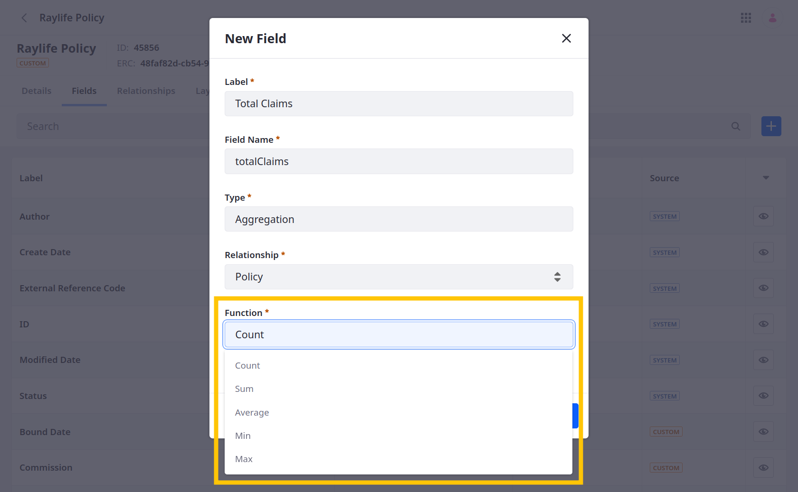
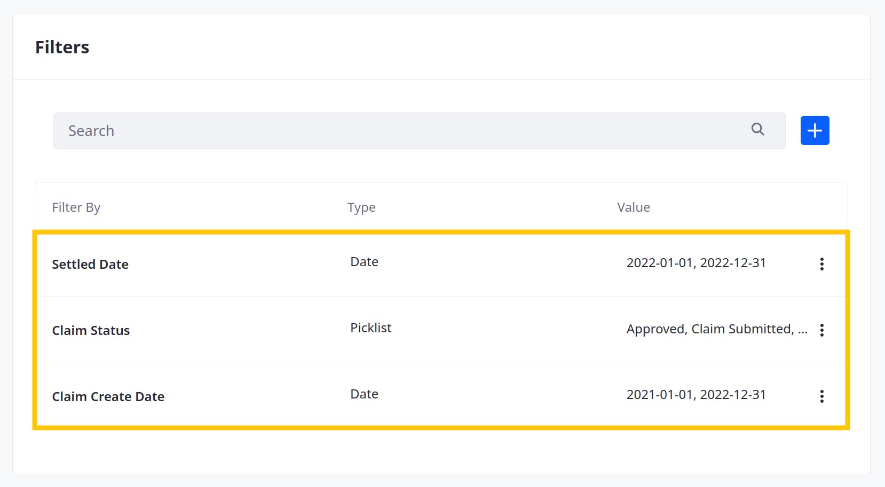

# Aggregation Fields

{bdg-secondary}`Liferay 7.4 U47+/GA47+`

Aggregation fields perform basic calculations on the entries from a relationship table and display the resulting values. Available [aggregation functions](#functions-reference) include count, sum, average, min, and max. Each function determines how values are calculated for the field. Aggregation field values are read-only.

To include aggregation fields, an object must be on the parent side of a one-to-many relationship or on either side of a many-to-many relationship. The related object must have a numeric field (i.e., integer, long integer, decimal, or precision decimal) to use the sum, average, min, and max functions.

After adding an aggregation field, you can add [filters](#using-aggregation-filters) to it. These filters can use date, integer, or picklist fields in the related object to limit the entries included in the calculation. Only entries that meet all filter criteria are included in the aggregation field's calculations.

## Functions Reference

Aggregation fields can have these functions:

| Function | Description |
| :--- | :--- |
| Count | Checks how many entries relate to the current entry and displays the total. |
| Sum | Retrieves a numeric value from each related entry and calculates the sum. |
| Average | Retrieves a numeric value from each related entry and calculates the average. |
| Min | Retrieves a numeric value from each related entry and calculates the lowest value. |
| Max | Retrieves a numeric value from each related entry and calculates the highest value. |

Consider a scenario with two insurance objects: policies and claims. If you relate the policy object to the claims object in a one-to-many relationship, you can add these aggregation fields to the policy object:

* Count: Count the number of claims related to each policy.
* Sum: Calculate and display the total monetary value of claims related to each policy.
* Average: Calculate and display the average monetary value of claims related to each policy.
* Min: Identify and display the lowest value claim for each policy.
* Max: Identify and display the highest value claim for each policy.

## Using Aggregation Filters

1. Begin editing an aggregation field.

1. Under Filters, click *Add* ().

1. Select a field to filter by. Available options include date, integer, and picklist fields in the related object.

1. Select a *Filter Type* to determine how the filter uses the selected field. Available options depend on the selected field.

   For date fields, select *Range* and enter a start date and end date.

   For picklist fields, select *Exclude* or *Include* and check the desired picklist values.

   For integer fields, select *Is Equal To* or *Is Not Equal To* and enter a whole number.

1. Click *Save*.

   

1. (Optional) Repeat this process to add multiple filters to an aggregation field.

   

1. When finished, click *Save*.

Once saved, only related entries that meet all filter criteria are included in the aggregation field's calculations.

## Related Topics

* [Fields](../fields.md)
* [Attachment Fields](./attachment-fields.md)
* [Adding Fields to Objects](./adding-fields-to-objects.md)
