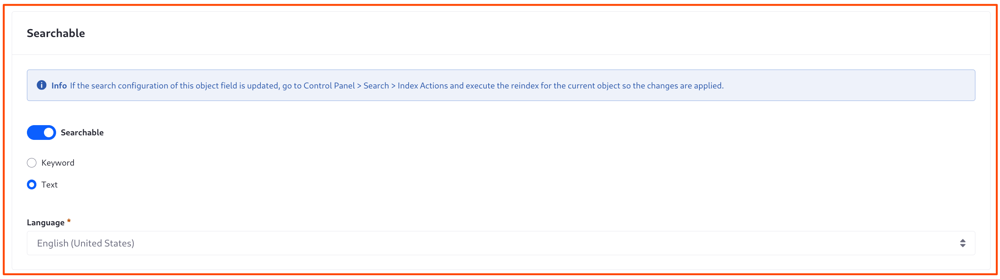

---
taxonomy-category-names:
- Development and Tooling
- Objects
- Liferay Self-Hosted
- Liferay PaaS
- Liferay SaaS
uuid: 013d44ac-a4a9-497b-85b2-be9b1fdcb23e
---
# Auto-Increment Fields

{bdg-secondary}`DXP 2024.Q1+/Portal 7.4 GA112+`

Auto-Increment fields are configurable [read-only fields](./using-read-only-fields.md) for uniquely identifying object entries in a human-readable format. For example, an IT ticketing system should generate a unique but meaningful identifier for each ticket, so users can refer to each entry easily. 

| Prefix | Starting Value | Suffix | Example Values                                                          |
|:-------|:---------------|:-------|:------------------------------------------------------------------------|
| life-  | 2000           | -ray   | life-2000-ray<br>life-2001-ray<br>life-2002-ray<br>...<br>life-3048-ray |
| none   | 0              | none   | 0<br>1<br>2<br>...<br>256                                               |
| FOO-   | 01             | none   | FOO-01<br>FOO-02<br>FOO-03<br>...<br>FOO-12                             |

!!! note
    Auto-Increment fields moved from [Release Feature to Generally Available (GA)](#auto-increment-availability) in Liferay 7.4 2024.Q2/GA120.

You must configure the starting numeric value. Liferay adds `1` to this value for each subsequent object entry. Optionally, you can add a meaningful suffix and/or prefix to each numeric value.


When editing the field, you can change its label and configure how it's searched.



## Exporting and Importing Entries with Auto-Increment Fields

Object entries are imported and exported using the [Data Migration Center](../../../../headless-delivery/consuming-apis/data-migration-center.md), a [batch client extension](../../../importing-exporting-data.md), or by calling the [batch engine's import/export task](../../../../headless-delivery/consuming-apis/batch-engine-api-basics-exporting-data.md) endpoints. 

Exporting entries with auto-increment fields preserves the values in the exported JSON. When importing entries that contain auto-increment fields, you must carefully consider whether the data is compatible with the object definition's existing entries.

Imported entries must have both unique [External Reference Codes (ERCs)](../../../../headless-delivery/consuming-apis/using-external-reference-codes.md) and unique auto-increment values.

| Unique ERC | Unique Auto-Increment Value | Successful Import |
|:-----------|:----------------------------|:------------------|
| &#10004;   | &#10004;                    | &#10004;          |
| &#10008;   | &#10004;                    | &#10008;          |
| &#10004;   | &#10008;                    | &#10008;          |

Not following this rule leads to inconsistent results. If you import entries with unique ERCs but overlapping auto-increment values, only entries with unique values import successfully:

| Existing Entries<br>ERC/Auto-Increment | Entries to Import<br>ERC/Auto-Increment                                                          | Import Result<br>ERC/Auto-Increment                                                              |
|:---------------------------------------|:-------------------------------------------------------------------------------------------------|:-------------------------------------------------------------------------------------------------|
| 11111/foo-01-bar<br>22222/foo-02-bar   | 33333/foo-01-bar<br>44444/foo-02-bar<br>55555/foo-03-bar<br>66666/foo-04-bar<br>77777/foo-05-bar | 11111/foo-01-bar<br>22222/foo-02-bar<br>55555/foo-03-bar<br>66666/foo-04-bar<br>77777/foo-05-bar |

If you import entries that don't follow the auto-increment format defined in the host system, only the values following the specified format import successfully:

| Existing Entries<br>Valid Auto-Increment Values | Entries to Import<br>Auto-Increment Values                          | Import Result<br>Valid Auto-Increment Values         |
|:------------------------------------------------|:--------------------------------------------------------------------|:-----------------------------------------------------|
| foo-01-bar<br>foo-02-bar                        | foo-003-bar<br>foo-4-bar<br>life-05-ray<br>foo-04-bar<br>foo-05-bar | foo-01-bar<br>foo-02-bar<br>foo-04-bar<br>foo-05-bar |

When you import entries, the highest numeric value in the system after the import becomes the value used to increment new field values.

If you import entries with no value in an auto-increment field, the system generates one according to the specified prefix/suffix format and uses the next numeric value in the series.

## Using Auto-Increment Fields with APIs

When you make a GET request to return object entries with an auto-increment field, the value is returned as a JSON string:

```json
"ticket" : "ticket-12"
```

To [add an object definition field](../managing-objects-with-headless-apis.md) with the headless API, use a POST request body like this one, which defines this auto-increment field format: `foo-01-bar`, `foo-02-bar`, etc. 

```json
{
   "businessType": "AutoIncrement",
   "label": {
      "en_US": "Able Ticket"
   },
   "name": "ableTicket",
   "objectFieldSettings": [
      {
         "name": "initialValue",
         "value": "01"
      },
      {
         "name": "prefix",
         "value": "foo-"
      },
      {
         "name": "suffix",
         "value": "-bar"
      }
   ], 
   "required": false
} 
```

See [Managing Objects with Headless APIs](../managing-objects-with-headless-apis.md) for more information.

## Auto-Increment Availability 

Auto-Increment fields were released behind a [release feature flag](../../../../system-administration/configuring-liferay/feature-flags.md) in Liferay 7.4 2024.Q1/GA112. They became Generally Available (GA) in 2024.Q2/GA120.

| Liferay Version    | Feature Status                                                                                              | Feature Flag [Label]                         |
|:-------------------|:------------------------------------------------------------------------------------------------------------|:---------------------------------------------|
| 2023.Q4<br>GA102   | [Release Feature](../../../../system-administration/configuring-liferay/feature-flags.md#release-feature-flags) | &#10004; [Auto-Increment Field Type for Objects (LPS-196724)] |
| 2024.Q1+<br>GA112+ | GA                                                                                                          | &#10008;                                     |

## Related Topics

* [Fields](../fields.md)
* [Attachment Fields](./attachment-fields.md)
* [Adding Fields to Objects](./adding-fields-to-objects.md)
* [Using External Reference Codes](../../../../headless-delivery/consuming-apis/using-external-reference-codes.md)
