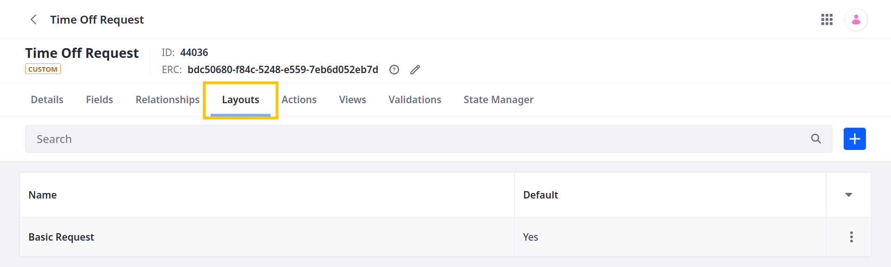

---
toc:
  - ./layouts/designing-object-layouts.md
  - ./layouts/adding-categorization-to-fields-tabs.md
uuid: 58e2dabf-bba1-4ca3-86bc-ac41df5e31e9
taxonomy-category-names:
- Development and Tooling
- Objects
- Liferay Self-Hosted
- Liferay PaaS
- Liferay SaaS
---
# Layouts

{bdg-secondary}`Liferay 7.4+`

Object layouts define how fields and relationships appear when creating and editing entries. All published objects include an autogenerated layout with a single tab that lists the object's fields in alphabetical order. You can [design your own layouts](./layouts/designing-object-layouts.md) for custom objects to determine how their fields and relationships appear. For 7.4 U31+ and GA31+, you also can add [categorization tools](./layouts/adding-categorization-to-fields-tabs.md) to tabs so end users can apply tags and categories to object entries.

```{important}
The autogenerated layout does not display object relationships. To display relationships, you must create a custom layout.
```




