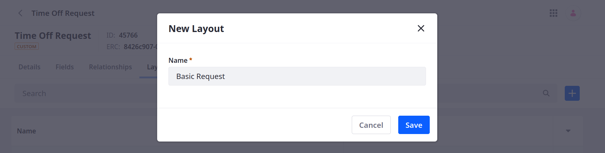
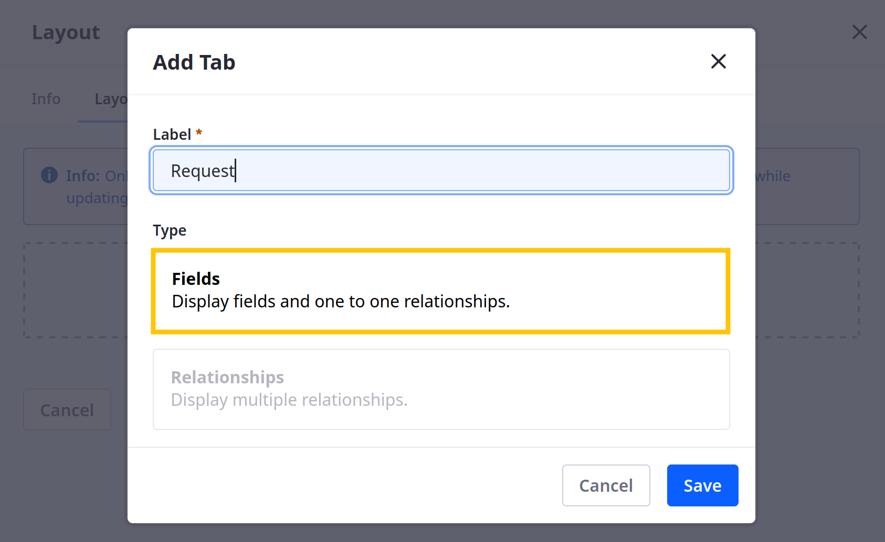
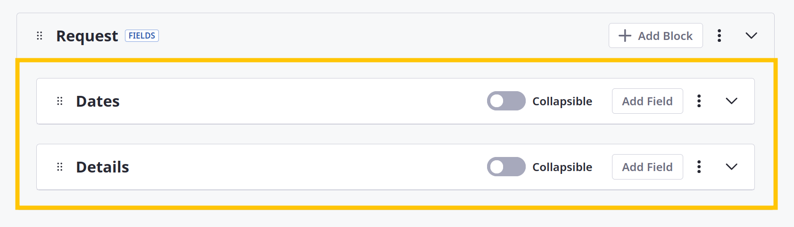
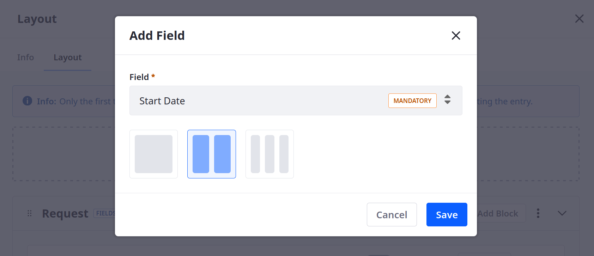
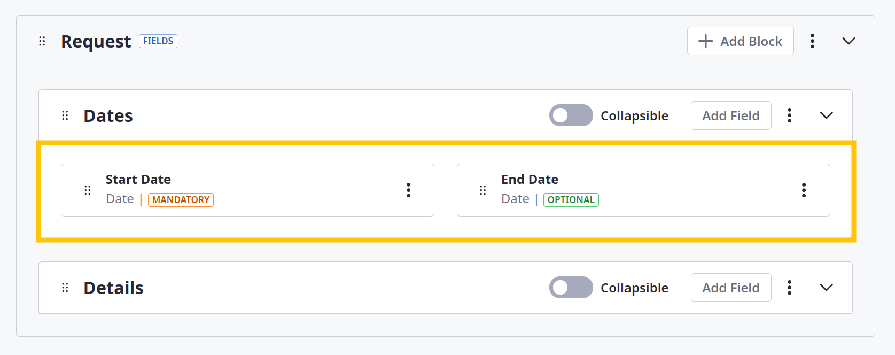
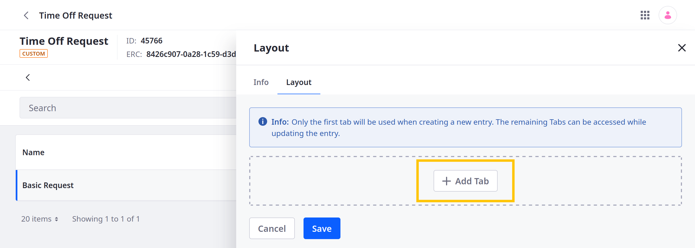
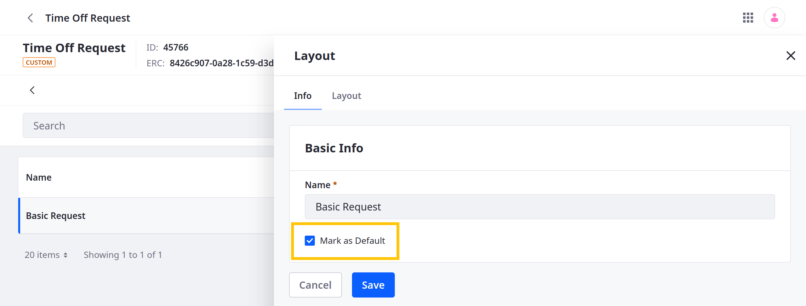
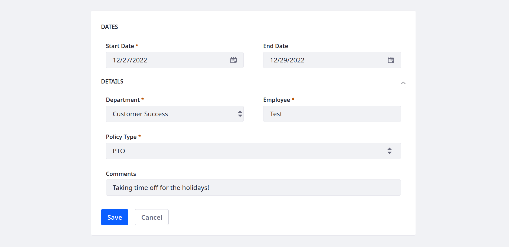

# Designing Object Layouts

{bdg-secondary}`Liferay 7.4 U31+/GA31+`

Layouts define how fields and relationships appear when creating and editing object entries. Each layout can include multiple tabs containing different elements that appear during or after entry creation. When designing a layout, there are two types of tabs:

* [Field tabs](#adding-field-tabs) can display fields created directly in an object definition or inherited from a one-to-many relationship.

* [Relationship tabs](#adding-relationship-tabs) can only display relationship tables from one-to-many or many-to-many relationships.

While designing layouts, you must first add a field tab, then you can add other tabs. Only the first tab appears during object entry creation. Other tabs appear when editing the object entry. Once you've finished designing your layout, mark it as [default](#selecting-a-default-layout) to use it.

```{important}
The first tab must be a field tab. This tab must include all mandatory object fields. Also, you can only add a relationship tab after the layout has a field tab. Relationship tabs cannot be the first tab in an object layout.
```

## Adding Layouts

1. Open the *Global Menu* (), go to the *Control Panel* tab, and click *Objects*.

1. Begin editing the desired object definition.

   ```{note}
   System objects do not support custom layouts. See [Extending System Objects](../extending-system-objects.md) for more information.
   ```

1. Go to the *Layouts* tab and click *Add* ().

1. Enter a *Name* and click *Save*.

   

This creates a blank layout to which you can add [field](#adding-field-tabs) and [relationship](#adding-relationship-tabs) tabs.

## Adding Field Tabs

1. Go to the *Layout* tab, and click *Add Tab*.

   

1. Enter a *Label*, select the *Fields* type, and click *Save*.

   The label determines the tab's display name in the Liferay UI.

   

1. Click *Add Block*, enter a *Label*, and click *Save*.

   This creates a subsection for adding fields. The label determines the section's display name in the Liferay UI.

   Repeat this step to add multiple blocks to the same tab.

   

1. Click *Add Field* for the desired block, select an object *field*, determine the field's *size* (i.e., one, two, or three columns), and click *Save*.

   

   Repeat this step to add more fields to the block.

   

1. Use the toggle switch to make a block collapsible.

   

1. After adding the desired tabs, save your changes to the layout.

After adding a field tab, you can add categorization tools to it so end users can apply tags and categories to object entries. See [Adding Categorization to Field Tabs](./adding-categorization-to-fields-tabs.md) for more information. <!--Add Comments-->

## Adding Relationship Tabs

1. Edit the desired layout, go to the *Layout* tab, and click *Add Tab*.

   

1. Enter a *Label*, select the *Relationships* type, and select the *relationship table* you want to display in the tab.

   The label determines the tab's display name in the Liferay UI.

   

1. Click *Save*.

   

1. After adding the desired tabs, save your changes to the layout.

```{important}
If the object has a many-to-many relationship with itself, you can add two relationship tabs to its layout. Each tab corresponds to one side of the relationship. For example, consider a ticket object that relates multiple tickets to one another. You can define two relationship tabs for keeping track of tickets and their dependencies. One tab would list all tickets that the current ticket depends on, while the other tab would list all tickets that depend on the current ticket. See [Defining Object Relationships](../relationships/defining-object-relationships.md) for more information.
```

## Selecting a Default Layout

Once you've designed your layout, you can set it as the object's default layout. This ensures it is used for creating and editing the object's entries. Otherwise, the object uses the autogenerated layout.

Follow these steps:

1. Select the desired *layout*.

1. In the Basic Details tab, check *Mark as Default*.

   

1. Click *Save*.

The layout is now used when creating and editing the object's entries.



## Related Topics

* [Creating Objects](../creating-objects.md)
* [Adding Fields to Objects](../fields/adding-fields-to-objects.md)
* [Defining Object Relationships](../relationships/defining-object-relationships.md)
