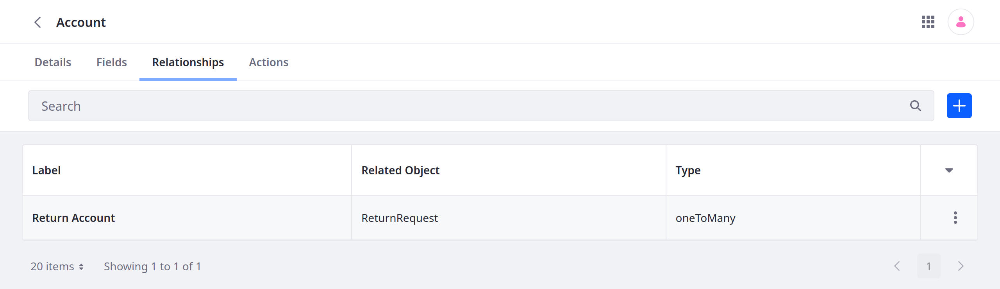
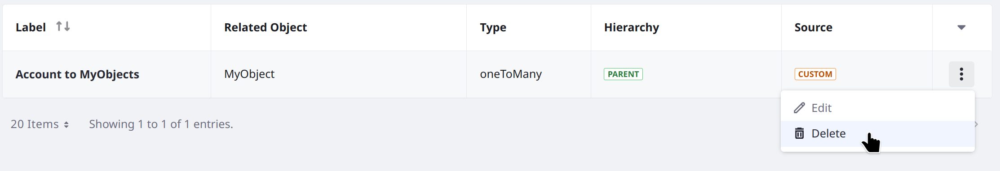

# Restricting Access to Object Data by Account

{bdg-secondary}`Liferay 7.4 U58+/GA58+`

In scenarios with multiple business [accounts](../../../../users-and-permissions/accounts.md), you may want to restrict access to object entries by account. For example, consider an [insurance scenario](#example-use-case-insurance-claims) with these requirements:

- Business account users must open claims without seeing claims made by other accounts.

- Customer success managers (CSMs) must review claims made by the accounts they manage.

- A claims manager must oversee all claims.

To restrict object entries by account, your custom object must have an active [relationship](../relationships/defining-object-relationships.md) with the Account system object, and you must configure the custom object to use this relationship for restricting entry data. Once set up, anyone adding entries to the custom object must select an account. This account becomes the entry's owner. See [Account Restriction and User Roles](#account-restriction-and-user-roles) to learn how role types control access to entries.


!!! important
    For Liferay DXP 2024.Q1+/Liferay Portal 7.4 GA112+, the entries of account restricted objects appear in search results if the search user has the `Accounts > Account Entry: View` permission in an account- or regular-scoped role. See [Searching for Content](../../../../using-search/getting-started/searching-for-content.md#searching-for-liferay-objects) for details.

## Enabling Account Restriction

You can enable account restriction in draft or published object definitions. If you enable it for a published object that already has object entries, the earlier entries are not related to any account and may be accessible only to administrative users with permission to see all the object's data.

1. Open the *Global Menu* (), go to the *Control Panel* tab, and click *Objects*.

1. If you're testing this feature, add an object definition and publish it.

1. Begin editing the Account system object.

1. Add a One to Many relationship that relates the Account object to the desired draft object. See [Defining Object Relationships](../relationships/defining-object-relationships.md) for more information.

   

1. Return to the Objects page and begin editing the desired custom object.

1. In the Details tab, activate *Account Restriction* and select the account relationship to use.

   

1. Click *Save*.

With account restriction enabled, the account relationship field is mandatory. Users must select an account when creating entries. Available account options are determined by each user's permissions. See [Account Restriction and User Roles](#account-restriction-and-user-roles) for guidance on configuring role permissions while account restriction is enabled. After entry creation, the selected account becomes the entry's owner and cannot be changed.

## Disabling Account Restriction

To disable account restriction, you must delete the relationship that enabled it:

1. Edit the Account system object: open the *Global Menu* (), go to the *Control Panel* tab, and click *Objects*, then click *Account*.

1. Open _Relationships_.

1. Click *Actions* () &rarr; *Delete*.

   

1. Confirm the relationship name and click *Delete*.

## Account Restriction and User Roles

After restricting object data by account, entries appear according to the user's permissions. Permissions at the regular role scope apply to all object data, while permissions at the organization or account scope apply to specific accounts. For example, if users have a regular role with the view permission, they can view all data from all accounts. However, if users only have an account role with the view permission, they can only view object data associated with their accounts.

| Permission Scope | Description |
| :--- | :--- |
| Regular Role | Permissions apply to all object data without restriction by account or organization role permissions. |
| Organization Role | Permissions apply to object data for specific accounts associated with an organization and its sub-organizations. |
| Account Role | Permissions apply to object data for a specific account. |

When setting up roles for account restriction, consider these factors:

* Account restricted objects must have *Show Widget* enabled and must set a [panel link](../creating-objects.md) to appear in the Roles UI.

* Regular roles must have the `Accounts > Account Entry: View` permission to create object entries. This is because regular roles are not associated with accounts or organizations. Without this permission, users with the regular role cannot select an account during entry creation.

* Organization roles must have these permissions to create object entries: `Users and Organizations &rarr; Organization: Manage Accounts` and `Users and Organizations &rarr; Organization: Manage Suborganizations Accounts`. Without these permissions, users with the organization role cannot select an account during entry creation.

* For organization and account role users to access a custom object, they must have a separate regular role granting the `Access in Control Panel` (company-scoped) or `Access in Site` permission (site-scoped). See [Object Application Permissions](../../understanding-object-integrations/permissions-framework-integration.md#application-permissions) for more information.

!!! important
    Account and organization roles are only supported in objects with account restriction enabled.

    Account restriction does not support the default Account Member and Organization user roles. These roles do not grant access automatically to related object data.

    When a user is a member of multiple accounts with different account roles and object permissions, these permissions apply to each account the user belongs to.

## Example Use Case: Insurance Claims

Consider an insurance scenario with these requirements:

* Business account users must open claims without seeing claims made by other accounts.

* Customer success managers (CSMs) must review claims made by the accounts they manage.

* A claims manager must oversee all claims.

To achieve this, create a Claims object with account restriction enabled. Then create organizations for grouping CSMs and associate each organization with the appropriate business accounts. Finally, create the following [account](#account-role), [organization](#organization-role), and [regular](#regular-role) roles and assign them to the appropriate users. Since the Claims object is company-scoped, account and organization users must also have a separate regular role that grants the `Portal: View Control Panel Menu` and `Claims: Access in Control Panel` permissions. For convenience, you can assign these permissions to the default user role.

```{note}
In this example, each role can create claim entries, but granting that permission is not necessary for the organization and regular roles.
```

### Account Role

Grant account users permission to create and manage the account's object data.

| Permission | Description |
| :--- | :--- |
| Claims: View | View the object's application page. |
| Claims > Claim: Delete | Delete object entries. |
| Claims > Claim: Permissions | View and modify permissions for individual object entries. |
| Claims > Claim: Update | Update object entries. |
| Claims > Claims: Add Object Entry | Create an object entry. |

```{important}
Do not assign the `Claims &rarr; Claim: View` resource permission to account roles. This permission can interfere with standard role behaviors.
```

### Organization Role

Grant organization users permission to create and manage object data for all accounts associated with the organization and its sub-organizations.

| Permission | Description |
| :--- | :--- |
| Claims: View | View the object's application page. |
| Claims > Claim: Delete | Delete object entries. |
| Claims > Claim: Permissions | View and modify permissions for individual object entries. |
| Claims > Claim: Update | Update object entries. |
| Claims > Claim: View | View object entries. |
| Claims > Claims: Add Object Entry | Create an object entry. |
| User and Organizations > Organization: Manage Accounts | View an organization's accounts. |
| User and Organizations > Organization: Manage Suborganizations Accounts | View accounts associated with sub-organizations. |

### Regular Role

Grant users permission to create and manage object data for all accounts.

| Permission | Description |
| :--- | :--- |
| Accounts > Account Entry: View | View access to account entries. |
| Portal: View Control Panel Menu | Access to the Global Menu (  ). |
| Claims: Access in Control Panel | Access the object in the Global Menu. |
| Claims: View | View the object's application page. |
| Claims > Claim: Delete | Delete object entries. |
| Claims > Claim: Permissions | View and modify permissions for individual object entries. |
| Claims > Claim: Update | Update object entries. |
| Claims > Claim: View | View object entries. |
| Claims > Claims: Add Object Entry | Create an object entry. |

## Related Topics

* [Accounts](../../../../users-and-permissions/accounts.md)
* [Extending System Objects](../extending-system-objects.md)
* [Defining Object Relationships](../relationships/defining-object-relationships.md)
* [Accessing Accounts Data from Custom Objects](./accessing-accounts-data-from-custom-objects.md)
* [Understanding Roles and Permissions](../../../../users-and-permissions/roles-and-permissions/understanding-roles-and-permissions.md)
* [Returning Objects in Search Results](../../../../using-search/search-pages-and-widgets/search-results/search-results-behavior.md#returning-objects-in-search-results)
