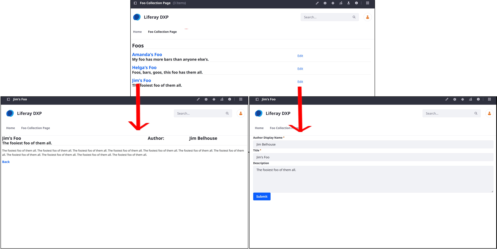

---
toc:
  - ./displaying-object-entries/displaying-object-entries-with-collection-providers.md
uuid: bf481358-5a1a-45af-ab98-a03bddd3044a
taxonomy-category-names:
- Sites
- Fragments
- Liferay Self-Hosted
- Liferay PaaS
- Liferay SaaS
---

# Displaying Object Entries

{bdg-secondary}`Liferay 7.4+`

You can display object entries dynamically with Liferay's page building features. For example, [collection displays](../../site-building/displaying-content/collections-and-collection-pages/displaying-collections.md) can show a list of entries while [display pages](../../site-building/displaying-content/using-display-page-templates.md) can provide the entry detail view. When combined with the [form container](../../site-building/creating-pages/page-fragments-and-widgets/using-fragments/configuring-fragments/general-settings-reference.md#form-container), display pages can also serve as the edit screen for object entries. 

Collections, display pages and form containers offer the most flexibility and are recommended. However, other display methods are available:

| Object Entry Display Feature | Description | Object Entry View |
| :--------------------------- | :-------------------- | :---------- |
| [Collections](../../site-building/displaying-content/collections-and-collection-pages.md) | You can create dynamic collections, manual collections, or automatic collections with the collection provider`*` [generated for every object](./displaying-object-entries/displaying-object-entries-with-collection-providers.md), and display them in the Collection Display fragment or on a Collection Page. This is the preferred method for displaying published object entries on pages. | List view |
| [Display Page Templates](../../site-building/displaying-content/using-display-page-templates.md) | You can create a flexible page to display an object entry or its edit form using all the best [page creation tools](../../site-building/creating-pages/using-content-pages.md). | Detail view Edit screen |
| [Form Containers](using-fragments-to-build-forms.md)/ [Form Fragments](using-fragments-to-build-forms.md) | You can use form container fragments on any content or display page to display an object's add or edit form. | Creation screen Edit screen |
| [Data Sets](../data-sets.md)  | Display any data returned from a REST application registered in Liferay. |  List view Detail view Creation screen Edit screen |
| [Object Widget](deploying-object-widgets-to-sites.md) | You automatically get a widget for your object entries, including a default table view and edit screen. The widget is full-featured but offers limited flexibility, relying on object layouts and views to customize its displays. | List view Detail view Creation screen Edit screen |
| [Object Layouts](creating-and-managing-objects/layouts/designing-object-layouts.md) | You can use layouts to provide a customized detail view for the object's widget.  | Detail view |
| [Object Views](creating-and-managing-objects/views/designing-object-views.md) | You can use views to customize the creation and edit form for the object's widget. | Creation screen Edit screen |
| [Information Templates](../../site-building/displaying-content/using-information-templates.md) | You can create FreeMarker templates to control how object entries appear in the Content Display fragment and fragments with sub-elements. | Detail view |
| [Navigation Menus](../../site-building/site-navigation/using-the-navigation-menus-application.md) | Add object entries to navigation menus. | List view |

`*` DXP users can also use a [Search Blueprints Collection Provider](../../using-search/liferay-enterprise-search/search-experiences/search-blueprints/collections-with-search-blueprints.md)  with objects. This is especially useful for displaying instance-scoped objects in a site, where manual and dynamic collections are not available.

!!! note
    Information Templates can be used in Content Display fragments and any other fragment with [sub-elements](../../site-building/creating-pages/page-fragments-and-widgets/using-fragments/configuring-fragments/fragment-sub-elements-reference.md) (e.g., text, rich text) that can be mapped to objects.

Together, these integrations enable users to leverage Liferay's WYSIWYG page building capabilities while delivering personalized user experiences.

## Creating Display Page Templates for Objects

When created, each object entry is assigned automatically a dedicated friendly URL that uses the following pattern: `server-address/l/objectEntryId` (e.g., `https://mysite.com/l/44337`). To view an entry at its URL, you must first create a Display Page Template for the object.

1. Open the *Site Menu* (), expand *Design*, and go to *Page Templates*.

1. Click the *Display Page Templates* tab.

1. Click the *Add* button () and select the *Blank* template.

   This opens a modal window.

1. Enter a *name* and select the desired *Object* for Content Type.

   

1. Click *Save*.

   This creates a blank template with the selected object as its default mapping source and redirects you to the template editing page.

1. Use page fragments and widgets to create flexible, dynamic displays for object entries. See [Using Display Page Templates](../../site-building/displaying-content/using-display-page-templates.md) for information.

   

1. Add the Page Comments widget so end users can comment on entry display pages.

   !!! note
       You must enable comments for the object definition. Otherwise, the widget is hidden in the display page.

1. When finished, click *Publish*.

1. Click the *Actions* button () for your template and select *Mark as Default*.

   This template is now used to render the object's entries whenever users visit their friendly URLs.

   

### Enabling Comments

1. Open the *Global Menu* (), go to the *Control Panel* tab, and click *Objects*.

1. Edit an object definition.

1. In the Details tab, enable comments and click *Save*.

   

## Creating Information Templates for Objects

With information templates, you can use FreeMarker to template objects.

1. Open the *Site Menu* () and go to *Design* &rarr; *Templates* &rarr; *Information Templates*.

1. Click *Add* ()

1. Enter a *name* and select the desired *Object*.

   

1. Click *Save*. This redirects you to the template design page.

1. (Optional) Click Actions () in the Application Bar, select *Import Script*, and choose an `.ftl` file to import. This replaces the current template with the file's FreeMarker script.

   

1. Use [FreeMarker](https://freemarker.apache.org) to design your template.

   In the *Elements* side panel (), you can access available fields from the selected object's structure.

   

1. (Optional) Add a description or image to the template in the Properties side panel ().

   

1. Click *Save* when finished.

You can now select from the template when mapping object entries to fragment fields.

## Adding Entries to Navigation Menus

Since objects are integrated with the info framework, you can add object entries to navigation menus to provide quick access. All published objects automatically appear as available sources for menu elements. See [Using the Navigation Menus Application](../../site-building/site-navigation/using-the-navigation-menus-application.md) for more information.

## Related Topics

* [Creating Objects](./creating-and-managing-objects/creating-objects.md)
* [Displaying Object Entries with Collections](./displaying-object-entries/displaying-object-entries-with-collection-providers.md)
* [About Collections and Collection Pages](../../site-building/displaying-content/collections-and-collection-pages.md)
* [Using Display Page Templates](../../site-building/displaying-content/using-display-page-templates.md)
