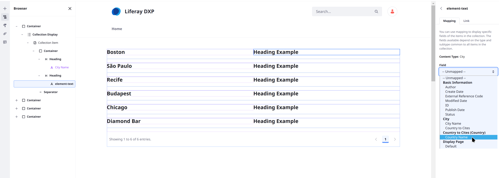

# Displaying Object Entries with Collections

{bdg-secondary}`Liferay 7.4 U77+/GA77+`

When you publish an object definition, Liferay creates a [collection provider](../../../site-building/displaying-content/collections-and-collection-pages/collection-providers.md) for it. For site-scoped objects, you can also [create manual or dynamic collections](../../../site-building/displaying-content/collections-and-collection-pages/creating-collections.md) for the object. You can use these collections with the [Collection Display fragment](../../../site-building/displaying-content/collections-and-collection-pages/displaying-collections.md#adding-a-collection-display-fragment-to-a-page) and [collection pages](../../../site-building/displaying-content/collections-and-collection-pages/displaying-collections.md#displaying-collections-on-a-collection-page) to display object entries. Objects support all collection display features, including filtering, styling, and display options.

!!! note
    Instance-scoped objects cannot be used in manual or dynamic collections. With Liferay DXP you can use Search Blueprints and its collection provider to achieve most use cases. See [Collections with Search Blueprints](../../../using-search/liferay-enterprise-search/search-experiences/search-blueprints/collections-with-search-blueprints.md) for more information.

## Using an Object Collection

1. Create a new [content page](../../../site-building/creating-pages/using-content-pages.md) or [display page template](../../../site-building/displaying-content/using-display-page-templates/creating-and-managing-display-page-templates.md). Alternatively, begin editing (  ) an existing one.

   !!!note
      You can also create a collection page using the collection provider. See [Collections and Collection Pages](../../../site-building/displaying-content/collections-and-collection-pages/about-collections-and-collection-pages.md) for more information.

1. Drag and drop the *Collection Display* fragment into the page or template from the Fragments and Widgets () sidebar.

1. Select the *Collection Display Fragment* to access its configuration options and click *Select Collection* in the General tab.

   

1. In the modal window, select a collection or click the *Collection Providers* tab and select the object's provider.

   

1. (Optional) Filter the displayed object entries. You can filter by any picklist or boolean fields in the object:

   Click *Collection Options* () and select *Filter Collection*.

   

   Then select the desired *filters* and click *Apply*.

   

After selecting the desired collection, use additional fragment options to determine how Object entries appear, including *List Style* and *Pagination*.

## Mapping Fragments to Object Fields

When you select an object for a Collection Display fragment, the object is set as its mapping source. Now you can add fragments to it and map their [sub-elements](../../../site-building/creating-pages/page-fragments-and-widgets/using-fragments/configuring-fragments/fragment-sub-elements-reference.md) to object fields to create flexible page displays for individual object entries. This is true for collection pages as well.

For example, you can embed a button in a Collection Display fragment mapped to an object and then configure the button's link to display the name of each item in the collection.

## Mapping Fragments to Related Object Fields

!!! important
    Mapping fragment elements to related object fields is behind a release feature flag. Read [Release Feature Flags](../../../system-administration/configuring-liferay/feature-flags.md#release-feature-flags) for more information.

If the mapped object is on the child side of a [one-to-many relationship](../creating-and-managing-objects/relationships/defining-object-relationships.md), you can map fragment elements to fields in the parent object. The embedded Collection Display fragment uses a unique [related items collection provider](../../../site-building/displaying-content/collections-and-collection-pages/collection-providers.md#related-items-collections-providers) to form the new collection.

For example, if a `City` object (child) is related to a `Country` object (parent), you can map fragments to fields in the `Country` object.

To map fragments to a related object's fields,

1. Use the Object's collection provider with a Collection Display fragment.

1. Embed another Collection Display fragment within the initial Collection Display.

   !!! tip
       Using the *Browser* tab in the page edit menu can help you position the fragment more precisely within the page hierarchy.

   

1. Click *Select Collection* in the new Collection Display fragment's configuration options.

1. Click the *Related Items Collection Providers* tab.

1. Select the collection provider with the name of the object's relationship. The associated object type appears under the relationship's name. In this example, the relationship is called `cities in country`:

   

Now you can embed fragments in the new Collection Display and map them to fields in the related object.

## Related Topics

* [Creating Objects](../creating-and-managing-objects/creating-objects.md)
* [Displaying Object Entires](../displaying-object-entries.md)
* [About Collections and Collection Pages](../../../site-building/displaying-content/collections-and-collection-pages/about-collections-and-collection-pages.md)
* [Collection Providers](../../../site-building/displaying-content/collections-and-collection-pages/collection-providers.md)
* [Defining Object Relationships](../creating-and-managing-objects/relationships/defining-object-relationships.md)
