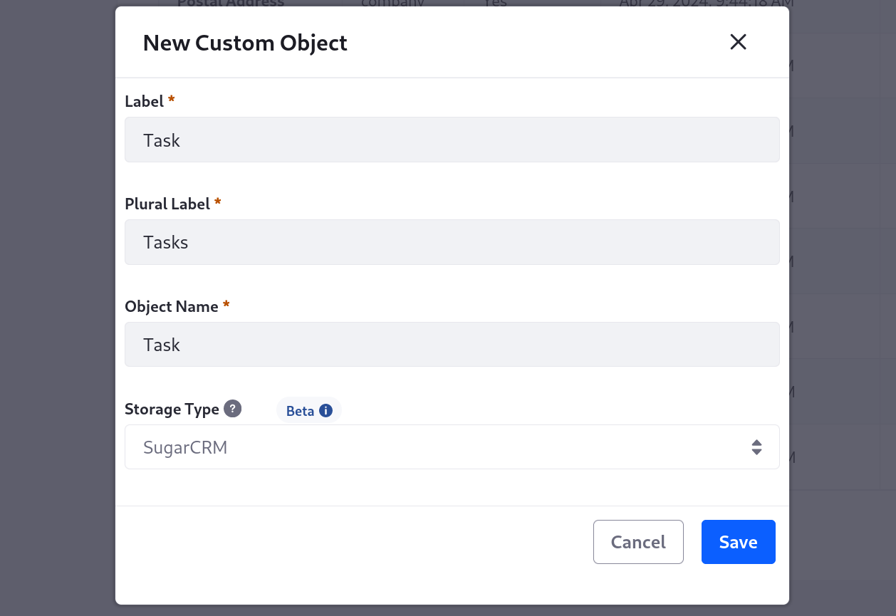

# Using Objects with SugarCRM

{bdg-link-primary}`[Beta Feature](../../../../system-administration/configuring-liferay/feature-flags.md#beta-feature-flags)`

<!-- Is the use case basically identical? What in SugarCRM corresponds to the object? I don't see applications so is it all the resources in the menu (e.g., Leads, Opportunities, Tasks, etc.)? I have no experience with CRMs prior to this -->
You can create objects that map to [SugarCRM](https://support.sugarcrm.com) objects (e.g., [Leads](https://support.sugarcrm.com/knowledge_base/accounts_contacts_leads/)), using SugarCRM as an external storage system. Once integrated, the Liferay object's data is only stored in SugarCRM. Both systems are automatically updated whenever users add, update, or delete entries in either context.

!!! note
    To use this feature, enable the Proxy Object (LPS-135430) [feature flag](../../../../system-administration/configuring-liferay/feature-flags.md).

## Preparing SugarCRM

In SugarCRM , you must generate an [OAuth key](https://support.sugarcrm.com/documentation/sugar_versions/14.0/sell/administration_guide/system/#OAuth_Keys) [connected apps](https://support.sugarcrm.com) are frameworks for allowing external applications to integrate with your SugarCRM account via APIs and standard protocols (e.g., SAML, OAuth). Before proceeding, [create a connected app](https://support.sugarcrm.com) to enable your Liferay instance to integrate with SugarCRM.

**Access Token URL:** 

When setting up the connected app in SugarCRM, [enable and configure OAuth](https://support.sugarcrm.com) for the API integration with Liferay. During this process, be sure to copy the OAuth consumer key and secret. These details are necessary when [configuring your Liferay instance](#configuring-your-liferay-instance).

Before creating your Liferay object, ensure your SugarCRM object includes all desired fields. Define any missing fields before linking Liferay object fields to them.

## Configuring Your Liferay Instance

The base URL to your SugarCRM instance, the path to its OAuth token, the Client ID (this may be called the Consumer Key in the SugarCRM interface). Al;so the grant type, password, and user name (is you choose password as grant type, I'm guessing?)

Follow these steps to connect your Liferay instance to SugarCRM:

1. Open the *Global Menu* (), go to the *Control Panel* tab, and click *Instance Settings*.

1. Click *Third Party* and go to the *SugarCRM Integration* tab.

1. Enter your SugarCRM login info and OAuth credentials for the [Liferay connected app](https://support.sugarcrm.com).

   For *Login URL*, you can use `https://login.salesforce.com/` or the login URL for your SugarCRM domain.

   

1. Click *Save*.

## Creating an Object with the SugarCRM Storage Type

To create a proxy object for storing data in SugarCRM, follow the [usual process](../../creating-and-managing-objects.md), but select the *SugarCRM* storage type. This configures the object to use SugarCRM as an external storage system.

<!-- Is this true for SugarCRM? -->
!!! note
    Currently, the SugarCRM storage type only supports custom [fields](../../creating-and-managing-objects/fields.md), [views](../../creating-and-managing-objects/views.md), and [layouts](../../creating-and-managing-objects/layouts.md).

After creating the object draft, [add fields](../../creating-and-managing-objects/fields/adding-fields-to-objects.md) for each custom field in the SugarCRM object. To prevent data loss, ensure each field corresponds to a custom field in the desired SugarCRM object. Then edit each field and add external reference codes that link to the desired SugarCRM fields. For each ERC, use the name of the corresponding custom SugarCRM field (e.g., `Title_c`, `Due_Date__c`).

Once published, the Liferay object's data is only stored in SugarCRM. Both systems are automatically updated whenever users add, update, or delete entries on either side of the relationship.

## Related Topics

* [Creating Objects](../../creating-and-managing-objects/creating-objects.md)
* [Adding Fields](../../creating-and-managing-objects/fields/adding-fields-to-objects.md)
