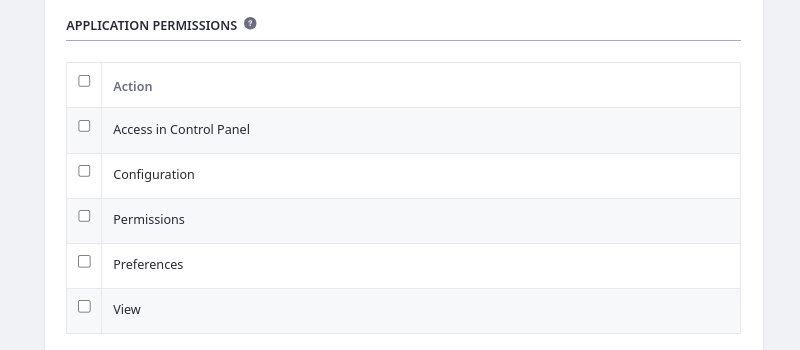
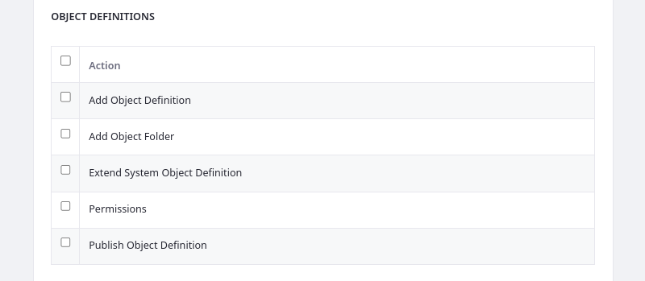
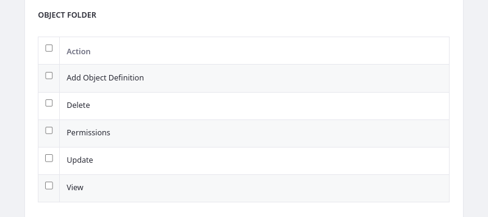
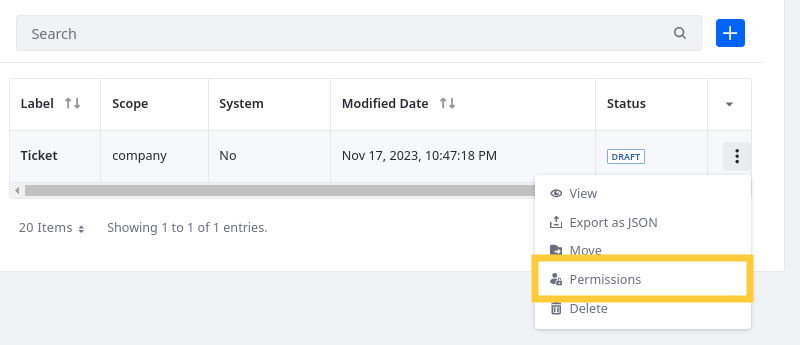

# Objects Application Permissions

{bdg-secondary}`Liferay 7.4 2023.Q4+/GA102+`

The Objects application is integrated with the permissions framework, so you can assign [application](#application-permissions) and [resource](#resource-permissions) permissions to user roles to determine which users can access the application and its data.

See [Defining Role Permissions](../../users-and-permissions/roles-and-permissions/defining-role-permissions.md) for more information about assigning permissions to user roles.

## Application Permissions

Application permissions grant permission to perform general application-related operations and do not include [resource-related permissions](#resource-permissions).

Objects has the following application permissions:

| Permission              | Description                                                        |
|:------------------------|:-------------------------------------------------------------------|
| Access in Control Panel | Access Objects in the Global Menu.                                 |
| Configuration           | View and modify configuration options for the Objects application. |
| Permissions             | View and modify Objects permissions.                               |
| Preferences             | View and modify preferences for the Objects application.           |
| View                    | View the Objects application.                                      |

!!! important
    For Liferay 7.4 2023.Q4+/GA102+, users must have the *Object Folder > View* permission to use the Objects UI. 

## Resource Permissions

Resource permissions grant access to view, create, and act on definitions and folders in the Objects application. Some of these permissions are for [creating entities](#object-definitions-resource-related-actions) while others are for acting on existing entities (e.g., [definitions](#object-definition-for-existing-custom-definitions) and [folders](#object-folder-for-existing-object-folders)).

Objects has the following resource permissions.

### Object Definitions (Resource-Related Actions)

| Permission                      | Description                                                            |
|:--------------------------------|:-----------------------------------------------------------------------|
| Add Object Definition           | Create an object definition draft.                                     |
| Add Object Folder               | Create a folder for organizing object definitions.                     |
| Extend System Object Definition | Add fields, relationships, actions, and validations to system objects. |
| Permissions                     | View and manage permissions related to objects.                        |
| Publish Object Definition       | Publish an object definition draft.                                    |

### Object Definition (For Existing Custom Definitions)

| Permission  | Description                                           |
|:------------|:------------------------------------------------------|
| Delete      | Delete an object definition.                          |
| Permissions | View and modify permissions for an object definition. |
| Update      | Update an object definition.                          |
| View        | View an object definition.                            |

### Object Folder (For Existing Object Folders)

| Permission            | Description                                       |
|:----------------------|:--------------------------------------------------|
| Add Object Definition | Move an object definition to the folder           |
| Delete                | Delete an object folder.                          |
| Permissions           | View and modify permissions for an object folder. |
| Update                | Update an object folder.                          |
| View                  | View an object folder.                            |

## Managing Permissions for Individual Object Definitions

1. Open the *Objects* application via the *Global Menu* ().

1. Click the *Actions* button () for the desired object definition and select *Permissions*.

   

1. Use the checkboxes to grant [object definition](#object-definition-for-existing-custom-definitions) permissions to the desired roles.

   !!! note
       Permissions defined at the roles admin level override permissions defined at the individual level.

   

1. Click *Save*.

## Managing Permissions for Individual Folders Definitions

1. Open the *Objects* application via the *Global Menu* ().

1. Click *Actions* () for the desired object folder and select *Permissions*.

   

1. Use the checkboxes to grant [object folder](#object-folder-for-existing-object-folders) permissions to the desired roles.

   !!! note
       Permissions defined at the roles admin level override permissions defined at the individual level.

   

1. Click *Save*.

## Related Topics

* [Objects](../objects.md)
* [Creating and Managing Objects](./creating-and-managing-objects.md)
