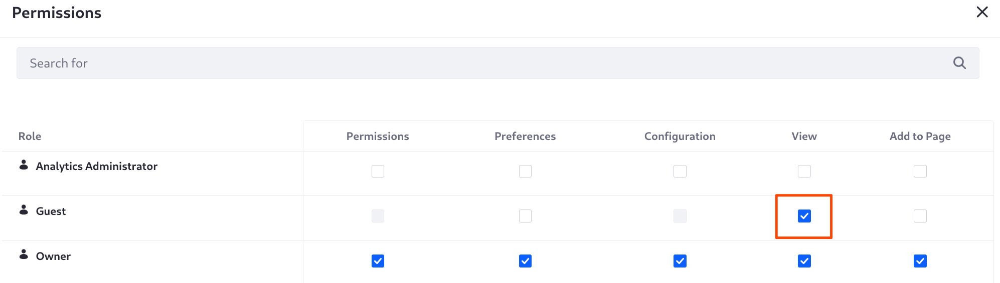
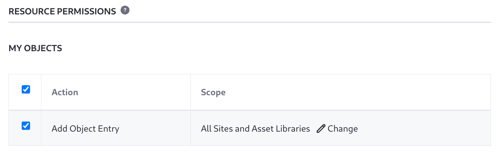
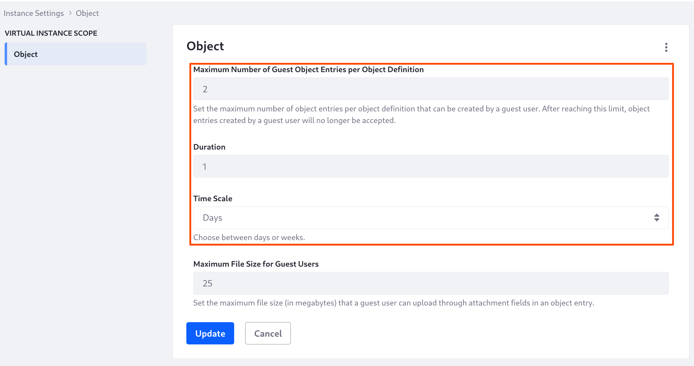
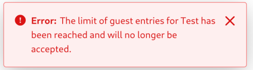

# Managing Guest User Entries

When you create an object and its application UI, unauthenticated users cannot add object entries, even if you add an object-backed application to a page and grant the guest user view permission in the application.

You must explicitly grant [Resource Permissions](./permissions-framework-integration.md#resource-permissions) on your object if you want guest users to create object entries.

## Allowing Guest Submissions

1. Open the *Global Menu* () &rarr; *Control Panel* &rarr; *Roles*.

1. In the Regular Roles tab, click *Guest* &rarr; *Define Permissions*.

1. Search for your object and select it to begin defining the guest user's permissions.

1. Under Resource Permissions, grant at least the *Add Object Entry* permission.

1. Click *Save*.

## Limiting Object Entry Submissions

To deter distributed denial-of-service (DDoS) attacks and spam submissions, you can limit guest object entry submissions. Go to *Global Menu* () &rarr; *Control Panel* &rarr; *Instance Settings* &rarr; *Object*.

**Maximum Number of Guest Object Entries per Object Definition:** Set the maximum number of object entries guest users can create for each object definition. After reaching this limit, guest-created object entries are not accepted. The default value is `100`.

In DXP 2024.Q2+/GA120+, you can also set a time period for the maximum number of allowed guest submissions, so that after the configured duration guest submissions are allowed again. With this you can ensure that you limit the _rate_ of guest entry submissions.

**Duration:** Set the time period for which the configured maximum number of guest entries cannot be exceeded.

**Time Scale:** Choose whether the duration is measured in days or weeks.

## Limiting the Attachment Field File Size

You can also limit the file size that guest users can upload in object attachment fields:

**Maximum File Size for Guest Users:** Set the maximum file size (in megabytes) that a guest user can upload through attachment fields in an object entry. The default value is `25`.

## Related Topics

* [Permissions Framework Integration](./permissions-framework-integration.md)
* [Creating and Managing Objects](../creating-and-managing-objects.md)
* [Roles and Permissions](../../../users-and-permissions/roles-and-permissions.md)
