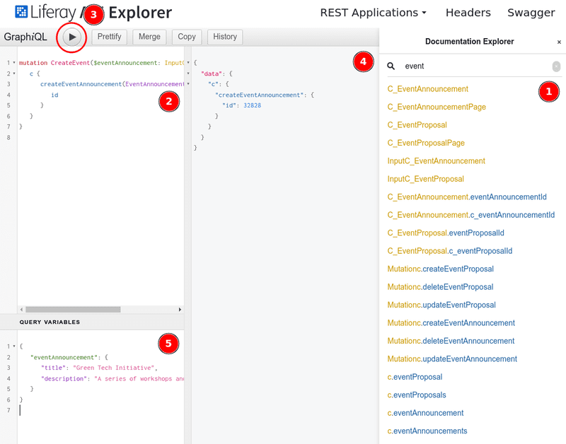
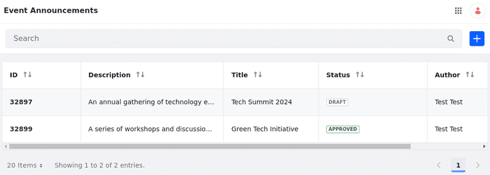

# Managing Object Entries Using GraphQL

You can use GraphQL to manage custom object entries in Liferay efficiently. This API framework simplifies data interaction and serves as an alternative to [REST APIs]((./object-api-basics.md)). With GraphQL, you can query specific data, reduce network requests, and improve application performance.

Read [Consuming GraphQL APIs](../../../../headless-delivery/consuming-apis/consuming-graphql-apis.md) to learn more about GraphQL in Liferay.

## Setting Up a Liferay Instance

```{include} /_snippets/run-liferay-portal.md
```

Then, follow these steps to [create](../../creating-and-managing-objects/creating-objects.md) a basic object for this tutorial:

1. Open the *Global Menu* (), go to the *Control Panel* tab, and click *Objects*.

1. Click *Add* () and enter these values:

   | Field        | Value                 |
   | :----------- | :-------------------- |
   | Label        | `Event Announcement`  |
   | Plural Label | `Event Announcements` |
   | Name         | `EventAnnouncement`   |

1. Select the new *Object* draft, go to the *Details* tab, and toggle on the *Allow Users to Save Entries as Draft* and the *Enable Entry Translation* options. Click *Save*.

1. Go to the *Fields* tab, and add two text fields:

   | Label       | Field Name  | Type | Required |
   | :---------- | :---------- | :--- | :------- |
   | Title       | title       | Text | &#10004; |
   | Description | description | Text | &#10004; |


1. Go back to the *Details* tab, select *Object* under Scope &rarr; Panel Link, and click *Publish*.

   The object definition appears under Object in the Global Menu. You can use the application to check if the entries are created correctly.

   !!! important
       For this tutorial, use the values provided above.

[Publishing an Object](../../creating-and-managing-objects/creating-objects.md#publishing-object-drafts) creates and activates a new application for receiving and storing data. You can now access it via headless APIs. All APIs for custom objects appear under `c` in Liferay's GraphQL schema.

You can use Liferay’s integrated GraphiQL IDE to search object schemas, draft queries, run requests, and more. To access it, go to Liferay’s API Explorer at `[server]:[port]/o/api` (e.g., `localhost:8080/o/api`) and click *GraphQL*.

## Posting Custom Object Entries

Use the `create` mutation to post custom object entries. In this example, add a new entry to the Event Announcement object, which has two fields: `title` and `description`.

1. Make the request by visiting Liferay’s integrated GraphiQL IDE.

   

1. Construct the GraphQL query based on the schema documentation (1) and place it in the query area (2) at the top left window of the GraphQL client.

   ```graphql
   mutation {
      c {
         createEventAnnouncement(
            EventAnnouncement: {
               title: "Green Tech Initiative",
               description: "A series of workshops and discussions on sustainable tech practices. Focus on energy-efficient coding, reducing data center carbon footprints, and eco-friendly solutions.",
            }
         ) {
         id
         }
      }
   }
   ```

   Alternatively, you can construct a JSON document containing the entry you wish to publish and place it into the Query Variables box (5) at the lower left (you may have to scroll down and click on *Query Variables* to expand the box).

   ```json
   {
      "eventAnnouncement": {
         "title": "Green Tech Initiative",
         "description": "A series of workshops and discussions on sustainable tech practices. Focus on energy-efficient coding, reducing data center carbon footprints, and eco-friendly solutions."
      }
   }
   ```

   Use the `eventAnnouncement` variable to pass dynamic data into the GraphQL mutation. This way, you can separate the query structure from the data it operates on, making it easier to reuse queries with different inputs.

      ```graphql
      mutation CreateEvent($eventAnnouncement: InputC_EventAnnouncement) {
         c {
            createEventAnnouncement(EventAnnouncement: $eventAnnouncement) {
               id
            }
         }
      }
   ```

1. Run your query by clicking the play button at the top (3).

The object entry you added now appears in the GraphQL client's right pane (4). Liferay returns a JSON representation of your object entry containing the fields you requested in the mutation and the entry's ID:

```json
{
  "data": {
    "c": {
      "createEventAnnouncement": {
        "id": 32802
      }
    }
  }
}
```

You can make these requests with any web client, such as cURL:

```bash
curl \
	"http://localhost:8080/o/graphql" \
	--data-raw '{
		"query": "mutation { c { createEventAnnouncement(EventAnnouncement: {title: \"Green Tech Initiative\", description: \"A series of workshops and discussions on sustainable tech practices. Focus on energy-efficient coding, reducing data center carbon footprints, and eco-friendly solutions.\"}) { id } } }"
	}' \
	--header "accept: application/json" \
	--header "Content-type: application/json" \
	--request "POST" \
	--user "test@liferay.com:learn"
```

!!! important
    During development, it's much easier to use Basic Auth, which passes credential data in the URL. Since this is insecure, never use this method for production.

## Posting Entries with a Draft Status

{bdg-secondary}`Liferay DXP 2024.Q3+/Portal 7.4 GA125+`

You can also post an object entry while setting its status. This example demonstrates how to add a new entry to the *Event Announcement* object with a draft status.

1. Construct the GraphQL query based on the schema documentation and place it in the query area at the top left window of the GraphQL client.

```graphql
mutation {
   c {
      createEventAnnouncement(
         EventAnnouncement: {
            title: "Tech Summit 2024",
            description: "An annual gathering of technology enthusiasts to explore the latest trends in AI, cybersecurity, and software development.",
            statusCode: 2
         }
      ) {
         id
         status
         statusCode
      }
   }
}
```

In this GraphQL mutation, you are calling `createEventAnnouncement` to add a new entry to the Event Announcement object definition. The mutation request includes the `EventAnnouncement` object with the fields `title`, `description`, and `statusCode`. The `statusCode` field is set to `2`, indicating that the entry is in draft status (where `0` is used for approved entries).

The response returns the `id`, `status`, and `statusCode` of the newly created event announcement, confirming that the object was created and is currently in draft status:

```json
{
   "data": {
      "c": {
         "createEventAnnouncement": {
         "id": 32897,
         "status": "draft",
         "statusCode": 2
         }
      }
   }
}
```

You can access the Event Announcements application to ensure the entry was created as a draft successfully.



## Getting Custom Object Entries

At the top left window of the GraphQL client, place this code, which retrieves all Event Announcements entries:

```graphql
query {
   c {
      eventAnnouncements(
         filter: ""
         page: 1
         pageSize: 10
         search: ""
         sort: ""
      ) {
         page
         items {
         id
         title
         description
         status
         }
      }
   }
}
```

This GraphQL query retrieves a list of event announcements with pagination parameters. It requests the first page of results, with a maximum of 10 items per page. The response includes the `id`, `title`, `description`, and `status` of each event announcement. You can modify the filter, search, and sort fields to refine the results based on specific criteria.

Click the play button to run it, and see available entries:

```json
{
   "data": {
      "c": {
         "eventAnnouncements": {
         "page": 1,
         "items": [
            {
               "id": 32897,
               "title": "Tech Summit 2024",
               "description": "An annual gathering of technology enthusiasts to explore the latest trends in AI, cybersecurity, and software development.",
               "status": "draft"
            },
            {
               "id": 32899,
               "title": "Green Tech Initiative",
               "description": "A series of workshops and discussions on sustainable tech practices. Focus on energy-efficient coding, reducing data center carbon footprints, and eco-friendly solutions.",
               "status": "approved"
            }
         ]
         }
      }
   }
}
```

## Getting a Single Custom Object Entry

To retrieve a single entry, use the entry's ID:

```graphql
query {
   c {
      eventAnnouncement(eventAnnouncementId: 32897) {
         title
         description
      	status
      	statusCode
      }
   }
}
```

Paste this into the query area at the top left window of the client and click the *Play* button. It returns the selected entry:

```json
{
  "data": {
    "c": {
      "eventAnnouncement": {
        "title": "Tech Summit 2024",
        "description": "An annual gathering of technology enthusiasts to explore the latest trends in AI, cybersecurity, and software development.",
        "status": "draft",
        "statusCode": 2
      }
    }
  }
}
```

## Getting Localized Content

{bdg-secondary}`Liferay DXP 2024.Q3+/Portal 7.4 GA125+`

If you have localized content, you can retrieve it by using the `_i18n` parameters in your GraphQL queries.

In the GraphQL client, enter the following query to get localized content for a specific entry:

```graphql
query {
   c {
      eventAnnouncement(eventAnnouncementId: 32899) {
         title_i18n
         description_i18n
      }
   }
}
```

This query retrieves the localized `title` and `description` fields for the specified event announcement by its ID.

Click the *play* button to run the query. The response shows the available localized values:

```json
{
   "data": {
      "c": {
         "eventAnnouncement": {
         "title_i18n": {
            "en_US": "Community Volunteer Day",
            "es_ES": "Día de Voluntariado Comunitario",
            "pt_BR": "Dia de Voluntariado Comunitário",
            "fr_FR": "Journée de Volontariat Communautaire"
         },
         "description_i18n": {
            "en_US": "An opportunity for community members to come together and volunteer for various local projects and initiatives.",
            "es_ES": "Una oportunidad para que los miembros de la comunidad se reúnan y colaboren en diversos proyectos e iniciativas locales.",
            "pt_BR": "Uma oportunidade para os membros da comunidade se reunirem e voluntariar para vários projetos e iniciativas locais.",
            "fr_FR": "Une occasion pour les membres de la communauté de se rassembler et de faire du bénévolat pour divers projets et initiatives locaux."
         }
         }
      }
   }
}
```

## Patching Custom Object Entries

To update fields in an entry, use the `update` mutation in GraphQL queries.

Enter this mutation in the query area of the GraphQL client to update an event announcement entry by its ID:

```graphql
mutation {
   c {
      updateEventAnnouncement(
         eventAnnouncementId: 32897,
         EventAnnouncement: {
         title: "Tech Summit 2025",
         description: "A series of workshops on sustainable tech practices. Focus on energy-efficient coding, reducing data center carbon footprints, and eco-friendly solutions."
         statusCode: 0
         }
      ) {
         id
         title
         description
      }
   }
}
```

This mutation updates the `title`, `description`, and `statusCode` fields of the entry with the specified ID.

Click the *play* button to run it, and the response includes the updated fields:

```json
{
   "data": {
      "c": {
         "updateEventAnnouncement": {
         "id": 32897,
         "title": "Tech Summit 2025",
         "description": "A series of workshops on sustainable tech practices. Focus on energy-efficient coding, reducing data center carbon footprints, and eco-friendly solutions.",
         "status": "approved",
         "statusCode": 0
         }
      }
   }
}
```

## Deleting Custom Object Entries

To delete an entry, use the `delete` mutation. The call is similar to retrieving a single entry:

```graphql
mutation {
   c {
      deleteEventAnnouncement(eventAnnouncementId: 32897)
   }
}
```

This mutation returns a Boolean in a JSON document indicating success or failure:

```json
{
   "data": {
      "c": {
         "deleteEventAnnouncement": true // null if the deletion fails
      }
   }
}
```

Congratulations! You've now learned how to use Liferay's GraphQL services to handle custom object entries.

## Related Topics

- [Consuming GraphQL APIs](../../../../headless-delivery/consuming-apis/consuming-graphql-apis.md)
- [Object API Basics](./object-api-basics.md)
