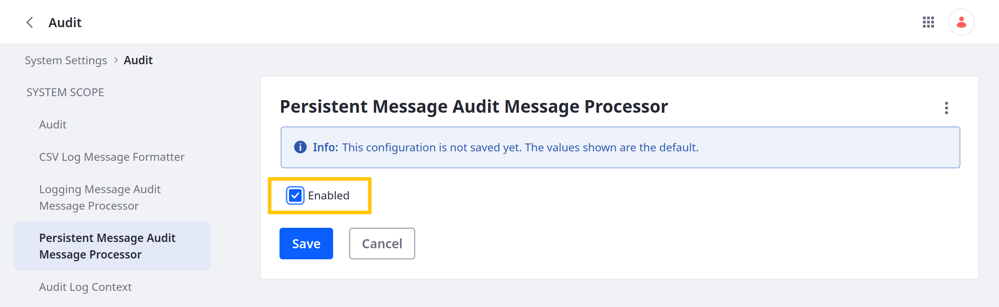

# Using nestedFields to Audit Entry History

{bdg-secondary}`Liferay 7.4 U72+/GA72+`

When you [enable entry history](../../creating-and-managing-objects/auditing-object-events.md#enabling-entry-history) for an object definition, you can use the `nestedFields` parameter with REST APIs to audit entry events. Add `nestedFields=auditEvents` to the path for GET requests (e.g., `http://localhost:8080/o/c/tickets/?nestedFields=auditEvents`).

To get started, [set up](#setting-up-a-liferay-instance) a new Liferay 7.4 instance and [prepare](#preparing-the-sample-code) the provided tutorial code. Then, [run the scripts](#using-the-sample-code) to create entries, update them, and query those changes using the `nestedFields` parameter.

!!! important
    Using REST APIs to view an entry's history requires both the `View` and `Object Entry History` permissions for the entry. See [Permissions Framework Integration](../permissions-framework-integration.md).

## Setting Up a Liferay Instance

```{include} /_snippets/run-liferay-portal.md
```

Next, enable Liferay's persistent audit message processor. Then create and publish an object definition.

### Enabling the Persistent Audit Message Processor

1. Open the *Global Menu* () &rarr; *Control Panel* tab, &rarr; *System Settings*.

1. Under Security, click *Audit* and go to the *Persistent Message Audit Message Processor* tab.

1. Check *Enabled*.

1. Click *Save*.

   

### Creating the Object Definition

1. Open the *Global Menu* (), go to the *Control Panel* tab, and click *Objects*.

1. [Create](../../creating-and-managing-objects/creating-objects.md#creating-object-drafts) an object draft.

   | Field        | Value   |
   |:-------------|:--------|
   | Label        | `Able`  |
   | Plural Label | `Ables` |
   | Name         | `Able`  |

1. Add this field to the draft.

   | Label  | Field Name | Type | Required |
   |:-------|:-----------|:-----|:---------|
   | `Name` | `name`     | Text | &#10004; |

1. In the Details tab, toggle *Enable Entry History*.

1. [Publish](../../creating-and-managing-objects/creating-objects.md#publishing-object-drafts) the object.

Once published, you can access the object via Headless APIs.

## Preparing the Sample Code

Download and unzip the sample code:

```bash
curl https://resources.learn.liferay.com/dxp/latest/en/building-applications/objects/understanding-object-integrations/using-custom-object-apis/liferay-g4m3.zip -O
```

```bash
unzip liferay-g4m3.zip
```

The sample code includes shell scripts for creating, updating, and querying object entries.

!!! tip
    For a complete list of APIs generated for site and company objects, see [Objects Headless Framework Integration](../../understanding-object-integrations/using-custom-object-apis.md). You can view and test custom object APIs via the Liferay API Explorer at `[server]:[port]/o/api` (e.g., `localhost:8080/o/api`). Click *REST Applications* and select an API.

## Using the Sample Code

1. Navigate to the `curl` folder in the `liferay-g4m3` project.

   ```bash
   cd liferay-g4m3/curl
   ```

1. Execute `Able_POST_ToCompany` to create three `Able` entries.

   ```bash
   ./Able_POST_ToCompany.sh
   ```

   ```json
   {
     ...
     "externalReferenceCode" : "able-one",
     "id" : 47512,
     ...
     "name" : "Able 1 - Foo"
   }

   {
     ...
     "externalReferenceCode" : "able-two",
     "id" : 47514,
     ...
     "name" : "Able 2 - Foo"
   }

   {
     ...
     "externalReferenceCode" : "able-three",
     "id" : 47516,
     ...
     "name" : "Able 3 - Foo"
   }
   ```

1. Execute `Able_PATCH_ByExternalReferenceCode` with the `able-one` ERC.

   ```bash
   ./Able_PATCH_ByExternalReferenceCode.sh able-one
   ```

   This updates the entry's name field twice.

   ```json
   {
     ...
     "externalReferenceCode" : "able-one",
     "id" : 47512,
     ...
     "name" : "Able 1 - Bar"
   }

   {
     ...
     "externalReferenceCode" : "able-one",
     "id" : 47512,
     ...
     "name" : "Able 1 - Goo"
   }
   ```

1. Execute `Able_GET_ByExternalReferenceCode` with the `able-one` ERC.

   ```bash
   ./Able_GET_ByExternalReferenceCode.sh able-one
   ```

   This returns the `able-one` entry with the `auditEvents` array, a history of the entries events, beginning with the most recent event and ending with the entry's creation.

   ```json
   {
     ...
     "auditEvents" : [ {
       "auditFieldChanges" : [ {
         "name" : "name",
         "newValue" : "Able 1 - Goo",
         "oldValue" : "Able 1 - Bar"
       } ],
       "dateCreated" : "2023-05-04T05:44:41Z",
       "eventType" : "UPDATE"
     }, {
       "auditFieldChanges" : [ {
         "name" : "name",
         "newValue" : "Able 1 - Bar",
         "oldValue" : "Able 1 - Foo"
       } ],
       "dateCreated" : "2023-05-04T05:44:40Z",
       "eventType" : "UPDATE"
     }, {
       "auditFieldChanges" : [ {
         "name" : "name",
         "newValue" : "Able 1 - Foo"
       } ],
       "dateCreated" : "2023-05-04T05:44:37Z",
       "eventType" : "ADD"
     } ],
     ...
     "externalReferenceCode" : "able-one",
     "id" : 47512,
     ...
     "name" : "Able 1 - Goo"
   }
   ```

   The `auditEvents` array includes these elements:

   * `auditFieldChanges`: The updated field, with its new and old values.
   * `dateCreated`: The time and date of the event.
   * `eventType`: The event type (e.g., `ADD`, `UPDATE`, `DELETE`).

1. Execute `Ables_GET_FromCompany`.

   ```bash
   ./Ables_GET_FromCompany.sh able-one
   ```

   This returns all Able entries with an audit of their events, beginning with the most recent event.

   ```json
   {
     ...
     "items" : [ {
       ...
       "auditEvents" : [ {
         "auditFieldChanges" : [ {
           "name" : "name",
           "newValue" : "Able 2 - Foo"
         } ],
         "dateCreated" : "2023-05-04T06:15:50Z",
         "eventType" : "ADD"
       } ],
       ...
       "externalReferenceCode" : "able-two",
       "id" : 47514,
       ...
       "name" : "Able 2 - Foo"
     }, {
       ...
       "auditEvents" : [ {
         "auditFieldChanges" : [ {
           "name" : "name",
           "newValue" : "Able 3 - Foo"
         } ],
         "dateCreated" : "2023-05-04T06:15:51Z",
         "eventType" : "ADD"
       } ],
       ...
       "externalReferenceCode" : "able-three",
       "id" : 47516,
       ...
       "name" : "Able 3 - Foo"
     }, {
       ...
       "auditEvents" : [ {
         "auditFieldChanges" : [ {
           "name" : "name",
           "newValue" : "Able 1 - Goo",
           "oldValue" : "Able 1 - Bar"
         } ],
         "dateCreated" : "2023-05-04T06:16:25Z",
         "eventType" : "UPDATE"
       }, {
         "auditFieldChanges" : [ {
           "name" : "name",
           "newValue" : "Able 1 - Bar",
           "oldValue" : "Able 1 - Foo"
         } ],
         "dateCreated" : "2023-05-04T06:16:24Z",
         "eventType" : "UPDATE"
       }, {
         "auditFieldChanges" : [ {
           "name" : "name",
           "newValue" : "Able 1 - Foo"
         } ],
         "dateCreated" : "2023-05-04T06:15:49Z",
         "eventType" : "ADD"
       } ],
       ...
       "externalReferenceCode" : "able-one",
       "id" : 47512,
       ...
       "name" : "Able 1 - Goo"
     } ],
     "lastPage" : 1,
     "page" : 1,
     "pageSize" : 20,
     "totalCount" : 3
   }
   ```

## Examining the GET Requests

These GET requests include the `nestedFields=auditEvents` parameter in their URLs.

### `Able_GET_ByExternalReferenceCode`

```{literalinclude} ./using-nestedfields-to-audit-entry-history/resources/liferay-g4m3.zip/curl/Able_GET_ByExternalReferenceCode.sh
   :language: bash
```

### `Ables_GET_FromCompany`

```{literalinclude} ./using-nestedfields-to-audit-entry-history/resources/liferay-g4m3.zip/curl/Ables_GET_FromCompany.sh
   :language: bash
```

## Related Topics

- [Auditing Object Events](../../creating-and-managing-objects/auditing-object-events.md)
- [Using nestedFields to Query Related Entries](./using-nestedfields-to-query-related-entries.md)
