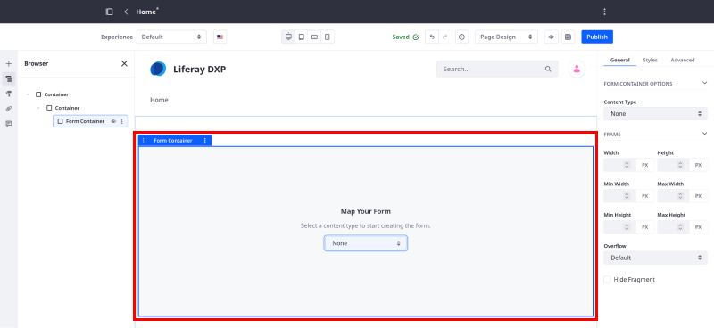
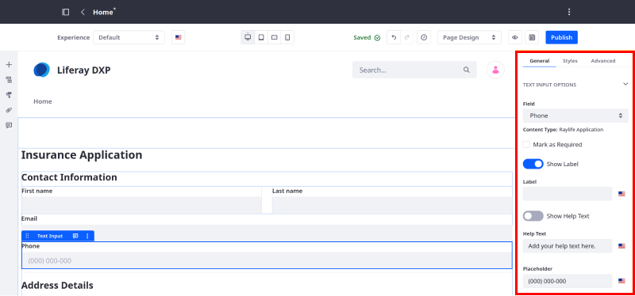

# Using Fragments to Build Forms

{bdg-secondary}`Liferay 7.4 2023.Q3+/GA92+`

Liferay includes form fragments for building object forms in content pages. To build a form, add a form container to a content page or page template and map it to a published object. The container automatically populates fragments mapped to each object field. You can organize, remove, or add fragments manually. Once published, end users can create object entries using the form.

To build forms in content pages,

* Place form fragments only in a mapped form container.
* Map every form fragment in the form to an object field to prevent data loss.
* Include fragments in the form container for all mandatory object fields.
* Make mandatory form fragments visible.
* Include a visible submit button in the form container.

!!! note
    When mapping an object to a Form Container fragment, a submit button is generated. You can map its text using [mapping settings](../../site-building/creating-pages/page-fragments-and-widgets/using-fragments/configuring-fragments/fragment-sub-elements-reference.md#mapping-settings).

    To create a button with [link settings](../../site-building/creating-pages/page-fragments-and-widgets/using-fragments/configuring-fragments/fragment-sub-elements-reference.md#link-settings) for redirection, add `type="button"` to the button fragment.

By default, Liferay includes the [Form Components](../../site-building/creating-pages/page-fragments-and-widgets/using-fragments/default-fragments-reference.md#form-components) fragment set, but you can create your own. See [Creating Form Fragments](../../site-building/developer-guide/developing-page-fragments/creating-form-fragments.md) for more information.

In addition, form fragments can only be used with [custom objects](../objects/creating-and-managing-objects/creating-objects.md). Therefore, Liferay hides the Form Components fragment set until you have at least one published object. Once published, users with access to the object can view and use the Form Components fragments.

## Creating a Form

1. Begin editing a content page or page template.

   Display page templates do not support form fragments.

1. (Optional) Design a layout using fragments. See [Building Responsive Layouts with Fragments](../../site-building/optimizing-sites/building-a-responsive-site/building-responsive-layouts-with-the-grid-fragment.md) for more information.

1. Add the *Form Container* fragment to the page and map it to an object.

   The container automatically generates a Submit button and fragments for all object fields. They appear in alphabetical order. Mandatory fields are marked accordingly.

   

1. Remove non-mandatory fields that you don't want in the form.

1. Drag and drop form fragments to reorganize them. By default, form elements are organized alphabetically.

1. (Optional) Add basic fragments to the form container. You can use basic components (e.g., grids, separators, paragraphs, images) to provide structure and style to your form container.

   

1. Configure the fragments. Form fragments include both [standard](../../site-building/creating-pages/page-fragments-and-widgets/using-fragments/configuring-fragments.md) and [unique](../../site-building/creating-pages/page-fragments-and-widgets/using-fragments/configuring-fragments/general-settings-reference.md#form-fragment-options) configuration options.

   !!! note
       Form fragment configuration options become available after mapping the fragment to an object field.

   

1. {bdg-link-primary}`[Beta Feature](../../system-administration/configuring-liferay/feature-flags.md#beta-feature-flags)` (Optional) If draft mode is enabled for the object, configure the Submitted Entry Status for the form's submit button: *Approved* or *Draft*.

   !!! important
       When using form fragments to update entries in a display page, you cannot change an entry's status from approved to draft.

   

1. Click *Publish* when finished.

## Supported Field Types for Form Components

Each form fragment can support one or more object field types. The default form components support these fields.

| Form Fragment    | Object Field Types                                |
| :--------------- | :------------------------------------------------ |
| CAPTCHA          | N/A                                               |
| Checkbox         | Boolean                                           |
| Date             | Date                                              |
| File Upload      | Attachment                                        |
| Multiselect List | Multiple Picklist                                 |
| Numeric Input    | Integer, Long Integer, Decimal, Precision Decimal |
| Rich Text        | Rich Text                                         |
| Select from List | Relationship, Picklist                            |
| Submit Button    | N/A                                               |
| Text Input       | Text, Long Text                                   |
| Textarea         | Text, Long Text                                   |

!!! tip
    If categorization is enabled for the object, you can use the Tags and Categories form fragments to add metadata to object entries.

## Related Topics

* [Form Components](../../site-building/creating-pages/page-fragments-and-widgets/using-fragments/default-fragments-reference.md#form-components)
* [Configuring Fragments](../../site-building/creating-pages/page-fragments-and-widgets/using-fragments/configuring-fragments.md)
* [Form Fragment Options](../../site-building/creating-pages/page-fragments-and-widgets/using-fragments/configuring-fragments/general-settings-reference.md#form-fragment-options)
* [Creating Form Fragments](../../site-building/developer-guide/developing-page-fragments/creating-form-fragments.md)
