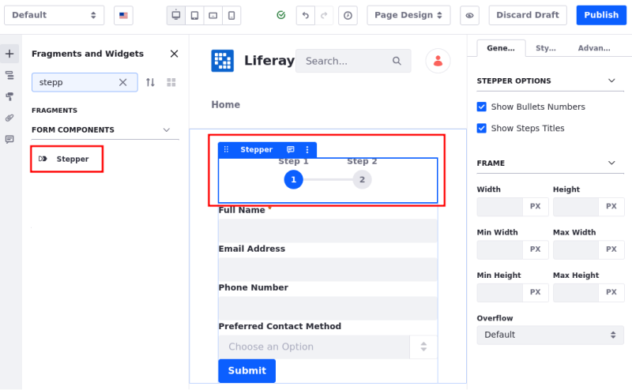

# Using Fragments to Build Multi-Step Forms

{bdg-secondary}`Liferay DXP 2024.Q4+`

!!! important
    Currently, this feature is behind a release feature flag (LPD-10727). Read [Release Feature Flags](../../system-administration/configuring-liferay/feature-flags.md#release-feature-flags) for more information.

You can [use fragments to create a sigle-step form](./using-fragments-to-build-forms.md) or create a multi-step form by [using the Stepper fragment](#using-the-stepper-fragment) or by [changing the form's Form Type configuration](#changing-the-form-type-configuration).

## Adding a Form Fragment

!!! important
    Form fragments can only be used with custom objects. Liferay hides the Form Components fragment set until you have at least one published object. Once published, users with access to the object can view and use the Form Components fragments. See [Creating Objects](../../../../../courses/latest/en/selling-liferay/level-1-technical/constructing-a-business-application/creating-objects.md) for more information.

1. While [editing a page](../../site-building/creating-pages/using-content-pages/adding-elements-to-content-pages.md), locate the *Form Fragment* in the Fragments and Widgets sidebar.

1. Drag and drop it into the editing area.

## Using the Stepper Fragment

The Stepper fragment transforms a single-step form into a multi-step form, making navigation between steps easier and clearer. Once set, you can rename the step titles, map them to fields, click on step indicators to navigate between steps, add form elements to each step, and configure how the steps look.

To add a Stepper fragment to the Form Container fragment in the page editor,

1. Locate the *Stepper* fragment in the Fragments and Widgets sidebar.

1. Drag and drop it into the Form Container, either at the top or bottom.

A confirmation message appears. Once confirmed, the Stepper fragment is added to the page, and you can begin [adding form fields to the steps](#adding-form-fields-to-the-steps).

## Changing the Form Type Configuration

Alternatively, you can change the form's Form Type configuration to Multistep instead of using the Stepper fragment.

!!! note
    The Stepper fragment is not added automatically in this case. You can [add it manually](#using-the-stepper-fragment) for easier visualization and navigation between form steps.

1. Select the *Form Container* and navigate to the *General* tab in the right panel.

1. Under Form Type, select *Multistep*.

This adds the Form Steps and two Step fragments to the container.

If you choose not to use the Stepper fragment, enable the *Display All Steps in Edit Mode* option in the General tab to view the drag-and-drop zones for each step.

Once the configuration is complete, you can begin [adding form fields to the steps](#adding-form-fields-to-the-steps).

## Adding Form Fields to the Steps

Each step in the form requires form fields to function as a form.

If you're using a Stepper fragment (1), select the step indicator to navigate to that step's drag-and-drop zone. From there, add form fragments and build the form for that step.

If you're not using a Stepper fragment (2), add form fragments to the drag-and-drop zone for the step.

Next, map the form fragment to an object field by selecting the fragment and navigating to the *General* tab in the right panel. Under Field, select the object field to map it to the fragment.

   

For multi-step forms, buttons must be configured based on their position in the form. To change the button type,

1. Select an existing *form button* or add one to the step's drag-and-drop zone.

1. Navigate to the *General* tab in the right panel. Change the button *Type* based on the step:

   The first step must have a Next button.
   Steps between the first and last must have both Next and Previous buttons.
   The last step must have both Previous and Submit buttons.

   

## Configuring Multi-Step Forms

After setting up your multi-step form and adding fields to it, you can customize it further by configuring several options:

To set the number of steps,

1. Select the *Form Container* fragment and navigate to the *General* tab in the right panel.

1. Under Number of Steps, adjust the value to add/remove steps.

   You can also use the up/down arrows next to the field to increase/decrease the number of steps.

   Step indicators and titles are added automatically to the Stepper fragment. If the Display All Steps in Edit Mode is enabled, drag-and-drop zones for new steps are appear in the editor.

   

To map/change the step title in the Stepper fragment,

1. Click the text on top of the step indicator once to access the Mapping tab in the right panel.

1. Select an item and its field to map to the title.

1. Alternatively, double-click the title to edit it manually.

   

To configure the Stepper fragment,

1. Select the *Stepper* fragment and navigate to the *General* tab in the right panel.

1. Under Stepper options, toggle the *Show Bullets Numbers* option to display/hide the numbers in the step indicators.

1. Toggle the *Show Steps Titles* option to display/hide the titles.

   

## Related Topics

- [Using Fragments to Build Forms](./using-fragments-to-build-forms.md)
- [Form Components](../../site-building/creating-pages/page-fragments-and-widgets/using-fragments/default-fragments-reference.md#form-components)
- [Configuring Fragments](../../site-building/creating-pages/page-fragments-and-widgets/using-fragments/configuring-fragments.md)
- [Form Fragment Options](../../site-building/creating-pages/page-fragments-and-widgets/using-fragments/configuring-fragments/general-settings-reference.md#form-fragment-options)
- [Creating Form Fragments](../../site-building/developer-guide/developing-page-fragments/creating-form-fragments.md)
