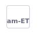

# Adding a Language

Liferay currently supports about 50 languages out-of-the-box. [Translation](https://translate.liferay.com/) is complete for many of these languages, and some are still in the translation process. Each language has its own [language properties file](https://github.com/liferay/liferay-portal/tree/master/modules/apps/portal-language/portal-language-lang/src/main/resources/content) containing its language keys.

## Adding a New Language

By default, the [`portal.properties`](https://github.com/liferay/liferay-portal/blob/41ac354cd0aa3f9d851a37a6a62d8167f81a2bce/portal-impl/src/portal.properties#L2930) file specifies all languages available in Liferay. To add a new language that is not specified,

1. Take note of the [ISO 639-1 standard code](http://www.loc.gov/standards/iso639-2/php/code_list.php) for your language (e.g. the ISO code for Amharic would be `am`).

1. Take note of the [ISO 3166-1 alpha-2 two-letter country code](https://www.iso.org/iso-3166-country-codes.html) for your language. (e.g. the ISO code for Ethiopia would be `ET`).

1. Modify and replace the `web.xml` file found in your Liferay installation: `[LIFERAY_HOME]/tomcat-[version]/webapps/ROOT/WEB-INF/`. Add your new language under `<web-resource-name>`. For example,

    ```xml
    <url-pattern>/am/c/portal/protected</url-pattern>
    <url-pattern>/am-ET/c/portal/protected</url-pattern>
    <url-pattern>/am_ET/c/portal/protected</url-pattern>
    ```

1. Modify and replace the `shielded-container-web.xml` file found in your Liferay installation: `[LIFERAY_HOME]/tomcat-[version]/webapps/ROOT/WEB-INF/`. Add your new language under `<servlet-mapping>`. For example,

    ```xml
    <servlet-mapping>
      <servlet-name>I18n Servlet</servlet-name>
      <url-pattern>/am/*</url-pattern>
    </servlet-mapping>
    <servlet-mapping>
      <servlet-name>I18n Servlet</servlet-name>
      <url-pattern>/am-ET/*</url-pattern>
    </servlet-mapping>
    <servlet-mapping>
      <servlet-name>I18n Servlet</servlet-name>
      <url-pattern>/am_ET/*</url-pattern>
    </servlet-mapping>
    ```

1. Create or modify your `portal-ext.properties` file in your installation's [Liferay Home](../../../installation-and-upgrades/reference/liferay-home.md) folder. Note, this file overrides the enabled default locales defined in the `portal.properties` file. Therefore list all the languages you plan to use in the `portal-ext.properties` file. Define both `locales` and `locales.enabled`. For example:

    ```properties
    locales=am_ET,ar_SA,fa_IR,en_US,zh_CN,ja_JP
    locales.enabled=am_ET,ar_SA,fa_IR,en_US,zh_CN,ja_JP
    ```

1. Add the language keys for your new language. You can do this in two ways:

   - Use the [Language Override tool](#adding-language-keys-with-the-language-override-tool). This is the recommended method of adding new language keys since {bdg-secondary}`Liferay DXP 7.4 U4/Portal 7.4 GA8.`.

   - Use a [language module](#adding-language-keys-with-a-language-module) and write your language keys in a `language.properties` file. This method offers more control over the language settings such as directionality and name structure.

1. Navigate to *Control Panel* &rarr; *Instance Settings* &rarr; *Localization*. Verify and move the new language to the current languages. Click *Save*.

   

1. Change your default language to the new language and click *Save*. The new language is now used by the Liferay instance.

   

### Adding Language Keys with the Language Override Tool

1. Navigate to the [Language Override](../../../system-administration/configuring-liferay/changing-translations-with-language-override.md) page.

1. Search for the language key you want to change and click it.

1. Enter the value you want to override.

   

### Adding Language Keys with a Language Module

1. Create your `language.properties` file for your language and use the ISO code in your file name. For example `Language_am.properties` for Amharic:

   ```properties
   create-account=መለያ መፍጠር
   email-address=የ ኢሜል አድራሻ
   forgot-password=መክፈቻ ቁልፉን ረሳኽው
   home=መነሻ ገጽ
   password=ፕስወርድ
   powered-by-x=በ {0} የተጎላበተ
   remember-me=አስታወስከኝ
   search=የፍለጋ አሞሌ
   sign-in=ስግን እን
   ```

1. Create a language module with the `language.properties` file you created and deploy the module to your Liferay installation. See [Overriding Global Language Translations with Language Properties](./overriding-global-language-translations-with-language-properties.md) to see a sample project and specific instructions on creating this module.

## Changing the Directionality

When adding a language that writes from right to left, add this property to your language properties:

```properties
lang.dir=rtl
```

This could affect the site's CSS in unexpected ways. You can prevent CSS rules from transforming (flipping) by placing the `/* @noflip */` decoration to the left of the CSS rule you want to apply it to. This example gives a left margin of `20em` to the `body` no matter the writing direction of the selected language:

```css
body {
  margin-left: 20em;
}
```

You can also use the `.rtl` CSS selector to apply rules exclusively to RTL languages. For more information on customizing language settings, see [Overriding Global Language Translations with Language Properties](./overriding-global-language-translations-with-language-properties.md)

## Adding a Flag Icon

Liferay's out-of-the-box languages have flag icons that appear on the language selector.

There are two ways to add a flag icon for your new language:

1. Use a [theme sprite map client extension](#adding-a-flag-icon-to-user-pages-using-a-theme-sprite-map-client-extension) for user pages and an [admin theme](#adding-a-flag-icon-to-admin-pages-using-an-admin-theme) for admin pages.

1. Use a [classic theme](#adding-a-flag-icon-to-user-pages-using-a-classic-theme) for user pages and an [admin theme](#adding-a-flag-icon-to-admin-pages-using-an-admin-theme) for admin pages.

The example below adds the Ethiopian flag to represent the Amharic language.

```html
<symbol id="am-et" viewBox="0 0 1200 600">
    <path fill="#da121a" d="M0 0H1200V600H0z"/>
    <path fill="#fcdd09" d="M0 0H1200V400H0z"/>
    <path fill="#078930" d="M0 0H1200V200H0z"/>
    <g transform="matrix(1.6666667,0,0,1.6666667,600,300)">
        <circle r="120" fill="#0f47af"/>
        <g id="a">
            <path d="m 0,-96 -4.205849,12.944272 17.347494,53.390097 H -9.987258 l -2.599358,8 h 74.162668 l 11.011056,-8 H 21.553343 Z" fill="#fcdd09"/>
            <path d="M 0,44 V 96" transform="rotate(-144)" stroke="#fcdd09" stroke-width="4"/>
        </g>
        <use xlink:href="#a" transform="rotate(72)" width="100%" height="100%"/>
        <use xlink:href="#a" transform="rotate(144)" width="100%" height="100%"/>
        <use xlink:href="#a" transform="rotate(-144)" width="100%" height="100%"/>
        <use xlink:href="#a" transform="rotate(-72)" width="100%" height="100%"/>
    </g>
</symbol>
```

### Adding a Flag Icon to User Pages Using a Theme Sprite Map Client Extension

{bdg-secondary}`Liferay 7.4`

1. Create a [theme sprite map client extension](../../../liferay-development/customizing-liferays-look-and-feel/using-a-theme-spritemap-client-extension.md).

1. In your `spritemap.svg`, add your flag's SVG inside a `<symbol>` tag. The `id` should be your language code.

1. Deploy your client extension to Liferay.

1. Create a new Blank Page and add a Language Selector fragment. Your language has no flag icon.

   

1. Add your client extension and publish the page. Your flag now appears on the Language Selector.

   

Use this client extension on every page or page template where you want your flag visible. For more information on Theme Sprite Map Client Extensions, see [Using a Theme Sprite Map Client Extension](../../../liferay-development/customizing-liferays-look-and-feel/using-a-theme-spritemap-client-extension.md).

### Adding a Flag Icon to User Pages Using a Classic Theme

1. Create a theme using Liferay's [theme generator](https://github.com/liferay/liferay-frontend-projects/tree/master/projects/js-themes-toolkit/packages/generator-liferay-theme).

1. Modify `src/images/clay/icons.svg` and add your flag's SVG inside a `<symbol>` tag. The `id` should be your language code.

1. Update `package.json` to use the appropriate version of each dependency.

1. Modify `src/WEB-INF/liferay-look-and-feel.xml`, following the example in the [liferay-portal repository](https://github.com/liferay/liferay-portal/blob/master/modules/apps/frontend-theme/frontend-theme-classic/src/WEB-INF/liferay-look-and-feel.xml).

1. Run `gulp deploy` on your root module directory.

1. Add your theme to all pages or page templates where you want your flag icon. For more information on themes, see [Themes](../../../liferay-development/customizing-liferays-look-and-feel/themes.md).

### Adding a Flag Icon to Admin Pages Using an Admin Theme

1. Create a theme using Liferay's [theme generator](https://github.com/liferay/liferay-frontend-projects/tree/master/projects/js-themes-toolkit/packages/generator-liferay-theme).

1. Modify `src/images/clay/icons.svg` and add your flag's SVG inside a `<symbol>` tag. The `id` should be your language code.

1. Update `package.json` to use the appropriate version of each dependency.

1. Modify `src/WEB-INF/liferay-look-and-feel.xml` to make this an admin theme. Follow the example in the [liferay-portal repository](https://github.com/liferay/liferay-portal/blob/master/modules/apps/frontend-theme/frontend-theme-admin/src/WEB-INF/liferay-look-and-feel.xml).

1. Run `gulp deploy` on your root module directory. Admin themes are applied automatically.

1. Refresh your page to apply the new changes.

For more information on themes, see [Themes](../../../liferay-development/customizing-liferays-look-and-feel/themes.md).

## Related Topics

- [Site Localization](../../../site-building/site-settings/site-localization.md)
- [Using a Theme Sprite Map Client Extension](../../../liferay-development/customizing-liferays-look-and-feel/using-a-theme-spritemap-client-extension.md)
- [Setting Up an Environment and Creating a Theme](../../../liferay-development/customizing-liferays-look-and-feel/themes/theme-development/setting-up-an-environment-and-creating-a-theme.md)
- [Upgrading Language Key Overrides](../../../installation-and-upgrades/upgrading-liferay/upgrading-custom-development/upgrading-language-key-overrides.md)