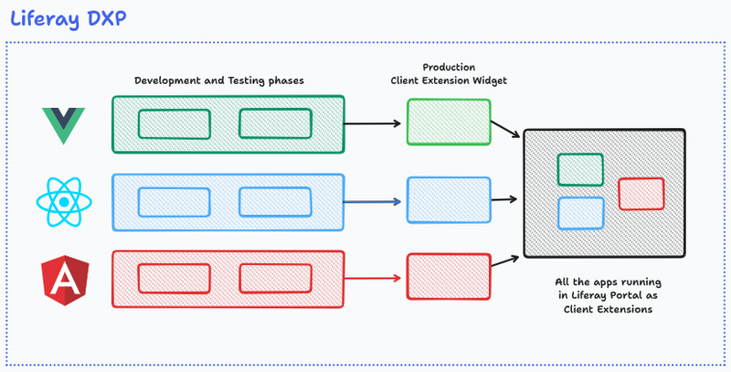
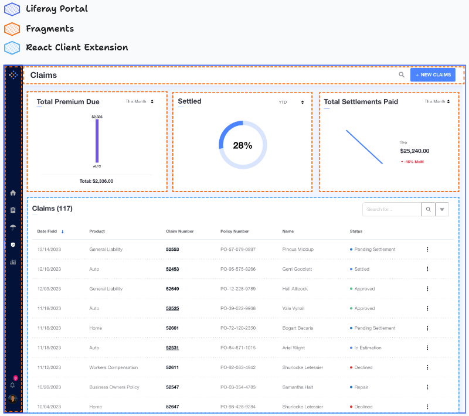

# Micro Frontends

Micro frontends extend the concept of microservices to the frontend side of development. You can build a fully-featured and powerful browser application that uses a microservice architecture to break the application down into smaller parts. Separate teams can then focus on delivering those smaller parts, even using different frameworks. When finished the parts are seamlessly pieced together to create a great user experience.

You use [frontend client extensions](../liferay-development/customizing-liferays-look-and-feel.md) coupled with out-of-the-box solutions like [fragments](../site-building/creating-pages/page-fragments-and-widgets/using-fragments.md) and [widgets](../site-building/creating-pages/page-fragments-and-widgets/using-widgets.md) to implement micro frontends. Developers can create or extend applications using different frameworks and then connect them to Liferay using client extensions.

One of the available frontend client extensions is the [basic custom element](../liferay-development/integrating-external-applications/creating-a-basic-custom-element.md). Basic custom elements use Liferay's frontend infrastructure to register external, remote applications with the Liferay platform and render them as widgets. This way, users can develop the applications separately, create basic custom elements using client extensions, and add them to a page.

!!! note
    Custom element client extensions can use any technology, regardless of how it’s built, packaged, or hosted.

The cases below illustrate the concept.

### Case 1: Raylife

<!-- Well... I think Raylife was deprecated. So, it may be a good idea to come up with a replacement for this section. Eric -->

Raylife is an agent portal solution built on Liferay. It works as an accelerator that can be customized.

Raylife requires four separate applications: a [React based client extension](../liferay-development/building-applications/developing-a-javascript-application/using-react.md) that displays a list of insurance claims with different fields, fragment blocks that visualize information (they can be replaced by other blocks to show different visualizations), a header, and a side menu bar.

The elements on the page communicate through events triggered by the DOM, and they can maintain synchronous communication and share resources.

All data on the screen is obtained through [headless APIs](../liferay-development/objects/creating-and-managing-objects/managing-objects-with-headless-apis.md) and [objects](../liferay-development/objects.md) for data persistence.

Different teams worked on the project at the same time. Each team was responsible for an application. Since client extensions were used, each team's code was isolated. While one of the applications used React as its main framework, others were created via custom fragments using HTML, CSS, and JavaScript.

### Case 2: Commerce Application

Imagine you need to create a website for an e-store. The website must have a header, a footer, and four applications: a main display application where users find information about the product (the name of the product, pictures, and a description), a cart/checkout application (including the Add to Cart button), a related products application to show products related to the one in the main display, and a comments/ratings section that contains customer's comments about the product with a star rating system to evaluate the product.

You can [use layout elements](../site-building/creating-pages/page-fragments-and-widgets/using-fragments/using-layout-elements.md) to customize your page's layout, use customizable OOTB fragments and widgets in your page (such as the header and the footer fragments), and add the other applications through client extensions.

Different teams can work on those different applications independently, using whatever frameworks they want. All applications benefit from Liferay's native APIs (headless API or global JavaScript API).

## Related Topics

- [Customizing Liferay's Look and Feel](../liferay-development/customizing-liferays-look-and-feel.md)
- [Using Fragments](../site-building/creating-pages/page-fragments-and-widgets/using-fragments.md)
- [Using Widgets](../site-building/creating-pages/page-fragments-and-widgets/using-widgets.md)